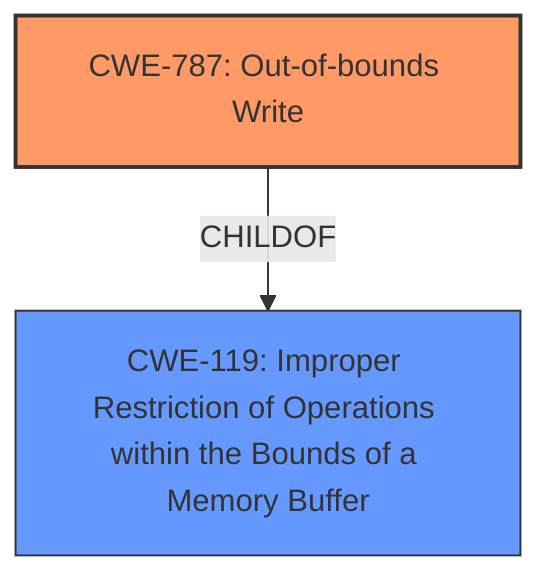

# Analysis for CVE-2021-30807

# Summary
| CWE ID | CWE Name | Confidence | CWE Abstraction Level | CWE Vulnerability Mapping Label | CWE-Vulnerability Mapping Notes |
|---|---|---|---|---|---|
| CWE-787 | Out-of-bounds Write | 0.9 | Base | Primary | Allowed |
| CWE-119 | Improper Restriction of Operations within the Bounds of a Memory Buffer | 0.7 | Class | Secondary | Discouraged |

## Evidence and Confidence

*   **Confidence Score:** 0.8
*   **Evidence Strength:** HIGH

## Relationship Analysis
The primary CWE selected is CWE-787 (Out-of-bounds Write), which is a child of CWE-119 (Improper Restriction of Operations within the Bounds of a Memory Buffer). This indicates a hierarchical relationship where CWE-787 is a more specific case of the more general CWE-119. The choice of CWE-787 is based on the clear identification of **memory corruption** due to writing outside the intended buffer boundaries, which aligns directly with CWE-787's definition. While CWE-119 is a broader category encompassing any read or write outside buffer boundaries, CWE-787 specifically addresses the "write" aspect, making it a more precise classification in this scenario.

## Vulnerability Chain
The vulnerability chain starts with the **memory corruption** issue, which leads to an out-of-bounds write (CWE-787). This then results in the ability to execute arbitrary code with kernel privileges.

Memory Corruption (Root Cause) -> Out-of-bounds Write (CWE-787) -> Arbitrary Code Execution (Impact)

## Summary of Analysis
The analysis is based on the vulnerability description indicating a **memory corruption** issue, which is further supported by the CVE Reference Links Content Summary. The summary explicitly mentions "Memory corruption in the IOMobileFrameBuffer component." This strongly suggests an out-of-bounds write scenario.

The selection of CWE-787 is further supported by the Retriever Results, which lists CWE-787 as the top combined result with a score of 1.000. This suggests a high degree of relevance based on the available information. The alternative term "Memory Corruption" for CWE-787 further reinforces this choice.

CWE-119 was considered but ultimately deemed less specific than CWE-787. While CWE-119 encompasses both out-of-bounds reads and writes, the vulnerability description and CVE summary clearly point to a write operation. The MITRE mapping guidance discourages the use of CWE-119 when more specific CWEs are available.

The final decision to map to CWE-787 is based on:

*   Direct evidence from the vulnerability description and CVE summary mentioning **memory corruption**.
*   The high relevance score of CWE-787 in the Retriever Results.
*   The specific nature of the vulnerability involving a write operation, aligning with CWE-787's definition.
*   The MITRE mapping guidance favoring more specific CWEs over general ones like CWE-119.

The selected CWE is at the optimal level of specificity because it accurately reflects the root cause of the vulnerability as an out-of-bounds write, without being overly broad or abstract.

Relevant CWE Information:

# Enhanced Context (25 CWEs)
The following CWEs were identified as potentially relevant to this vulnerability:

## CWE-680: Integer Overflow to Buffer Overflow
**Abstraction Level**: Compound
**Similarity Score**: 0.76
**Source**: dense

**Description**:
The product performs a calculation to determine how much memory to allocate, but an integer overflow can occur that causes less memory to be allocated than expected, leading to a buffer overflow.

**Mapping Guidance**:
- Usage: Discouraged
- Rationale: This CWE entry is a named chain, which combines multiple weaknesses.

*This CWE was not selected because the description doesn't mention an integer overflow.*

## CWE-191: Integer Underflow (Wrap or Wraparound)
**Abstraction Level**: Base
**Similarity Score**: 0.76
**Source**: dense

**Description**:
The product subtracts one value from another, such that the result is less than the minimum allowable integer value, which produces a value that is not equal to the correct result.

**Mapping Guidance**:
- Usage: Allowed
- Rationale: This CWE entry is at the Base level of abstraction, which is a preferred level of abstraction for mapping to the root causes of vulnerabilities.

*This CWE was not selected because the description doesn't mention an integer underflow.*

## CWE-131: Incorrect Calculation of Buffer Size
**Abstraction Level**: Base
**Similarity Score**: 0.75
**Source**: dense

**Description**:
The product does not correctly calculate the size to be used when allocating a buffer, which could lead to a buffer overflow.

**Mapping Guidance**:
- Usage: Allowed
- Rationale: This CWE entry is at the Base level of abstraction, which is a preferred level of abstraction for mapping to the root causes of vulnerabilities.

*This CWE was not selected because the description doesn't mention incorrect buffer size calculation.*

## CWE-681: Incorrect Conversion between Numeric Types
**Abstraction Level**: Base
**Similarity Score**: 0.75
**Source**: dense

**Description**:
When converting from one data type to another, such as long to integer, data can be omitted or translated in a way that produces unexpected values. If the resulting values are used in a sensitive context, then dangerous behaviors may occur.

**Mapping Guidance**:
- Usage: Allowed
- Rationale: This CWE entry is at the Base level of abstraction, which is a preferred level of abstraction for mapping to the root causes of vulnerabilities.

*This CWE was not selected because the description doesn't mention incorrect conversion between numeric types.*

## CWE-190: Integer Overflow or Wraparound
**Abstraction Level**: Base
**Similarity Score**: 0.74
**Source**: dense

**Description**:
The product performs a calculation that can
         produce an integer overflow or wraparound when the logic
         assumes that the resulting value will always be larger than
         the original value. This occurs when an integer value is
         incremented to a value that is too large to store in the
         associated representation. When this occurs, the value may
         become a very small or negative number.

**Mapping Guidance**:
- Usage: Allowed
- Rationale: This CWE entry is at the Base level of abstraction, which is a preferred level of abstraction for mapping to the root causes of vulnerabilities.

*This CWE was not selected because the description doesn't mention an integer overflow or wraparound.*

## CWE-197: Numeric Truncation Error
**Abstraction Level**: Base
**Similarity Score**: 0.74
**Source**: dense

**Description**:
Truncation errors occur when a primitive is cast to a primitive of a smaller size and data is lost in the conversion.

**Mapping Guidance**:
- Usage: Allowed
- Rationale: This CWE entry is at the Base level of abstraction, which is a preferred level of abstraction for mapping to the root causes of vulnerabilities.

*This CWE was not selected because the description doesn't mention numeric truncation error.*

## CWE-124: Buffer Underwrite ('Buffer Underflow')
**Abstraction Level**: Base
**Similarity Score**: 0.74
**Source**: dense

**Description**:
The product writes to a buffer using an index or pointer that references a memory location prior to the beginning of the buffer.

**Mapping Guidance**:
- Usage: Allowed
- Rationale: This CWE entry is at the Base level of abstraction, which is a preferred level of abstraction for mapping to the root causes of vulnerabilities.

*This CWE was not selected because the description indicates a memory corruption by writing past the end of the buffer.*

## CWE-126: Buffer Over-read
**Abstraction Level**: Variant
**Similarity Score**: 0.74
**Source**: dense

**Description**:
The product reads from a buffer using buffer access mechanisms such as indexes or pointers that reference memory locations after the targeted buffer.

**Mapping Guidance**:
- Usage: Allowed
- Rationale: This CWE entry is at the Variant level of abstraction, which is a preferred level of abstraction for mapping to the root causes of vulnerabilities.

*This CWE was not selected because the description indicates a memory corruption caused by writing.*

## CWE-667: Improper Locking
**Abstraction Level**: Class
**Similarity Score**: 0.73
**Source**: dense

**Description**:
The product does not properly acquire or release a lock on a resource, leading to unexpected resource state changes and behaviors.

**Mapping Guidance**:
- Usage: Allowed-with-Review
- Rationale: This CWE entry is a Class and might have Base-level children that would be more