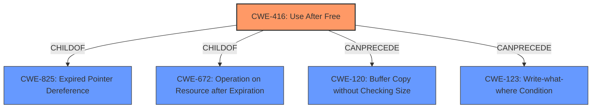

# Enhanced Analysis for CVE-2021-30858

# Summary
| CWE ID | CWE Name | Confidence | CWE Abstraction Level | CWE Vulnerability Mapping Label | CWE-Vulnerability Mapping Notes |
|---|---|---|---|---|---|
| CWE-416 | Use After Free | 1.0 | Variant | Allowed | Primary CWE |

## Evidence and Confidence

*   **Confidence Score:** 1.0
*   **Evidence Strength:** HIGH

## Relationship Analysis
The primary relationship that influenced the selection of CWE-416 is its nature as a **Variant** of CWE-825 (Expired Pointer Dereference) and CWE-672 (Operation on Resource after Expiration). While CWE-825 and CWE-672 are more general, CWE-416 specifically addresses the condition where memory is reused *after* it has been freed, which aligns precisely with the vulnerability description. The "CanPrecede" relationships to CWE-120 (Buffer Copy without Checking Size) and CWE-123 (Write-what-where Condition) suggest potential exploitation paths, but these are secondary to the root cause.



## Vulnerability Chain
The vulnerability chain starts with the **use after free** condition (CWE-416), which can lead to arbitrary code execution. The chain can be represented as:
CWE-416 (Use After Free) -> Arbitrary Code Execution (Impact)
There is a missing link in the chain to show how an attacker can achieve arbitrary code execution.

## Summary of Analysis
The analysis is based on the explicit evidence provided in the vulnerability description and CVE Reference Links Content Summary. The key phrase "**use after free**" directly maps to CWE-416.

The CVE Reference Links Content Summary reinforces this: "A **use-after-free** (UAF) issue exists in WebKit" and "This occurs when a program attempts to access memory that has already been freed, which can lead to crashes, data corruption, and arbitrary code execution."

The selection of CWE-416 is at the optimal level of specificity because it directly represents the root cause of the vulnerability as described. While other CWEs such as CWE-787 (Out-of-bounds Write) might be potential consequences or exploitation techniques related to UAF, they are not the primary weakness. CWE-416 accurately captures the fundamental flaw of reusing memory after it has been freed. The other CWEs are consequences of the primary weakness.

Relevant CWE Information:

# Enhanced Context (25 CWEs)
The following CWEs were identified as potentially relevant to this vulnerability:

## CWE-191: Integer Underflow (Wrap or Wraparound)
**Abstraction Level**: Base
**Similarity Score**: 0.78
**Source**: dense
Not Selected: This CWE relates to integer underflow, which is not mentioned or implied in the vulnerability description. The vulnerability focuses on memory management.

## CWE-681: Incorrect Conversion between Numeric Types
**Abstraction Level**: Base
**Similarity Score**: 0.76
**Source**: dense
Not Selected: This CWE relates to incorrect conversion between numeric types, which is not mentioned or implied in the vulnerability description. The vulnerability focuses on memory management.

## CWE-197: Numeric Truncation Error
**Abstraction Level**: Base
**Similarity Score**: 0.76
**Source**: dense
Not Selected: This CWE relates to numeric truncation errors, which are not mentioned or implied in the vulnerability description. The vulnerability focuses on memory management.

## CWE-190: Integer Overflow or Wraparound
**Abstraction Level**: Base
**Similarity Score**: 0.75
**Source**: dense
Not Selected: This CWE relates to integer overflow or wraparound, which is not mentioned or implied in the vulnerability description. The vulnerability focuses on memory management.

## CWE-131: Incorrect Calculation of Buffer Size
**Abstraction Level**: Base
**Similarity Score**: 0.75
**Source**: dense
Not Selected: This CWE relates to incorrect calculation of buffer size, which is not mentioned or implied in the vulnerability description. The vulnerability focuses on memory management, specifically the reuse of freed memory, rather than the initial allocation.

## CWE-680: Integer Overflow to Buffer Overflow
**Abstraction Level**: Compound
**Similarity Score**: 0.75
**Source**: dense
Not Selected: This CWE relates to a chain of integer overflow leading to buffer overflow, which is not directly relevant to the use-after-free vulnerability. The focus is on memory being freed and then accessed, not an overflow during allocation.

## CWE-667: Improper Locking
**Abstraction Level**: Class
**Similarity Score**: 0.75
**Source**: dense
Not Selected: While concurrency issues can sometimes lead to use-after-free vulnerabilities, there is no explicit mention of locking or concurrency in the description. Therefore, this CWE is not a direct fit.

## CWE-125: Out-of-bounds Read
**Abstraction Level**: Base
**Similarity Score**: 0.74
**Source**: dense
Not Selected: While out-of-bounds reads can occur in conjunction with use-after-free, the primary issue here is the access of freed memory. The description does not explicitly mention a read past the boundaries of a buffer.

## CWE-124: Buffer Underwrite ('Buffer Underflow')
**Abstraction Level**: Base
**Similarity Score**: 0.74
**Source**: dense
Not Selected: This CWE relates to writing before the beginning of a buffer, which is not mentioned or implied in the vulnerability description.

## CWE-789: Memory Allocation with Excessive Size Value
**Abstraction Level**: Variant
**Similarity Score**: 0.74
**Source**: dense
Not Selected: This CWE relates to allocating excessive memory, which is not mentioned or implied in the vulnerability description. The focus is on memory being freed and then accessed, not the initial allocation size.

## CWE-190: Integer Overflow or Wraparound
**Abstraction Level**: Base
**Similarity Score**: 7698.28
**Source**: sparse
Not Selected: This CWE relates to integer overflow or wraparound, which is not mentioned or implied in the vulnerability description.

## CWE-125: Out-of-bounds Read
**Abstraction Level**: Base
**Similarity Score**: 7265.86
**Source**: sparse
Not Selected: While out-of-bounds reads can occur in conjunction with use-after-free, the primary issue here is the access of freed memory. The description does not explicitly mention a read past the boundaries of a buffer.

## CWE-119: Improper Restriction of Operations within the Bounds of a Memory Buffer
**Abstraction Level**: Class
**Similarity Score**: 7178.05
**Source**: sparse
Not Selected: This is a general class of buffer issues and is too broad compared to the specific use-after-free condition described.

## CWE-1284: Improper Validation of Specified Quantity in Input
**Abstraction Level**: Base
**Similarity Score**: 7083.44
**Source**: sparse
Not Selected: This CWE relates to improper validation of input quantity, which is not mentioned or implied in the vulnerability description.

## CWE-667: Improper Locking
**Abstraction Level**: Class
**Similarity Score**: 7030.88
**Source**: sparse
Not Selected: While concurrency issues can sometimes lead to use-after-free vulnerabilities, there is no explicit mention of locking or concurrency in the description. Therefore, this CWE is not a direct fit.

## CWE-123: Write-what-where Condition
**Abstraction Level**: base
**Similarity Score**: 5.03
**Source**: graph
Not Selected: This CWE relates to the ability to write an arbitrary value to an arbitrary location, often as a result of a buffer overflow. While a use-after-free could lead to this condition, it is not the root cause described in the vulnerability.

## CWE-41: Improper Resolution of Path Equivalence
**Abstraction Level**: base
**Similarity Score**: 5.03
**Source**: graph
Not Selected: This CWE relates to path traversal issues and is not relevant to the memory management vulnerability described.

## CWE-120: Buffer Copy without Checking Size of Input ('Classic Buffer Overflow')


## CWE Relationship Analysis

Current CWEs represent these abstraction levels: .


### Vulnerability Chain Analysis

**Chain starting from CWE-41:**
- 41 (Improper Resolution of Path Equivalence) - ROOT


**Chain starting from CWE-123:**
- 123 (Write-what-where Condition) - ROOT


### CWE Relationship Diagram

```mermaid
graph TD
    classDef primary fill:#f96,stroke:#333,stroke-width:2px
    classDef secondary fill:#69f,stroke:#333
    classDef tertiary fill:#9e9,stroke:#333
```