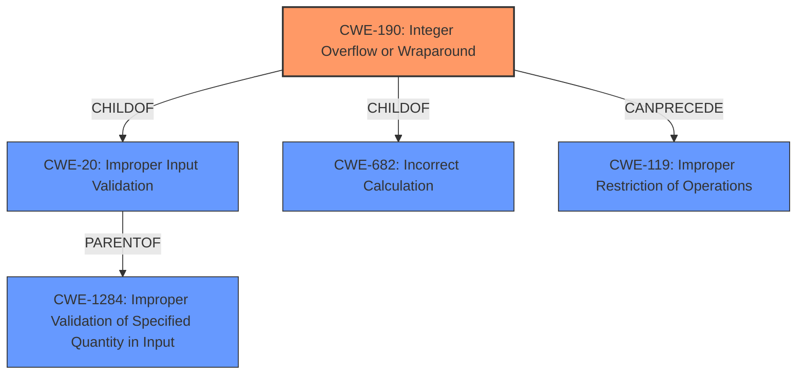

# Analysis Report for CVE-2021-30860

# Vulnerability Analysis Report: CVE-2021-30860

## Description


## Analysis (with Relationship Data)

# Summary
| CWE ID | CWE Name | Confidence | CWE Abstraction Level | CWE Vulnerability Mapping Label | CWE-Vulnerability Mapping Notes |
|---|---|---|---|---|---|
| CWE-190 | Integer Overflow or Wraparound | 1.0 | Base | Allowed | Primary CWE |
| CWE-20 | Improper Input Validation | 0.7 | Class | Discouraged | Secondary Candidate |

## Evidence and Confidence

*   **Confidence Score:** 0.9
*   **Evidence Strength:** HIGH

## Relationship Analysis
The primary CWE identified is CWE-190 (**Integer Overflow or Wraparound**), which is a **Base** level CWE. It is related to CWE-682 (Incorrect Calculation) and CWE-20 (**Improper Input Validation**). CWE-190 can **precede** CWE-119 (**Improper Restriction of Operations within the Bounds of a Memory Buffer**). CWE-20 is a parent of CWE-1284 (**Improper Validation of Specified Quantity in Input**).



## Vulnerability Chain
The vulnerability chain starts with **improper input validation** (CWE-20), leading to an **integer overflow** (CWE-190), which then can lead to out-of-bounds write (CWE-787) and eventually arbitrary code execution.

## Summary of Analysis
The initial assessment identified CWE-190 (**Integer Overflow or Wraparound**) as the primary weakness, based on the vulnerability description stating "An **integer overflow** was addressed with improved input validation." The CVE Reference Links Content Summary also mentions "**Integer overflow** in CoreGraphics when processing a maliciously crafted PDF" and "**insufficient input validation**".

The Retriever Results also lists CWE-190 as the top candidate. CWE-20 (**Improper Input Validation**) is considered a secondary weakness, as the fix involved "improved input validation" indicating that the overflow was possible due to missing or insufficient validation.

CWE-190 is at the Base level of abstraction, which is the preferred level for mapping. The mapping guidance for CWE-190 allows its usage and notes that it can lead to buffer overflows if less memory is allocated than expected. CWE-20 is a Class-level CWE and is generally discouraged unless more specific CWEs cannot be found. In this case, the specific type of input validation error isn't clear enough to select a more specific child of CWE-20, so CWE-20 is used as a secondary candidate.

The final decision is to primarily map this vulnerability to CWE-190 (**Integer Overflow or Wraparound**) with high confidence, and consider CWE-20 (**Improper Input Validation**) as a contributing factor.

Other CWEs considered but not used:
- CWE-787 (**Out-of-bounds Write**): While an integer overflow can lead to an out-of-bounds write, the description focuses on the overflow itself.
- CWE-843 (**Access of Resource Using Incompatible Type ('Type Confusion')**): Not directly mentioned in the description.
- CWE-665 (**Improper Initialization**): Not directly related to the provided information.
- CWE-191 (**Integer Underflow (Wrap or Wraparound)**): The description specifies an overflow, not an underflow.
- CWE-128 (**Wrap-around Error**): Similar to CWE-190, but CWE-190 is more specific to integer overflows.
- CWE-415 (**Double Free**): Not relevant to the vulnerability description.
- CWE-667 (**Improper Locking**): Not relevant.
- CWE-122 (**Heap-based Buffer Overflow**): While an overflow can cause a heap-based overflow, the description doesn't specify where in memory the overflow occurred.


## CWE Relationship Analysis

Current CWEs represent these abstraction levels: .


### Vulnerability Chain Analysis

**Chain starting from CWE-190:**
- 190 (Integer Overflow or Wraparound) - ROOT


**Chain starting from CWE-20:**
- 20 (Improper Input Validation) - ROOT


### CWE Relationship Diagram

```mermaid
graph TD
    classDef primary fill:#f96,stroke:#333,stroke-width:2px
    classDef secondary fill:#69f,stroke:#333
    classDef tertiary fill:#9e9,stroke:#333
```


*Report generated on 2025-03-30 11:27:22*
