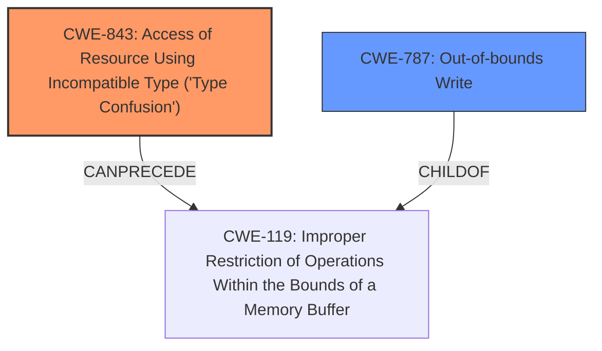

# Raw Analyzer Response for CVE-2021-30869

# Summary
| CWE ID | CWE Name | Confidence | CWE Abstraction Level | CWE Vulnerability Mapping Label | CWE-Vulnerability Mapping Notes |
|---|---|---|---|---|---|
| CWE-843 | Access of Resource Using Incompatible Type ('Type Confusion') | 1.0 | Base | Allowed | Primary CWE |
| CWE-787 | Out-of-bounds Write | 0.6 | Base | Allowed | Secondary Candidate |

## Evidence and Confidence

*   **Confidence Score:** 0.8
*   **Evidence Strength:** HIGH

## Relationship Analysis
The primary CWE is CWE-843, which is a Base level CWE. CWE-843 can precede CWE-119 (Improper Restriction of Operations Within the Bounds of a Memory Buffer). CWE-787 (Out-of-bounds Write) is a child of CWE-119. The selection of CWE-843 is based on the vulnerability description highlighting a **type confusion** issue.

## Vulnerability Chain
The vulnerability chain starts with a **type confusion** (CWE-843), potentially leading to memory corruption and an out-of-bounds write (CWE-787), and culminating in the execution of arbitrary code with kernel privileges.

## Summary of Analysis
The initial analysis strongly suggests that CWE-843 (Access of Resource Using Incompatible Type ('Type Confusion')) is the primary weakness, as it directly aligns with the provided vulnerability description. The description explicitly states: "A **type confusion** issue was addressed with improved state handling." The CVE Reference Links Content Summary further reinforces this by stating: "A type confusion issue within the XNU kernel."

The retriever results also support this, with CWE-843 having the highest similarity score. Its abstraction level is Base, which is preferred. The mapping guidance allows its use.

CWE-787 (Out-of-bounds Write) is considered as a secondary candidate because **type confusion** can often lead to memory corruption and out-of-bounds writes, as indicated in the CWE-843 description: "In languages without memory safety, such as C and C++, type confusion can lead to out-of-bounds memory access." However, without more direct evidence of an out-of-bounds write, it's classified as a secondary candidate with lower confidence.

The selection of CWE-843 is at the optimal level of specificity because it directly reflects the root cause described in the vulnerability report.
Other CWEs from **Complete CWE Specifications** were considered but not used:

*   CWE-1289: Improper Validation of Unsafe Equivalence in Input: This was considered, but the vulnerability description doesn't explicitly mention issues related to input validation or equivalence checks.
*   CWE-404: Improper Resource Shutdown or Release: This CWE focuses on resource release issues, which aren't directly mentioned in the vulnerability.
*   CWE-667: Improper Locking: While concurrency issues can sometimes lead to **type confusion**, there's no specific mention of locking problems in the description.
*   CWE-125: Out-of-bounds Read: Similar to CWE-787, this relates to memory access issues, but the primary issue seems to be the **type confusion** itself.
*   CWE-131: Incorrect Calculation of Buffer Size: This isn't explicitly mentioned in the vulnerability description.
*   CWE-226: Sensitive Information in Resource Not Removed Before Reuse: This is not related to the vulnerability description.
*   CWE-191: Integer Underflow (Wrap or Wraparound): This is not related to the vulnerability description.
*   CWE-805: Buffer Access with Incorrect Length Value: This is not directly supported by the evidence provided.
*   CWE-252: Unchecked Return Value: This is not directly supported by the evidence provided.
*   CWE-190: Integer Overflow or Wraparound: This is not directly supported by the evidence provided.
*   CWE-1284: Improper Validation of Specified Quantity in Input: This is not directly supported by the evidence provided.
*   CWE-123: Write-what-where Condition: This is a potential consequence of **type confusion**, but not the primary weakness.
*   CWE-41: Improper Resolution of Path Equivalence: This is not related to the vulnerability description.
*   CWE-416: Use After Free: This is not directly supported by the evidence provided.
*   CWE-825: Expired Pointer Dereference: This is not directly supported by the evidence provided.
*   CWE-22: Improper Limitation of a Pathname to a Restricted Directory ('Path Traversal'): This is not related to the vulnerability description.
*   CWE-770: Allocation of Resources Without Limits or Throttling: This is not related to the vulnerability description.
*   CWE-73: External Control of File Name or Path: This is not related to the vulnerability description.