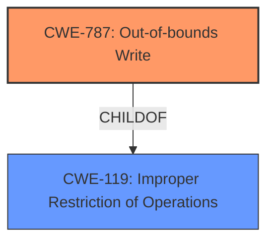

# Analysis Report for CVE-2021-30883

# Vulnerability Analysis Report: CVE-2021-30883

## Description


## Analysis (with Relationship Data)

# Summary
| CWE ID | CWE Name | Confidence | CWE Abstraction Level | CWE Vulnerability Mapping Label | CWE-Vulnerability Mapping Notes |
|---|---|---|---|---|---|
| CWE-787 | Out-of-bounds Write | 0.9 | Base | Allowed | Primary CWE |
| CWE-119 | Improper Restriction of Operations within the Bounds of a Memory Buffer | 0.6 | Class | Discouraged | Secondary Candidate |

## Evidence and Confidence

*   **Confidence Score:** 0.9
*   **Evidence Strength:** HIGH

## Relationship Analysis
The primary CWE is CWE-787, which is a base-level CWE and a child of CWE-119. CWE-119 is a class-level CWE that is often misused when more specific CWEs are available. The vulnerability description specifically mentions "memory corruption," which aligns well with the description of CWE-787 as a condition where the product writes data past the end or before the beginning of the intended buffer. Therefore, the relationship between CWE-787 and CWE-119 reinforces the selection of CWE-787 as the more specific and appropriate classification.



## Vulnerability Chain
The chain of root cause and weaknesses followed for the Vulnerability Description:
1.  **Root Cause:** **Memory Corruption** (CWE-787)
2.  **Impact:** Arbitrary code execution

## Summary of Analysis
The initial assessment identifies the vulnerability as a **memory corruption** issue that allows arbitrary code execution with kernel privileges. The primary basis for this assessment is the vulnerability description key phrases, which explicitly states "**rootcause: memory corruption**". The CVE reference links content summary also indicates "**Root Cause: A memory corruption issue**" and "**Vulnerability: Memory corruption in the IOMobileFrameBuffer component**".

The retriever results strongly suggest CWE-787 (Out-of-bounds Write) as the most relevant CWE, with a score of 1.000. This CWE aligns with the description of **memory corruption** due to writing data outside the intended buffer. The alternate terms for CWE-787 also include "**Memory Corruption:** Often used to describe the consequences of writing to memory outside the bounds of a buffer, or to memory that is otherwise invalid."

CWE-119 (Improper Restriction of Operations within the Bounds of a Memory Buffer) is considered but ultimately deemed less specific. The mapping guidance for CWE-119 discourages its use when lower-level CWEs are available. Given the evidence supporting CWE-787, it is the more appropriate choice.

The selection of CWE-787 is based on direct evidence from the vulnerability description and the retriever results. The CWE's base abstraction level and allowed usage further support this decision. The relationship analysis confirms that CWE-787 is a child of CWE-119, making it a more specific and accurate classification. Therefore, the selected CWE is at the optimal level of specificity.

Relevant CWE Information:

# Enhanced Context (25 CWEs)
The following CWEs were identified as potentially relevant to this vulnerability:

## CWE-667: Improper Locking
**Abstraction Level**: Class
**Similarity Score**: 0.77
**Source**: dense

**Description**:
The product does not properly acquire or release a lock on a resource, leading to unexpected resource state changes and behaviors.

**Mapping Guidance**:
- Usage: Allowed-with-Review
- Rationale: This CWE entry is a Class and might have Base-level children that would be more appropriate

*Not Selected:* This CWE is related to locking issues, which is not the primary cause of the reported **memory corruption** vulnerability.

## CWE-131: Incorrect Calculation of Buffer Size
**Abstraction Level**: Base
**Similarity Score**: 0.76
**Source**: dense

**Description**:
The product does not correctly calculate the size to be used when allocating a buffer, which could lead to a buffer overflow.

**Mapping Guidance**:
- Usage: Allowed
- Rationale: This CWE entry is at the Base level of abstraction, which is a preferred level of abstraction for mapping to the root causes of vulnerabilities.

*Not Selected:* Although this could lead to a buffer overflow, the description does not indicate an issue with calculating the buffer size, but rather **memory corruption**.

## CWE-1289: Improper Validation of Unsafe Equivalence in Input
**Abstraction Level**: Base
**Similarity Score**: 0.76
**Source**: dense

**Description**:
The product receives an input value that is used as a resource identifier or other type of reference, but it does not validate or incorrectly validates that the input is equivalent to a potentially-unsafe value.

**Mapping Guidance**:
- Usage: Allowed
- Rationale: This CWE entry is at the Base level of abstraction, which is a preferred level of abstraction for mapping to the root causes of vulnerabilities.

*Not Selected:* The description doesn't indicate an input validation issue; it indicates a **memory corruption** issue.

## CWE-125: Out-of-bounds Read
**Abstraction Level**: Base
**Similarity Score**: 0.75
**Source**: dense

**Description**:
The product reads data past the end, or before the beginning, of the intended buffer.

**Mapping Guidance**:
- Usage: Allowed
- Rationale: This CWE entry is at the Base level of abstraction, which is a preferred level of abstraction for mapping to the root causes of vulnerabilities.

*Not Selected:* The description doesn't indicate an out-of-bounds read issue; it indicates a **memory corruption** issue.

## CWE-404: Improper Resource Shutdown or Release
**Abstraction Level**: Class
**Similarity Score**: 0.75
**Source**: dense

**Description**:
The product does not release or incorrectly releases a resource before it is made available for re-use.

**Mapping Guidance**:
- Usage: Allowed-with-Review
- Rationale: This CWE entry is a Class and might have Base-level children that would be more appropriate

*Not Selected:* This is related to resource management issues, not the primary cause of the reported **memory corruption** vulnerability.

## CWE-681: Incorrect Conversion between Numeric Types
**Abstraction Level**: Base
**Similarity Score**: 0.75
**Source**: dense

**Description**:
When converting from one data type to another, such as long to integer, data can be omitted or translated in a way that produces unexpected values. If the resulting values are used in a sensitive context, then dangerous behaviors may occur.

**Mapping Guidance**:
- Usage: Allowed
- Rationale: This CWE entry is at the Base level of abstraction, which is a preferred level of abstraction for mapping to the root causes of vulnerabilities.

*Not Selected:* This is related to type conversion issues, not the primary cause of the reported **memory corruption** vulnerability.

## CWE-191: Integer Underflow (Wrap or Wraparound)
**Abstraction Level**: Base
**Similarity Score**: 0.75
**Source**: dense

**Description**:
The product subtracts one value from another, such that the result is less than the minimum allowable integer value, which produces a value that is not equal to the correct result.

**Mapping Guidance**:
- Usage: Allowed
- Rationale: This CWE entry is at the Base level of abstraction, which is a preferred level of abstraction for mapping to the root causes of vulnerabilities.

*Not Selected:* This is related to integer underflow issues, not the primary cause of the reported **memory corruption** vulnerability.

## CWE-226: Sensitive Information in Resource Not Removed Before Reuse
**Abstraction Level**: Base
**Similarity Score**: 0.75
**Source**: dense

**Description**:
The product releases a resource such as memory or a file so that it can be made available for reuse, but it does not clear or "zeroize" the information contained in the resource before the product performs a critical state transition or makes the resource available for reuse by other entities.

**Mapping Guidance**:
- Usage: Allowed
- Rationale: This CWE entry is at the Base level of abstraction, which is a preferred level of abstraction for mapping to the root causes of vulnerabilities.

*Not Selected:* This is related to information leakage, not the primary cause of the reported **memory corruption** vulnerability.

## CWE-126: Buffer Over-read
**Abstraction Level**: Variant
**Similarity Score**: 0.75
**Source**: dense

**Description**:
The product reads from a buffer using buffer access mechanisms such as indexes or pointers that reference memory locations after the targeted buffer.

**Mapping Guidance**:
- Usage: Allowed
- Rationale: This CWE entry is at the Variant level of abstraction, which is a preferred level of abstraction for mapping to the root causes of vulnerabilities.

*Not Selected:* The description doesn't indicate a buffer over-read issue; it indicates a **memory corruption


## CWE Relationship Analysis

Current CWEs represent these abstraction levels: .


### Vulnerability Chain Analysis

**Chain starting from CWE-667:**
- 667 (Improper Locking) - ROOT


**Chain starting from CWE-787:**
- 787 (Out-of-bounds Write) - ROOT


### CWE Relationship Diagram

```mermaid
graph TD
    classDef primary fill:#f96,stroke:#333,stroke-width:2px
    classDef secondary fill:#69f,stroke:#333
    classDef tertiary fill:#9e9,stroke:#333
```


*Report generated on 2025-04-02 12:23:05*
