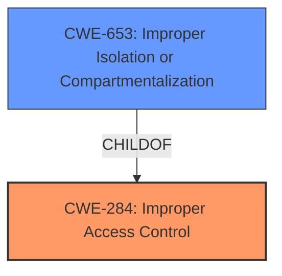

# Enhanced Analysis for CVE-2021-30947

# Summary
| CWE ID | CWE Name | Confidence | CWE Abstraction Level | CWE Vulnerability Mapping Label | CWE-Vulnerability Mapping Notes |
|---|---|---|---|---|---|
| CWE-284 | Improper Access Control | 0.9 | Pillar | Allowed-with-Review | Primary CWE |
| CWE-653 | Improper Isolation or Compartmentalization | 0.7 | Class | Allowed | Secondary CWE |

## Evidence and Confidence

*   **Confidence Score:** 0.8
*   **Evidence Strength:** MEDIUM

## Relationship Analysis
The primary relationship considered was the hierarchical structure, specifically the parent-child relationship between CWE-284 (Improper Access Control) and potential child CWEs. Since the vulnerability involves an application gaining unauthorized access to user files, the general nature of access control issues makes CWE-284 a suitable high-level classification. However, considering the "sandbox restrictions" mentioned in the vulnerability description and the "Sandbox bypass" from the CVE Reference Links Content Summary, CWE-653 (Improper Isolation or Compartmentalization) becomes a relevant secondary consideration as it reflects the failure to properly isolate the application within the sandbox.



## Vulnerability Chain
The vulnerability chain begins with the **incorrect access control** in the sandbox, leading to a **sandbox bypass**, which then results in the impact of an application being able to access a user's files.

## Summary of Analysis
The initial assessment identified CWE-284 (Improper Access Control) as a strong candidate due to the vulnerability's description of an application gaining unauthorized access to user files. The CVE Reference Links Content Summary reinforced this by explicitly stating "Incorrect access control" as a weakness.

However, further analysis considering the context of "sandbox restrictions" and "Sandbox bypass" suggested that CWE-653 (Improper Isolation or Compartmentalization) could provide additional specificity. This is because sandboxes are designed to isolate applications and prevent them from accessing resources outside of their designated environment. The failure of the sandbox to properly isolate the application is a key factor in this vulnerability.

Ultimately, CWE-284 was selected as the primary CWE due to its direct relevance to the vulnerability's impact. CWE-653 was selected as a secondary CWE to capture the nuance of the sandbox bypass. This decision balances the need for a general classification (CWE-284) with the desire to provide more specific information about the root cause (CWE-653).

The evidence for CWE-284 comes directly from the CVE Reference Links Content Summary: "Incorrect access control". The evidence for CWE-653 comes from the vulnerability description mentioning "sandbox restrictions" and the CVE Reference Links Content Summary stating "Sandbox bypass".

The graph relationships influenced the final selection by highlighting the hierarchical connection between CWE-284 and CWE-653, where CWE-653 is a more specific type of access control issue related to isolation.

The selected CWEs are at the optimal level of specificity because they capture both the general access control problem (CWE-284) and the specific mechanism that failed (CWE-653). A more specific CWE might exist, but the available evidence doesn't strongly support it.

Relevant CWE Information:

# Enhanced Context (25 CWEs)
The following CWEs were identified as potentially relevant to this vulnerability:

## CWE-667: Improper Locking
**Abstraction Level**: Class
**Similarity Score**: 0.79
**Source**: dense

**Description**:
The product does not properly acquire or release a lock on a resource, leading to unexpected resource state changes and behaviors.

**Mapping Guidance**:
- Usage: Allowed-with-Review
- Rationale: This CWE entry is a Class and might have Base-level children that would be more appropriate

*Reason for not selecting this CWE*: Improper locking is not directly related to the described access issue.

## CWE-404: Improper Resource Shutdown or Release
**Abstraction Level**: Class
**Similarity Score**: 0.77
**Source**: dense

**Description**:
The product does not release or incorrectly releases a resource before it is made available for re-use.

**Mapping Guidance**:
- Usage: Allowed-with-Review
- Rationale: This CWE entry is a Class and might have Base-level children that would be more appropriate

*Reason for not selecting this CWE*: Resource shutdown or release is not the primary issue described in the vulnerability.

## CWE-1289: Improper Validation of Unsafe Equivalence in Input
**Abstraction Level**: Base
**Similarity Score**: 0.77
**Source**: dense

**Description**:
The product receives an input value that is used as a resource identifier or other type of reference, but it does not validate or incorrectly validates that the input is equivalent to a potentially-unsafe value.

**Mapping Guidance**:
- Usage: Allowed
- Rationale: This CWE entry is at the Base level of abstraction, which is a preferred level of abstraction for mapping to the root causes of vulnerabilities.

*Reason for not selecting this CWE*: The vulnerability is not explicitly related to input validation, but more directly to access control and sandbox restrictions.

## CWE-662: Improper Synchronization
**Abstraction Level**: Class
**Similarity Score**: 0.77
**Source**: dense

**Description**:
The product utilizes multiple threads or processes to allow temporary access to a shared resource that can only be exclusive to one process at a time, but it does not properly synchronize these actions, which might cause simultaneous accesses of this resource by multiple threads or processes.

**Mapping Guidance**:
- Usage: Discouraged
- Rationale: This CWE entry is a level-1 Class (i.e., a child of a Pillar). It might have lower-level children that would be more appropriate

*Reason for not selecting this CWE*: The vulnerability does not involve multiple threads or processes accessing shared resources.

## CWE-226: Sensitive Information in Resource Not Removed Before Reuse
**Abstraction Level**: Base
**Similarity Score**: 0.76
**Source**: dense

**Description**:
The product releases a resource such as memory or a file so that it can be made available for reuse, but it does not clear or "zeroize" the information contained in the resource before the product performs a critical state transition or makes the resource available for reuse by other entities.

**Mapping Guidance**:
- Usage: Allowed
- Rationale: This CWE entry is at the Base level of abstraction, which is a preferred level of abstraction for mapping to the root causes of vulnerabilities.

*Reason for not selecting this CWE*: Sensitive information reuse is not directly relevant to the vulnerability description.

## CWE-653: Improper Isolation or Compartmentalization
**Abstraction Level**: Class
**Similarity Score**: 0.76
**Source**: dense

**Description**:
The product does not properly compartmentalize or isolate functionality, processes, or resources that require different privilege levels, rights, or permissions.

**Mapping Guidance**:
- Usage: Allowed
- Rationale: This CWE entry is at the Base level of abstraction, which is a preferred level of abstraction for mapping to the root causes of vulnerabilities.

*Reason for selecting this CWE as a secondary concern*: This aligns well with the sandbox bypass aspect of the vulnerability, indicating a failure to properly isolate the application.

## CWE-664: Improper Control of a Resource Through its Lifetime
**Abstraction Level**: Pillar
**Similarity Score**: 0.75
**Source**: dense

**Description**:
The product does not maintain or incorrectly maintains control over a resource throughout its lifetime of creation, use, and release.

**Mapping Guidance**:
- Usage: Discouraged
- Rationale: This CWE entry is high-level when lower-level children are available.

*Reason for not selecting this CWE*: Too general and doesn't specifically address the access control or sandbox issues.

## CWE-665: Improper Initialization
**Abstraction Level**: Class
**Similarity Score**: 0.75
**Source**: dense

**Description**:
The product does not initialize or incorrectly initializes a resource, which might leave the resource in an unexpected state when it is accessed or used.

**Mapping Guidance**:
- Usage: Discouraged
- Rationale: This CWE entry is a level-1 Class (i.e., a child of a Pillar). It might have lower-level children that would be more appropriate

*Reason for not selecting this CWE*: Initialization issues are not explicitly mentioned in the vulnerability description.

## CWE-691: Insufficient Control Flow Management
**Abstraction Level**: Pillar
**Similarity Score**: 0.74
**Source**: dense

**Description**:
The code does not sufficiently manage its control flow during execution, creating conditions in which the control flow can be modified in unexpected ways.

**Mapping Guidance**:
- Usage: Discouraged
- Rationale: This CWE entry is extremely high-level, a Pillar. However, classification research is limited for weaknesses of this type, so there can be gaps or organizational difficulties


## CWE Relationship Analysis

Current CWEs represent these abstraction levels: .


### Vulnerability Chain Analysis

**Chain starting from CWE-664:**
- 664 (Improper Control of a Resource Through its Lifetime) - ROOT


**Chain starting from CWE-662:**
- 662 (Improper Synchronization) - ROOT


### CWE Relationship Diagram

```mermaid
graph TD
    classDef primary fill:#f96,stroke:#333,stroke-width:2px
    classDef secondary fill:#69f,stroke:#333
    classDef tertiary fill:#9e9,stroke:#333
```