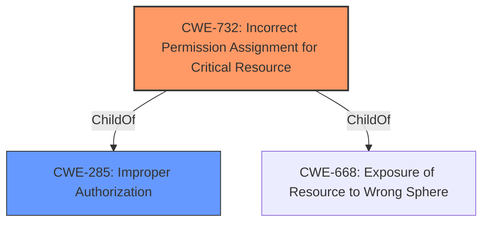

# Analysis for CVE-2021-30988

# Summary
| CWE ID | CWE Name | Confidence | CWE Abstraction Level | CWE Vulnerability Mapping Label | CWE-Vulnerability Mapping Notes |
|---|---|---|---|---|---|
| CWE-732 | Incorrect Permission Assignment for Critical Resource | 0.8 | Class | Allowed-with-Review | Primary CWE |
| CWE-285 | Improper Authorization | 0.6 | Class | Discouraged | Secondary Candidate |

## Evidence and Confidence

*   **Confidence Score:** 0.8
*   **Evidence Strength:** HIGH

## Relationship Analysis
The primary CWE selected is CWE-732, which is a child of CWE-285 (Improper Authorization). While CWE-285 could be considered, CWE-732 is more specific as it directly addresses the **incorrect permission assignment** for a critical resource, aligning well with the vulnerability description involving a **permissions issue**. The abstraction level of CWE-732 as a Class is appropriate given the information available, and it is a better fit than its parent, CWE-285, due to its specificity.

## Vulnerability Chain
The vulnerability chain starts with an **incorrect permission assignment** (CWE-732). This leads to a malicious application being able to identify other applications installed on the user's device. The root cause is the **incorrect permission assignment**, and the impact is information disclosure.

## Summary of Analysis
The initial analysis focused on identifying the root cause of the vulnerability. The description clearly states a "**permissions issue**" and the CVE Reference Links Content Summary highlights "**Improper validation of permissions**." Given this, CWE-732 (Incorrect Permission Assignment for Critical Resource) was selected as the primary CWE.

CWE-285 (Improper Authorization) was also considered, as CWE-732 is a child of CWE-285. However, CWE-732 is more specific and better captures the essence of the vulnerability.

The selection of CWE-732 is based on the provided evidence, which directly points to a permission-related issue. The relationship analysis confirms that CWE-732 is a more specific child of CWE-285, making it a more appropriate choice. The evidence from the "CVE Reference Links Content Summary" that highlights "**Weaknesses/vulnerabilities present: Improper validation of permissions**" supports the choice of a permission-related CWE.

Relevant CWE Information:

# Enhanced Context (25 CWEs)
The following CWEs were identified as potentially relevant to this vulnerability:

## CWE-1220: Insufficient Granularity of Access Control
**Abstraction Level**: Base
**Similarity Score**: 0.77

## CWE-1289: Improper Validation of Unsafe Equivalence in Input
**Abstraction Level**: Base
**Similarity Score**: 0.77

## CWE-274: Improper Handling of Insufficient Privileges
**Abstraction Level**: Base
**Similarity Score**: 0.76

## CWE-664: Improper Control of a Resource Through its Lifetime
**Abstraction Level**: Pillar
**Similarity Score**: 0.75

## CWE-807: Reliance on Untrusted Inputs in a Security Decision
**Abstraction Level**: Base
**Similarity Score**: 0.75

## CWE-691: Insufficient Control Flow Management
**Abstraction Level**: Pillar
**Similarity Score**: 0.75

## CWE-653: Improper Isolation or Compartmentalization
**Abstraction Level**: Class
**Similarity Score**: 0.75

## CWE-280: Improper Handling of Insufficient Permissions or Privileges 
**Abstraction Level**: Base
**Similarity Score**: 0.75

## CWE-404: Improper Resource Shutdown or Release
**Abstraction Level**: Class
**Similarity Score**: 0.74

## CWE-183: Permissive List of Allowed Inputs
**Abstraction Level**: Base
**Similarity Score**: 0.74

## CWE-863: Incorrect Authorization
**Abstraction Level**: Class
**Similarity Score**: 6206.45

## CWE-639: Authorization Bypass Through User-Controlled Key
**Abstraction Level**: Base
**Similarity Score**: 6160.82

## CWE-367: Time-of-check Time-of-use (TOCTOU) Race Condition
**Abstraction Level**: Base
**Similarity Score**: 6153.09

## CWE-1284: Improper Validation of Specified Quantity in Input
**Abstraction Level**: Base
**Similarity Score**: 6146.08

## CWE-125: Out-of-bounds Read
**Abstraction Level**: Base
**Similarity Score**: 6135.92

## CWE-123: Write-what-where Condition
**Abstraction Level**: base
**Similarity Score**: 5.03

## CWE-843: Access of Resource Using Incompatible Type ('Type Confusion')
**Abstraction Level**: base
**Similarity Score**: 5.03

## CWE-416: Use After Free
**Abstraction Level**: variant
**Similarity Score**: 4.53

## CWE-787: Out-of-bounds Write
**Abstraction Level**: base
**Similarity Score**: 4.33

## CWE-825: Expired Pointer Dereference
**Abstraction Level**: base
**Similarity Score**: 4.33

## CWE-125: Out-of-bounds Read
**Abstraction Level**: base
**Similarity Score**: 4.33

## CWE-190: Integer Overflow or Wraparound
**Abstraction Level**: base
**Similarity Score**: 4.33

## CWE-1341: Multiple Releases of Same Resource or Handle
**Abstraction Level**: base
**Similarity Score**: 4.33

## CWE-22: Improper Limitation of a Pathname to a Restricted Directory ('Path Traversal')
**Abstraction Level**: base
**Similarity Score**: 4.33

## CWE-770: Allocation of Resources Without Limits or Throttling
**Abstraction Level**: base
**Similarity Score**: 4.33

CWE-787 (Out-of-bounds Write), CWE-843 (Access of Resource Using Incompatible Type), and other memory corruption related CWEs were considered but deemed not applicable because the vulnerability description specifically mentions a "**permissions issue**" and does not provide evidence of memory corruption. CWE-20 (Improper Input Validation) was considered but deemed too general, as a more specific permission-related CWE is available.