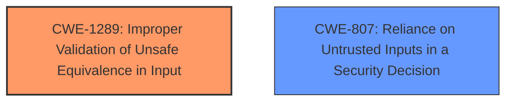

# Raw Analyzer Response for CVE-2021-31010

# Summary
| CWE ID  | CWE Name                                                            | Confidence | CWE Abstraction Level | CWE Vulnerability Mapping Label | CWE-Vulnerability Mapping Notes |
| :-------- | :------------------------------------------------------------------ | :--------- | :---------------------- | :------------------------------ | :------------------------------ |
| CWE-1289 | Improper Validation of Unsafe Equivalence in Input                | 0.85       | Base                    | Primary                         | Allowed                         |
| CWE-807 | Reliance on Untrusted Inputs in a Security Decision               | 0.75       | Base                    | Secondary                       | Allowed                         |

## Evidence and Confidence

*   **Confidence Score:** 0.8
*   **Evidence Strength:** HIGH

## Relationship Analysis
The primary relationship influencing the selection was the direct match between the vulnerability description and the CWE-1289 definition, as well as the weakness phrases that directly related to the root cause. This was further supported by the "CWE for similar CVE Descriptions." There were no strong parent-child or peer relationships to significantly alter the decision, as the focus remained on identifying the specific root cause related to improper input validation during deserialization.

## Vulnerability Chain
The vulnerability chain starts with the **improper validation** of deserialized data (**ROOT CAUSE**), leading to a potential circumvention of sandbox restrictions (**IMPACT**). The chain lacks explicit details on the specific steps after deserialization, but the core issue lies in the **improper validation** that allows the exploit to occur.

## Summary of Analysis
The initial analysis focused on identifying the root cause of the vulnerability, which was clearly stated as a deserialization issue that was addressed through improved validation. The key phrase "improper validation" immediately pointed towards input validation related CWEs.

The Retriever Results and Complete CWE Specifications were then examined to find the most appropriate CWE. CWE-1289 was chosen because it directly addresses the **improper validation** of potentially unsafe values in input, which aligns perfectly with the vulnerability description. CWE-807 was considered as a secondary CWE because the product is using a protection mechanism that relies on the values of an input, but the input can be modified by an untrusted actor.

The decision to select CWE-1289 was heavily based on the evidence provided in the CVE Reference Links Content Summary, which explicitly mentions "Improper validation of deserialized data."

Relevant CWE Information:

# Enhanced Context (25 CWEs)
The following CWEs were identified as potentially relevant to this vulnerability:

## CWE-1289: Improper Validation of Unsafe Equivalence in Input
**Abstraction Level**: Base
**Similarity Score**: 0.77
**Source**: dense

**Description**:
The product receives an input value that is used as a resource identifier or other type of reference, but it does not validate or incorrectly validates that the input is equivalent to a potentially-unsafe value.

**Mapping Guidance**:
- Usage: Allowed
- Rationale: This CWE entry is at the Base level of abstraction, which is a preferred level of abstraction for mapping to the root causes of vulnerabilities.

**Technical Explanation:**
CWE-1289 (Improper Validation of Unsafe Equivalence in Input) is applicable because the vulnerability involves a deserialization issue where the input data, which is used as a resource identifier, is not properly validated to ensure it is safe. This **lack of validation** allows potentially unsafe data to be processed, leading to the circumvention of sandbox restrictions.

**Security Implications:**
The security implication of CWE-1289 is that an attacker can provide malicious input that is not properly validated during deserialization, allowing them to bypass security controls such as sandbox restrictions. This can lead to unauthorized access, code execution, or other malicious activities.

**Relationships:**
There are no specific parent-child or chain relationships that significantly influenced this mapping decision. The primary factor was the direct match between the vulnerability description and the CWE description.

**MITRE Mapping Guidance:**
The MITRE mapping guidance for CWE-1289 states that it is at the Base level of abstraction, which is preferred for mapping to the root causes of vulnerabilities, and its usage is allowed. This further supports the selection of CWE-1289.

## CWE-807: Reliance on Untrusted Inputs in a Security Decision
**Abstraction Level**: Base
**Similarity Score**: 0.75
**Source**: dense

**Description**:
The product uses a protection mechanism that relies on the existence or values of an input, but the input can be modified by an untrusted actor in a way that bypasses the protection mechanism.

**Mapping Guidance**:
- Usage: Allowed
- Rationale: This CWE entry is at the Base level of abstraction, which is a preferred level of abstraction for mapping to the root causes of vulnerabilities.

**Technical Explanation:**
CWE-807 (Reliance on Untrusted Inputs in a Security Decision) is applicable because the deserialization process is a protection mechanism that relies on the input data being safe and valid. However, since the input is not properly validated, an attacker can modify the input in a way that bypasses the protection mechanism, leading to the circumvention of sandbox restrictions.

**Security Implications:**
The security implication of CWE-807 is that an attacker can manipulate untrusted input to bypass security decisions made by the product. This can lead to unauthorized access, code execution, or other malicious activities.

**Relationships:**
There are no specific parent-child or chain relationships that significantly influenced this mapping decision. The primary factor was the alignment between the vulnerability description and the CWE description.

**MITRE Mapping Guidance:**
The MITRE mapping guidance for CWE-807 states that it is at the Base level of abstraction, which is preferred for mapping to the root causes of vulnerabilities, and its usage is allowed. This further supports the selection of CWE-807.

**CWEs Considered But Not Used:**
CWE-20 (Improper Input Validation) was considered but not used because it is a high-level class CWE and the vulnerability description provides more specific information about the type of input validation issue (deserialization). The MITRE mapping guidance discourages the use of CWE-20 when lower-level CWEs are available.

CWE-787 (Out-of-bounds Write) and CWE-843 (Access of Resource Using Incompatible Type ('Type Confusion')) were also considered because they appeared in the Retriever Results. However, these CWEs describe specific memory corruption issues, while the vulnerability description focuses on the **improper validation** of deserialized data. Therefore, they were not selected as the primary CWE.