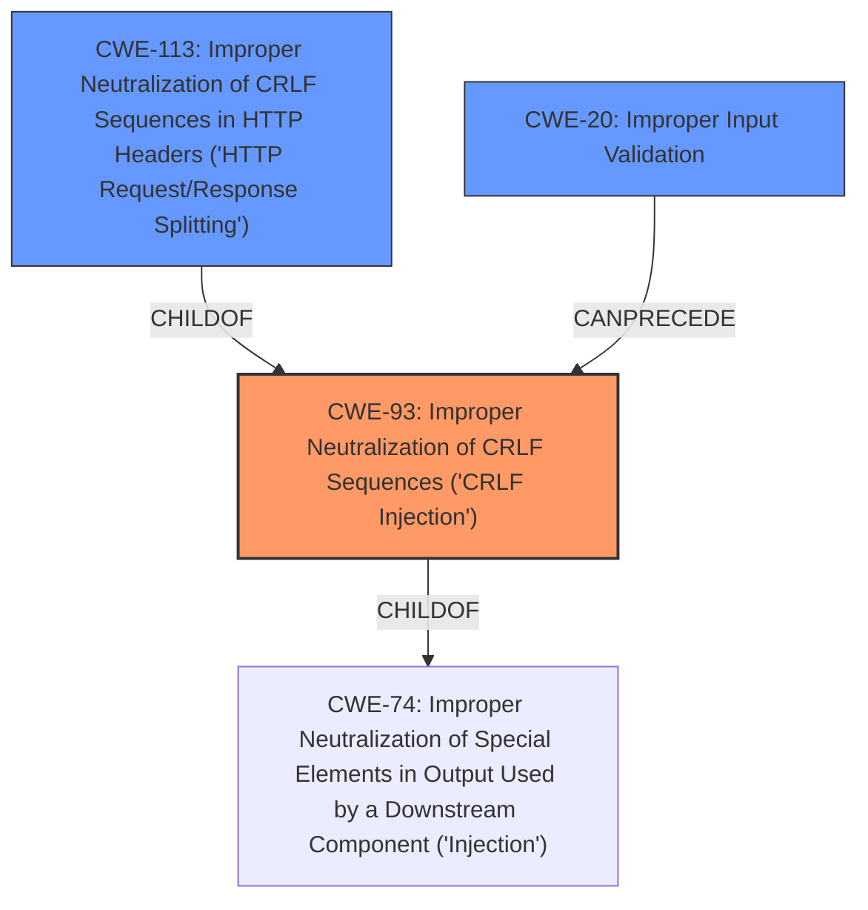

# Raw Analyzer Response for CVE-2021-31249

# Summary
| CWE ID | CWE Name | Confidence | CWE Abstraction Level | CWE Vulnerability Mapping Label | CWE-Vulnerability Mapping Notes |
|---|---|---|---|---|---|
| CWE-93 | Improper Neutralization of CRLF Sequences ('CRLF Injection') | 1.0 | Base | Allowed | Primary CWE |
| CWE-113 | Improper Neutralization of CRLF Sequences in HTTP Headers ('HTTP Request/Response Splitting') | 0.8 | Variant | Allowed | Secondary Candidate |
| CWE-20 | Improper Input Validation | 0.6 | Class | Discouraged | Secondary Candidate |

## Evidence and Confidence

*   **Confidence Score:** 0.9
*   **Evidence Strength:** HIGH

## Relationship Analysis
The primary weakness is CWE-93, which deals with the **improper neutralization of CRLF sequences**. CWE-113, a variant of CWE-93, focuses on HTTP headers. The vulnerability involves **CRLF injection** due to the **lack of validation on the redirect= parameter**, affecting HTTP headers, making CWE-93 the most appropriate primary classification. CWE-20, while relevant, is too general, and its mapping is discouraged by MITRE.

## Vulnerability Chain
The vulnerability chain starts with the **lack of input validation** which leads to a **CRLF injection** vulnerability. This can then lead to XSS or information disclosure.

## Summary of Analysis
The initial analysis focused on the **lack of validation** as the root cause, which aligns with CWE-93 and CWE-113. The key phrase "**lack of validation on the redirect= parameter**" and the description of the vulnerability as a "**CRLF injection** vulnerability" strongly support the selection of CWE-93 as the primary CWE. The CVE Reference Links Content Summary states: "**Root Cause of Vulnerability:** The root cause is a **lack of input validation** on the `redirect` parameter... This allows for CRLF injection."

CWE-93 is the most specific and appropriate base-level CWE to describe the vulnerability. CWE-113 is a variant that is also relevant, as the CRLF injection specifically targets HTTP headers. CWE-20 is too general and is discouraged by MITRE when more specific CWEs are available. The final selection of CWE-93 as primary and CWE-113 as secondary is based on the evidence of **CRLF injection** in the context of HTTP headers due to **lack of input validation**.

Relevant CWE Information:

# Enhanced Context (25 CWEs)
The following CWEs were identified as potentially relevant to this vulnerability:

## CWE-113: Improper Neutralization of CRLF Sequences in HTTP Headers ('HTTP Request/Response Splitting')
**Abstraction Level**: Variant
**Similarity Score**: 0.80
**Source**: dense

**Description**:
The product receives data from an HTTP agent/component (e.g., web server, proxy, browser, etc.), but it does not neutralize or incorrectly neutralizes CR and LF characters before the data is included in outgoing HTTP headers.

**Mapping Guidance**:
- Usage: Allowed
- Rationale: This CWE entry is at the Variant level of abstraction, which is a preferred level of abstraction for mapping to the root causes of vulnerabilities.

## CWE-93: Improper Neutralization of CRLF Sequences ('CRLF Injection')
**Abstraction Level**: Base
**Similarity Score**: 7556.73
**Source**: sparse

**Description**:
The product uses CRLF (carriage return line feeds) as a special element, e.g. to separate lines or records, but it does not neutralize or incorrectly neutralizes CRLF sequences from inputs.

**Mapping Guidance**:
- Usage: Allowed
- Rationale: This CWE entry is at the Base level of abstraction, which is a preferred level of abstraction for mapping to the root causes of vulnerabilities.

### CWEs Considered But Not Used:

*   **CWE-78 (Improper Neutralization of Special Elements used in an OS Command ('OS Command Injection'))**: This was considered but is not applicable because the vulnerability involves CRLF injection, not OS command injection.
*   **CWE-20 (Improper Input Validation)**: While the root cause is a **lack of input validation**, this CWE is too general. The vulnerability is more specifically a **CRLF injection**, making CWE-93 a better fit. MITRE also discourages using CWE-20 when more specific CWEs are available.
*   **CWE-1284 (Improper Validation of Specified Quantity in Input)**: This CWE is not applicable because the vulnerability is not related to the validation of a specified quantity but rather the presence of CRLF sequences.
*   **CWE-620 (Unverified Password Change)**: This CWE is not relevant as the vulnerability does not involve password changes.
*   **CWE-117 (Improper Output Neutralization for Logs)**: While CRLF injection could potentially affect logs, the primary vulnerability is the injection itself, not the logging of the data.
*   **CWE-352 (Cross-Site Request Forgery (CSRF))**: This CWE is not directly related as the vulnerability is about injecting CRLF sequences, not forging requests.
*   **CWE-641 (Improper Restriction of Names for Files and Other Resources)**: This CWE is not relevant because the vulnerability doesn't involve file or resource naming.
*   **CWE-138 (Improper Neutralization of Special Elements)**: This CWE is too general and doesn't specifically address CRLF injection.