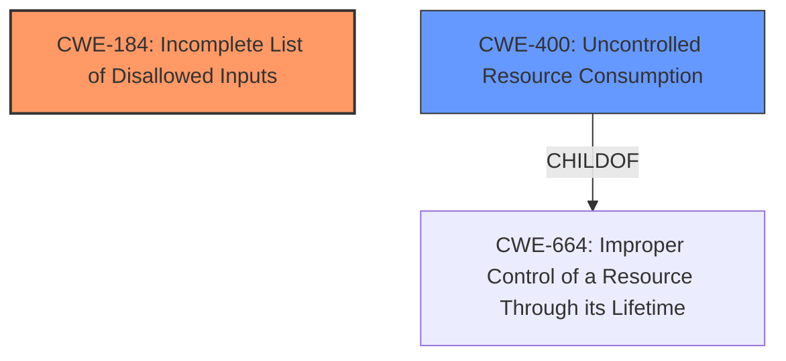

# Analysis for CVE-2021-31370

# Summary
| CWE ID | CWE Name | Confidence | CWE Abstraction Level | CWE Vulnerability Mapping Label | CWE-Vulnerability Mapping Notes |
|---|---|---|---|---|---|
| CWE-184 | Incomplete List of Disallowed Inputs | 1 | Base | Allowed | Primary CWE |
| CWE-400 | Uncontrolled Resource Consumption | 0.5 | Class | Discouraged | Secondary Candidate |

## Evidence and Confidence

*   **Confidence Score:** 0.8
*   **Evidence Strength:** HIGH

## Relationship Analysis
The primary CWE, CWE-184 **[CWE-184: Incomplete List of Disallowed Inputs]**, is a Base level CWE. It can precede several other CWEs including CWE-79 **[CWE-79: Improper Neutralization of Input During Web Page Generation ('Cross-site Scripting')]**, CWE-78 **[CWE-78: Improper Neutralization of Special Elements used in an OS Command ('OS Command Injection')]**, CWE-434 **[CWE-434: Unrestricted Upload of File with Dangerous Type]**, and CWE-98 **[CWE-98: Improper Control of Filename for Include/Require Statement in PHP Program ('PHP Remote File Inclusion')]**. While these aren't directly applicable in this case, they indicate potential attack vectors that could arise from **incomplete input validation**.

CWE-400 **[CWE-400: Uncontrolled Resource Consumption]** is a Class-level CWE and a child of CWE-664 **[CWE-664: Improper Control of a Resource Through its Lifetime]**. While the vulnerability leads to resource exhaustion, the root cause is the **incomplete input validation**, making CWE-184 **[CWE-184: Incomplete List of Disallowed Inputs]** more appropriate as the primary CWE.

## Vulnerability Chain
The vulnerability chain starts with an **Incomplete List of Disallowed Inputs** (CWE-184) which allows a high rate of specific multicast traffic to be sent. This traffic then causes control traffic to be dropped, leading to a Denial of Service (DoS).

CWE-184 (Root Cause) -> DoS (Impact)

## Summary of Analysis
The initial assessment identified CWE-184 **[CWE-184: Incomplete List of Disallowed Inputs]** as the primary candidate due to the explicit mention of "**Incomplete List of Disallowed Inputs**" in the vulnerability description. The description states: "An **Incomplete List of Disallowed Inputs** vulnerability in Packet Forwarding Engine (PFE) of Juniper Networks Junos OS... allows an adjacent unauthenticated attacker which sends a high rate of specific multicast traffic to cause control traffic received from the network to be dropped."

The relationship analysis confirms that CWE-184 **[CWE-184: Incomplete List of Disallowed Inputs]** is a Base-level CWE, which is preferred for root cause analysis. While CWE-400 **[CWE-400: Uncontrolled Resource Consumption]** is a potential consequence, it's a Class-level CWE and doesn't represent the underlying flaw as accurately as CWE-184 **[CWE-184: Incomplete List of Disallowed Inputs]**.

The final decision prioritizes CWE-184 **[CWE-184: Incomplete List of Disallowed Inputs]** as the root cause, with CWE-400 **[CWE-400: Uncontrolled Resource Consumption]** representing the impact. The selection is based on direct evidence from the vulnerability description, relationship analysis, and adherence to MITRE's mapping guidance.

Relevant CWE Information:
# Enhanced Context (25 CWEs)
The following CWEs were identified as potentially relevant to this vulnerability:

## CWE-664: Improper Control of a Resource Through its Lifetime
**Abstraction Level**: Pillar
**Similarity Score**: 0.78
**Source**: dense

**Description**:
The product does not maintain or incorrectly maintains control over a resource throughout its lifetime of creation, use, and release.

**Mapping Guidance**:
- Usage: Discouraged
- Rationale: This CWE entry is high-level when lower-level children are available.

## CWE-184: Incomplete List of Disallowed Inputs
**Abstraction Level**: Base
**Similarity Score**: 0.76
**Source**: dense

**Description**:
The product implements a protection mechanism that relies on a list of inputs (or properties of inputs) that are not allowed by policy or otherwise require other action to neutralize before additional processing takes place, but the list is incomplete.

**Mapping Guidance**:
- Usage: Allowed
- Rationale: This CWE entry is at the Base level of abstraction, which is a preferred level of abstraction for mapping to the root causes of vulnerabilities.

## CWE-404: Improper Resource Shutdown or Release
**Abstraction Level**: Class
**Similarity Score**: 0.76
**Source**: dense

**Description**:
The product does not release or incorrectly releases a resource before it is made available for re-use.

**Mapping Guidance**:
- Usage: Allowed-with-Review
- Rationale: This CWE entry is a Class and might have Base-level children that would be more appropriate

## CWE-606: Unchecked Input for Loop Condition
**Abstraction Level**: Base
**Similarity Score**: 0.76
**Source**: dense

**Description**:
The product does not properly check inputs that are used for loop conditions, potentially leading to a denial of service or other consequences because of excessive looping.

**Mapping Guidance**:
- Usage: Allowed
- Rationale: This CWE entry is at the Base level of abstraction, which is a preferred level of abstraction for mapping to the root causes of vulnerabilities.

## CWE-668: Exposure of Resource to Wrong Sphere
**Abstraction Level**: Class
**Similarity Score**: 0.75
**Source**: dense

**Description**:
The product exposes a resource to the wrong control sphere, providing unintended actors with inappropriate access to the resource.

**Mapping Guidance**:
- Usage: Discouraged
- Rationale: CWE-668 is high-level and is often misused as a catch-all when lower-level CWE IDs might be applicable. It is sometimes used for low-information vulnerability reports [REF-1287]. It is a level-1 Class (i.e., a child of a Pillar). It is not useful for trend analysis.

## CWE-1289: Improper Validation of Unsafe Equivalence in Input
**Abstraction Level**: Base
**Similarity Score**: 0.75
**Source**: dense

**Description**:
The product receives an input value that is used as a resource identifier or other type of reference, but it does not validate or incorrectly validates that the input is equivalent to a potentially-unsafe value.

**Mapping Guidance**:
- Usage: Allowed
- Rationale: This CWE entry is at the Base level of abstraction, which is a preferred level of abstraction for mapping to the root causes of vulnerabilities.

## CWE-754: Improper Check for Unusual or Exceptional Conditions
**Abstraction Level**: Class
**Similarity Score**: 0.75
**Source**: dense

**Description**:
The product does not check or incorrectly checks for unusual or exceptional conditions that are not expected to occur frequently during day to day operation of the product.

**Mapping Guidance**:
- Usage: Allowed-with-Review
- Rationale: This CWE entry is a Class and might have Base-level children that would be more appropriate

## CWE-703: Improper Check or Handling of Exceptional Conditions
**Abstraction Level**: Pillar
**Similarity Score**: 0.75
**Source**: dense

**Description**:
The product does not properly anticipate or handle exceptional conditions that rarely occur during normal operation of the product.

**Mapping Guidance**:
- Usage: Discouraged
- Rationale: This CWE entry is extremely high-level, a Pillar.

## CWE-41: Improper Resolution of Path Equivalence
**Abstraction Level**: Base
**Similarity Score**: 0.74
**Source**: dense

**Description**:
The product is vulnerable to file system contents disclosure through path equivalence. Path equivalence involves the use of special characters in file and directory names. The associated manipulations are intended to generate multiple names for the same object.

**Mapping Guidance**:
- Usage: Allowed
- Rationale: This CWE entry is at the Base level of abstraction, which is a preferred level of abstraction for mapping to the root causes of vulnerabilities.

## CWE-183: Permissive List of Allowed Inputs
**Abstraction Level**: Base
**Similarity Score**: 0.74
**Source**: dense

**Description**:
The product implements