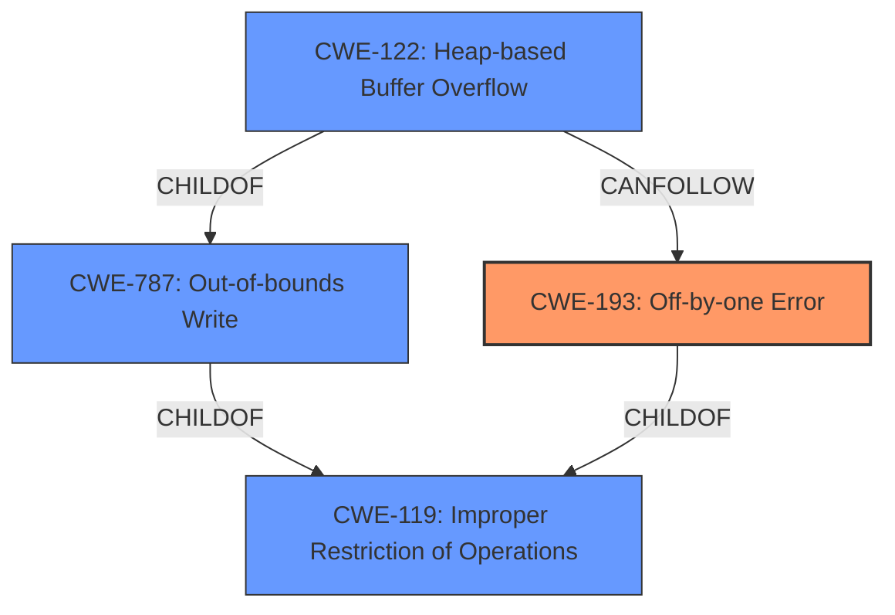

# Enhanced Analysis for CVE-2021-3156

# Summary
| CWE ID | CWE Name | Confidence | CWE Abstraction Level | CWE Vulnerability Mapping Label | CWE-Vulnerability Mapping Notes |
|---|---|---|---|---|---|
| CWE-193 | Off-by-one Error | 0.9 | Base | Allowed | Primary CWE |
| CWE-122 | Heap-based Buffer Overflow | 0.8 | Variant | Allowed | Secondary Candidate |
| CWE-119 | Improper Restriction of Operations within the Bounds of a Memory Buffer | 0.6 | Class | Discouraged | Secondary Candidate |

## Evidence and Confidence

*   **Confidence Score:** 0.8
*   **Evidence Strength:** HIGH

## Relationship Analysis
The primary weakness is an **off-by-one error** (CWE-193), which leads to a **heap-based buffer overflow** (CWE-122). CWE-122 is a variant of CWE-787 (Out-of-bounds Write). Both CWE-193 and the out-of-bounds write (CWE-787) are children of CWE-119 (Improper Restriction of Operations within the Bounds of a Memory Buffer). Therefore, the hierarchical relationship highlights the progression from a specific coding error to a more general class of memory safety issues.



## Vulnerability Chain
The vulnerability chain starts with the **off-by-one error** (CWE-193), which then results in a **heap-based buffer overflow** (CWE-122), ultimately leading to privilege escalation to root.

## Summary of Analysis
The primary cause of this vulnerability is the **off-by-one error** (CWE-193). The vulnerability description clearly states: "Sudo before 1.9.5p2 contains an **off-by-one error** that can result in a **heap-based buffer overflow**, which allows privilege escalation to root via "sudoedit -s" and a command-line argument that ends with a single backslash character." Multiple sources in the "CVE Reference Links Content Summary" confirm this root cause.

The **off-by-one error** directly leads to a **heap-based buffer overflow**, making CWE-122 a secondary weakness. While CWE-119 is a broader classification, focusing on CWE-193 and CWE-122 provides a more precise representation of the vulnerability.

The evidence supports the selection of CWE-193 as the primary CWE due to its role as the direct cause of the overflow. The "CVE Reference Links Content Summary" section reinforces this assessment.

I am confident in this assessment because the provided evidence strongly supports the identification of CWE-193 and CWE-122 as the most relevant CWEs.

Relevant CWE Information:

# Enhanced Context (25 CWEs)
The following CWEs were identified as potentially relevant to this vulnerability:

## CWE-191: Integer Underflow (Wrap or Wraparound)
**Abstraction Level**: Base
**Similarity Score**: 0.74

## CWE-131: Incorrect Calculation of Buffer Size
**Abstraction Level**: Base
**Similarity Score**: 0.73

## CWE-124: Buffer Underwrite ('Buffer Underflow')
**Abstraction Level**: Base
**Similarity Score**: 0.72

## CWE-805: Buffer Access with Incorrect Length Value
**Abstraction Level**: Base
**Similarity Score**: 0.72

## CWE-197: Numeric Truncation Error
**Abstraction Level**: Base
**Similarity Score**: 0.71

## CWE-193: Off-by-one Error
**Abstraction Level**: Base
**Similarity Score**: 0.71

## CWE-786: Access of Memory Location Before Start of Buffer
**Abstraction Level**: Base
**Similarity Score**: 0.71

## CWE-680: Integer Overflow to Buffer Overflow
**Abstraction Level**: Compound
**Similarity Score**: 0.70

## CWE-126: Buffer Over-read
**Abstraction Level**: Variant
**Similarity Score**: 0.70

## CWE-681: Incorrect Conversion between Numeric Types
**Abstraction Level**: Base
**Similarity Score**: 0.70

## CWE-193: Off-by-one Error
**Abstraction Level**: Base
**Similarity Score**: 9757.23

## CWE-190: Integer Overflow or Wraparound
**Abstraction Level**: Base
**Similarity Score**: 9702.19

## CWE-125: Out-of-bounds Read
**Abstraction Level**: Base
**Similarity Score**: 9050.02

## CWE-1284: Improper Validation of Specified Quantity in Input
**Abstraction Level**: Base
**Similarity Score**: 8961.36

## CWE-122: Heap-based Buffer Overflow
**Abstraction Level**: Variant
**Similarity Score**: 8716.82

## CWE-190: Integer Overflow or Wraparound
**Abstraction Level**: base
**Similarity Score**: 5.03

## CWE-170: Improper Null Termination
**Abstraction Level**: base
**Similarity Score**: 5.03

## CWE-195: Signed to Unsigned Conversion Error
**Abstraction Level**: variant
**Similarity Score**: 4.53

## CWE-1284: Improper Validation of Specified Quantity in Input
**Abstraction Level**: base
**Similarity Score**: 4.33

## CWE-617: Reachable Assertion
**Abstraction Level**: base
**Similarity Score**: 4.33

## CWE-123: Write-what-where Condition
**Abstraction Level**: base
**Similarity Score**: 3.89

## CWE-789: Memory Allocation with Excessive Size Value
**Abstraction Level**: variant
**Similarity Score**: 3.75

## CWE-463: Deletion of Data Structure Sentinel
**Abstraction Level**: base
**Similarity Score**: 3.64

## CWE-1339: Insufficient Precision or Accuracy of a Real Number
**Abstraction Level**: base
**Similarity Score**: 3.57

## CWE-120: Buffer Copy without Checking Size of Input ('Classic Buffer Overflow')
**Abstraction Level**: base
**Similarity Score**: 3.36

CWEs considered but not used:

*   CWE-190: Integer Overflow or Wraparound: While integer overflows can lead to buffer overflows, the primary cause in this case is the **off-by-one error**, not an integer overflow. Therefore, CWE-190 is not the most accurate representation of the root cause.
*   CWE-131: Incorrect Calculation of Buffer Size: While related to buffer overflows, the vulnerability description specifically points to an **off-by-one error** rather than a general miscalculation of the buffer size.
*   CWE-120: Buffer Copy without Checking Size of Input ('Classic Buffer Overflow'): This CWE is too general. The description specifies a more precise cause (**off-by-one error**).
*   CWE-119: Improper Restriction of Operations within the Bounds of a Memory Buffer: This is a high-level Class CWE. While technically correct (the **heap-based buffer overflow** violates memory boundaries), using the more specific CWE-122 and CWE-193 provides a more accurate and detailed classification.


## CWE Relationship Analysis

Current CWEs represent these abstraction levels: .


### Vulnerability Chain Analysis

**Chain starting from CWE-119:**
- 119 (Improper Restriction of Operations within the Bounds of a Memory Buffer) - ROOT


**Chain starting from CWE-123:**
- 123 (Write-what-where Condition) - ROOT


### CWE Relationship Diagram

```mermaid
graph TD
    classDef primary fill:#f96,stroke:#333,stroke-width:2px
    classDef secondary fill:#69f,stroke:#333
    classDef tertiary fill:#9e9,stroke:#333
```