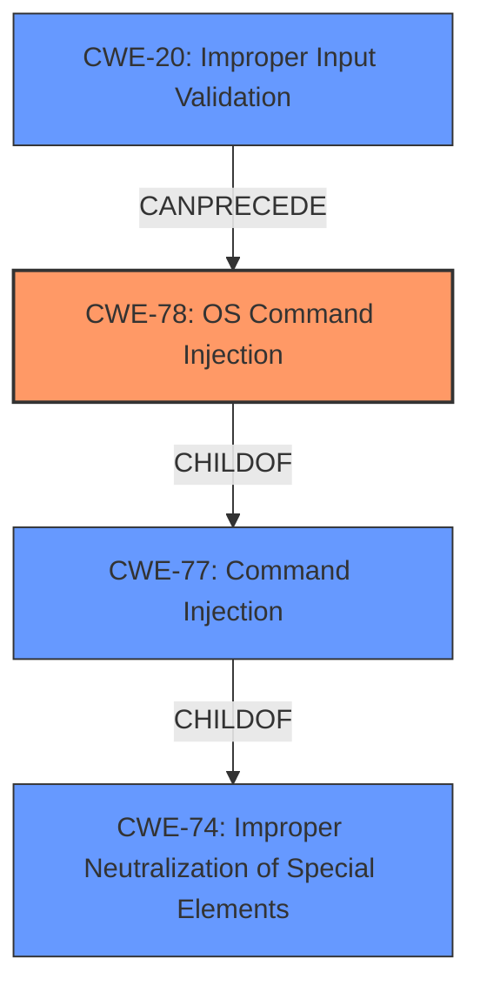

# Analysis Report for CVE-2021-31573

# Vulnerability Analysis Report: CVE-2021-31573

## Description


## Analysis (with Relationship Data)

# Summary
| CWE ID  | CWE Name                                                                                                    | Confidence | CWE Abstraction Level | CWE Vulnerability Mapping Label | CWE-Vulnerability Mapping Notes |
| :-------- | :---------------------------------------------------------------------------------------------------------- | :--------- | :---------------------- | :------------------------------ | :-------------------------------- |
| CWE-78  | Improper Neutralization of Special Elements used in an OS Command ('OS Command Injection')            | 0.95       | Base                    | Allowed                       | Primary CWE                       |
| CWE-20  | Improper Input Validation                                                                                 | 0.75       | Class                   | Discouraged                       | Secondary Candidate           |

## Evidence and Confidence

*   **Confidence Score:** 0.90
*   **Evidence Strength:** HIGH

## Relationship Analysis
The primary relationship influencing the decision is the ChildOf relationship between CWE-78 (OS Command Injection) and CWE-77 (Command Injection), with CWE-78 being a more specific case of command injection. CWE-78 is also related to CWE-74 (Improper Neutralization of Special Elements in Output Used by a Downstream Component ('Injection')), indicating a broader class of injection vulnerabilities. CWE-20 (Improper Input Validation) is a Class-level weakness that can precede many other weaknesses, including CWE-78, forming a chain. The abstraction levels guided the selection towards the more specific Base-level CWE-78, while acknowledging the broader Class-level CWE-20 as a contributing factor.



## Vulnerability Chain
The vulnerability chain starts with **improper input validation** (CWE-20), which leads to **command injection**, specifically OS command injection (CWE-78). The final impact is remote escalation of privilege.

## Summary of Analysis
The initial assessment focused on the provided information and the identified **weakness** of **command injection** due to **improper input validation**. The vulnerability description states: "In Config Manager, there is a possible **command injection** due to **improper input validation**. This could lead to remote escalation of privilege from a proximal attacker with no additional execution privileges needed."

The primary CWE match suggested CWE-787, but this seems to be an incorrect suggestion.
The retriever results show CWE-77 (Improper Neutralization of Special Elements used in a Command ('Command Injection')) and CWE-78 (Improper Neutralization of Special Elements used in an OS Command ('OS Command Injection')) as top candidates.

Based on the evidence, CWE-78 is chosen as the primary CWE because the vulnerability involves the injection of OS commands. The vulnerability description explicitly mentions "command injection," and the broader context suggests that these commands are OS-level commands rather than commands within a specific application or protocol. CWE-78 is a Base-level CWE, which is the preferred level of abstraction.

CWE-20 (Improper Input Validation) is included as a secondary CWE because the root cause of the command injection is **improper input validation**. The software fails to adequately validate the input, allowing an attacker to inject malicious commands. CWE-20 is a Class-level CWE and is discouraged for direct mapping when more specific CWEs are available. However, it is relevant here to represent the underlying cause of the vulnerability.

The selection of CWE-78 and CWE-20 provides a comprehensive view of the vulnerability, addressing both the specific weakness and the underlying root cause. The confidence in this assessment is high due to the explicit mention of "command injection" and "**improper input validation**" in the vulnerability description, and the alignment of these terms with the definitions of CWE-78 and CWE-20.

Relevant CWE Information:
# Enhanced Context (25 CWEs)

## CWE-78: Improper Neutralization of Special Elements used in an OS Command ('OS Command Injection')
**Abstraction:** Base
The product constructs all or part of an OS command using externally-influenced input from an upstream component, but it does not neutralize or incorrectly neutralizes special elements that could modify the intended OS command when it is sent to a downstream component.

This aligns with the description of the vulnerability, which involves **command injection** leading to remote escalation of privilege. The **improper input validation** allows attackers to inject special elements that modify the intended OS command.

## CWE-20: Improper Input Validation
**Abstraction:** Class
The product receives input or data, but it does not validate or incorrectly validates that the input has the properties that are required to process the data safely and correctly.

This aligns with the root cause analysis of the vulnerability, which is the **improper input validation**. The product fails to validate the input properly, allowing attackers to inject malicious code.

CWEs Considered But Not Used:

*   CWE-77 (Improper Neutralization of Special Elements used in a Command ('Command Injection')): While related, CWE-78 is more specific as it involves OS commands.
*   CWE-862 (Missing Authorization): This was considered but the description does not mention missing authorization.
*   CWE-908 (Use of Uninitialized Resource): This was considered but the description does not mention any uninitialized resource.
*   CWE-269 (Improper Privilege Management): This was considered but the description does not directly point to a privilege management issue, but rather command injection due to **improper input validation** that results in privilege escalation.
*   CWE-73 (External Control of File Name or Path): This was considered but does not seem to be the central issue.
*   CWE-667 (Improper Locking): This was considered but the description does not mention any locking issue.
*   CWE-93 (Improper Neutralization of CRLF Sequences ('CRLF Injection')): This was considered but the description does not mention any CRLF sequence issue.
*   CWE-665 (Improper Initialization): This was considered but the description does not mention any initialization issue.


## CWE Relationship Analysis

Current CWEs represent these abstraction levels: .


### Vulnerability Chain Analysis

**Chain starting from CWE-862:**
- 862 (Missing Authorization) - ROOT


**Chain starting from CWE-908:**
- 908 (Use of Uninitialized Resource) - ROOT


### CWE Relationship Diagram

```mermaid
graph TD
    classDef primary fill:#f96,stroke:#333,stroke-width:2px
    classDef secondary fill:#69f,stroke:#333
    classDef tertiary fill:#9e9,stroke:#333
```


*Report generated on 2025-03-31 05:55:33*
