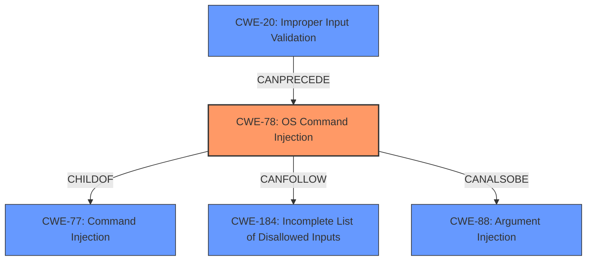

# Analysis Report for CVE-2021-31575

# Vulnerability Analysis Report: CVE-2021-31575

## Description


## Analysis (with Relationship Data)

# Summary
| CWE ID  | CWE Name                                                                                                | Confidence | CWE Abstraction Level | CWE Vulnerability Mapping Label | CWE-Vulnerability Mapping Notes |
| :-------- | :-------------------------------------------------------------------------------------------------------- | :----------- | :---------------------- | :------------------------------ | :---------------------------------- |
| CWE-78  | Improper Neutralization of Special Elements used in an OS Command ('OS Command Injection') | 1          | Base                    | Primary CWE                     | Allowed                           |
| CWE-20  | Improper Input Validation                                                                               | 0.7        | Class                     | Secondary Candidate             | Discouraged                         |

## Evidence and Confidence

*   **Confidence Score:** 0.85
*   **Evidence Strength:** HIGH

## Relationship Analysis
The primary CWE is CWE-78 which is a base CWE and a child of CWE-77.
CWE-78 has a CANFOLLOW relationship with CWE-184 (Incomplete List of Disallowed Inputs).
CWE-78 has a CANALSOBE relationship with CWE-88 (Improper Neutralization of Argument Delimiters in a Command ('Argument Injection')).
CWE-20 is a class CWE that has a CANPRECEDE relationship with CWE-78.



## Vulnerability Chain
The vulnerability chain starts with **improper input validation**, which then leads to **command injection**, and ultimately results in remote escalation of privilege.

## Summary of Analysis
The vulnerability description indicates a **command injection** due to **improper input validation**. The primary match from the provided "CWE for similar CVE Descriptions" is CWE-787, but that appears to be a typo, and based on the name it is not relevant. The retriever results list CWE-77 and CWE-78 as top candidates.

The key phrases "command injection" and "**improper input validation**" clearly point to a command injection vulnerability. The vulnerability description explicitly mentions "**improper input validation**" as the root cause, further solidifying this assessment.

CWE-78 [Improper Neutralization of Special Elements used in an OS Command ('OS Command Injection')] is chosen as the primary CWE because the description explicitly mentions a command injection vulnerability. The description of CWE-78 states: "The product constructs all or part of an OS command using externally-influenced input from an upstream component, but it does not neutralize or incorrectly neutralizes special elements that could modify the intended OS command when it is sent to a downstream component." The vulnerability allows for remote escalation of privilege due to the **command injection**. This aligns directly with the description of CWE-78. Confidence: 1.

CWE-20 [Improper Input Validation] is a secondary candidate because the vulnerability description identifies "**improper input validation**" as the root cause. However, CWE-20 is a high-level class, and the vulnerability description provides enough information to identify the more specific CWE-78. Although the retriever lists it, the MITRE guidance says "CWE-20 is commonly misused in low-information vulnerability reports when lower-level CWEs could be used instead, or when more details about the vulnerability are available [REF-1287]. It is not useful for trend analysis. It is also a level-1 Class (i.e., a child of a Pillar)." Since we have enough information for a more specific CWE, this is a secondary candidate. Confidence: 0.7

CWE-77 [Improper Neutralization of Special Elements used in a Command ('Command Injection')] was considered, but CWE-78 is more specific because it explicitly refers to OS commands, whereas CWE-77 is a more general case. While the description doesn't explicitly say it's an OS command, this is strongly implied.
CWE-862 [Missing Authorization] was considered, but the vulnerability description does not mention any missing authorization checks. The issue is related to input validation, not authorization.
CWE-908 [Use of Uninitialized Resource] was considered, but the description gives no indication about the usage of an unitialized resource.
CWE-269 [Improper Privilege Management] was considered because the impact of the vulnerability is a "remote escalation of privilege", but that is not the root cause.
CWE-73 [External Control of File Name or Path] was considered, but the vulnerability description does not mention anything about filenames or paths.
CWE-667 [Improper Locking] was considered, but the vulnerability description does not mention anything about locking issues.
CWE-93 [Improper Neutralization of CRLF Sequences ('CRLF Injection')] was considered, but the vulnerability description does not mention CRLF sequences.
CWE-665 [Improper Initialization] was considered, but the vulnerability description does not mention any initialization issues.


## CWE Relationship Analysis

Current CWEs represent these abstraction levels: .


### Vulnerability Chain Analysis

**Chain starting from CWE-862:**
- 862 (Missing Authorization) - ROOT


**Chain starting from CWE-184:**
- 184 (Incomplete List of Disallowed Inputs) - ROOT


### CWE Relationship Diagram

```mermaid
graph TD
    classDef primary fill:#f96,stroke:#333,stroke-width:2px
    classDef secondary fill:#69f,stroke:#333
    classDef tertiary fill:#9e9,stroke:#333
```


*Report generated on 2025-03-30 11:53:42*
