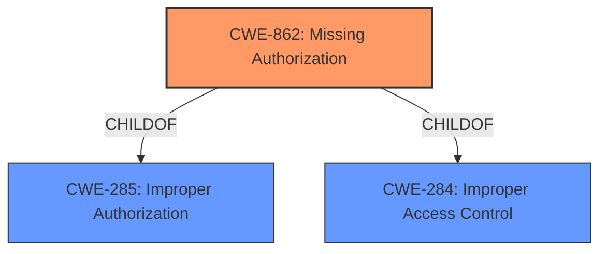

# Analysis for CVE-2021-31576

# Summary
| CWE ID  | CWE Name | Confidence | CWE Abstraction Level | CWE Vulnerability Mapping Label | CWE-Vulnerability Mapping Notes |
| ------------- | ------------- | ------------- | ------------- | ------------- | ------------- |
| CWE-862 | Missing Authorization | 1 | Class | Allowed-with-Review | Primary CWE |

## Evidence and Confidence

*   **Confidence Score:** 1
*   **Evidence Strength:** HIGH

## Relationship Analysis
The primary CWE is CWE-862 (Missing Authorization), which is a Class-level CWE. The analysis considered the parent-child relationships. While CWE-862 is a Class, the description clearly indicates the root cause is a **missing permission check**, which directly corresponds to the definition of Missing Authorization.

## Vulnerability Chain
The vulnerability chain is straightforward: a **missing permission check** (CWE-862) leads to remote information disclosure.

## Summary of Analysis
The analysis is based on the vulnerability description, which explicitly states a "**missing permission check**". This directly aligns with CWE-862 (Missing Authorization).

The vulnerability description includes the key phrase "**missing permission check**," indicating a failure to perform authorization. The impact is remote information disclosure, which is a consequence of the **missing permission check**. The evidence is strong, leading to a high confidence score.

CWE-862 is selected because the **root cause** is a **missing authorization check**. While it's a Class-level CWE, there are no more specific children that directly address the "missing" aspect of the authorization failure.

Relevant CWE Information:

# Enhanced Context (25 CWEs)
## CWE-807: Reliance on Untrusted Inputs in a Security Decision
**Abstraction Level**: Base
**Similarity Score**: 0.77
**Source**: dense
This CWE was not chosen because the vulnerability isn't specifically about relying on untrusted inputs for security decisions, but rather the absence of any authorization check.

## CWE-667: Improper Locking
**Abstraction Level**: Class
**Similarity Score**: 0.76
**Source**: dense
This CWE was not chosen because the vulnerability doesn't involve concurrency or locking issues.

## CWE-404: Improper Resource Shutdown or Release
**Abstraction Level**: Class
**Similarity Score**: 0.76
**Source**: dense
This CWE was not chosen because the vulnerability doesn't involve resource management or shutdown issues.

## CWE-1289: Improper Validation of Unsafe Equivalence in Input
**Abstraction Level**: Base
**Similarity Score**: 0.76
**Source**: dense
This CWE was not chosen because the vulnerability isn't about improper validation of input equivalence.

## CWE-451: User Interface (UI) Misrepresentation of Critical Information
**Abstraction Level**: Class
**Similarity Score**: 0.76
**Source**: dense
This CWE was not chosen because the vulnerability doesn't involve UI misrepresentation.

## CWE-668: Exposure of Resource to Wrong Sphere
**Abstraction Level**: Class
**Similarity Score**: 0.76
**Source**: dense
This CWE was not chosen because it is too high-level and a more specific CWE (CWE-862) is available.

## CWE-653: Improper Isolation or Compartmentalization
**Abstraction Level**: Class
**Similarity Score**: 0.76
**Source**: dense
This CWE was not chosen because the vulnerability isn't about isolation or compartmentalization issues.

## CWE-41: Improper Resolution of Path Equivalence
**Abstraction Level**: Base
**Similarity Score**: 0.76
**Source**: dense
This CWE was not chosen because the vulnerability isn't related to path equivalence issues.

## CWE-754: Improper Check for Unusual or Exceptional Conditions
**Abstraction Level**: Class
**Similarity Score**: 0.76
**Source**: dense
This CWE was not chosen because the vulnerability is specifically about missing authorization, not just a general failure to check conditions.

## CWE-226: Sensitive Information in Resource Not Removed Before Reuse
**Abstraction Level**: Base
**Similarity Score**: 0.75
**Source**: dense
This CWE was not chosen because the vulnerability doesn't involve resource reuse or clearing sensitive information.

## CWE-367: Time-of-check Time-of-use (TOCTOU) Race Condition
**Abstraction Level**: Base
**Similarity Score**: 5942.08
**Source**: sparse
This CWE was not chosen because the vulnerability doesn't involve a TOCTOU race condition.

## CWE-362: Concurrent Execution using Shared Resource with Improper Synchronization ('Race Condition')
**Abstraction Level**: Class
**Similarity Score**: 5921.03
**Source**: sparse
This CWE was not chosen because the vulnerability doesn't involve concurrency or synchronization issues.

## CWE-863: Incorrect Authorization
**Abstraction Level**: Class
**Similarity Score**: 5834.57
**Source**: sparse
This CWE was not chosen because the description indicates authorization is missing, not incorrectly implemented.

## CWE-1284: Improper Validation of Specified Quantity in Input
**Abstraction Level**: Base
**Similarity Score**: 5787.01
**Source**: sparse
This CWE was not chosen because the vulnerability isn't about validating input quantities.

## CWE-116: Improper Encoding or Escaping of Output
**Abstraction Level**: Class
**Similarity Score**: 5746.20
**Source**: sparse
This CWE was not chosen because the vulnerability doesn't involve output encoding or escaping issues.

## CWE-73: External Control of File Name or Path
**Abstraction Level**: base
**Similarity Score**: 4.33
**Source**: graph
This CWE was not chosen because the vulnerability isn't about external control of file names or paths.

## CWE-22: Improper Limitation of a Pathname to a Restricted Directory ('Path Traversal')
**Abstraction Level**: base
**Similarity Score**: 4.33
**Source**: graph
This CWE was not chosen because the vulnerability isn't about path traversal issues.

## CWE-190: Integer Overflow or Wraparound
**Abstraction Level**: base
**Similarity Score**: 4.33
**Source**: graph
This CWE was not chosen because the vulnerability doesn't involve integer overflows or wraparounds.

## CWE-770: Allocation of Resources Without Limits or Throttling
**Abstraction Level**: base
**Similarity Score**: 4.33
**Source**: graph
This CWE was not chosen because the vulnerability isn't about resource allocation issues.

## CWE-476: NULL Pointer Dereference
**Abstraction Level**: base
**Similarity Score**: 4.33
**Source**: graph
This CWE was not chosen because the vulnerability doesn't involve null pointer dereferences.

## CWE-1272: Sensitive Information Uncleared Before Debug/Power State Transition
**Abstraction Level**: base
**Similarity Score**: 4.33
**Source**: graph
This CWE was not chosen because the vulnerability doesn't involve debug/power state transitions.

## CWE-1284: Improper Validation of Specified Quantity in Input
**Abstraction Level**: base
**Similarity Score**: 3.89
**Source**: graph
This CWE was not chosen because the vulnerability isn't about improper validation of specified quantity in input.

## CWE-416: Use After Free
**Abstraction Level**: variant
**Similarity Score**: 3.75
**Source**: graph
This CWE was not chosen because the vulnerability doesn't involve use-after-free issues.

## CWE-843: Access of Resource Using Incompatible Type ('Type Confusion')
**Abstraction Level**: base
**Similarity Score**: 3.44
**Source**: graph
This CWE was not chosen because the vulnerability doesn't involve type confusion issues.

## CWE-123: Write-what-where Condition
**Abstraction Level**: base
**Similarity Score**: 3.36
**Source**: graph
This CWE was not chosen because the vulnerability doesn't involve write-what-where conditions.