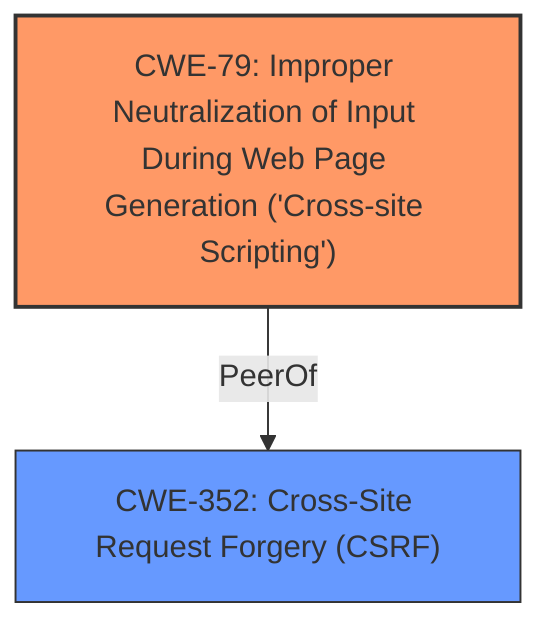

# Raw Analyzer Response for CVE-2021-31676

# Summary
| CWE ID | CWE Name | Confidence | CWE Abstraction Level | CWE Vulnerability Mapping Label | CWE-Vulnerability Mapping Notes |
|---|---|---|---|---|---|
| CWE-79 | Improper Neutralization of Input During Web Page Generation ('Cross-site Scripting') | 1.0 | Base | Allowed | Primary CWE: Reflected XSS vulnerability due to lack of input sanitization and output encoding. |
| CWE-352 | Cross-Site Request Forgery (CSRF) | 1.0 | Compound | Allowed | Secondary CWE: Multiple instances of CSRF vulnerabilities due to missing CSRF protection mechanisms. |

## Evidence and Confidence

*   **Confidence Score:** 1.0
*   **Evidence Strength:** HIGH

## Relationship Analysis
The primary weakness is CWE-79, which represents the reflected XSS vulnerability. CWE-352 is a secondary weakness, representing the multiple CSRF vulnerabilities. CWE-79 is related to CWE-352, as XSS can be used in conjunction with CSRF to amplify the impact of attacks.

## Vulnerability Chain
The vulnerabilities consist of the following chains:

1.  **CSRF Vulnerabilities:** Missing CSRF protection leading to unauthorized modifications and deletions.
    *   Root Cause: **Missing CSRF token or other mechanism to validate the origin of the request.**
    *   Impact: Modification of admin profile, deletion of user accounts, deletion of important data.
2.  **Reflected XSS Vulnerability:** Lack of input sanitization and output encoding leading to arbitrary JavaScript execution.
    *   Root Cause: **Lack of input sanitization and output encoding.**
    *   Impact: Execution of arbitrary JavaScript code in the context of a victim's browser.

## Summary of Analysis
The primary vulnerability is CWE-79, as the application **does not neutralize user-controllable input** before placing it in output used as a web page. The evidence for this is: "The file `pescms/App/Team/GET/Repoort.php` directly outputs user-supplied parameters `begin` and `end` from the GET request without proper sanitization." This aligns perfectly with the CWE-79 description: "The product does not neutralize or incorrectly neutralizes user-controllable input before it is placed in output that is used as a web page that is served to other users."

Additionally, multiple instances of CSRF vulnerabilities are present. The evidence for this is: "The file `pescms/App/Team/PUT/User.php` allows modification of personal information without proper CSRF protection." and "The files `pescms/App/Team/DELETE/Content.php` and `pescms/App/Team/DELETE/Field.php` allow deletion of user accounts through a direct request, without proper CSRF protection." This aligns with the CWE-352 description: "The web application does not, or can not, sufficiently verify whether a well-formed, valid, consistent request was intentionally provided by the user who submitted the request."

CWE-79 is at the Base level of abstraction, which is preferred. CWE-352 is a Compound weakness.
CWE-80 was considered, but CWE-79 is a more general, more appropriate fit.
CWE-116 was considered, but it's a class-level CWE and not as specific as CWE-79.
CWE-434, CWE-1004, CWE-73, CWE-644, and CWE-918 are not applicable, as they do not directly relate to the described vulnerabilities.