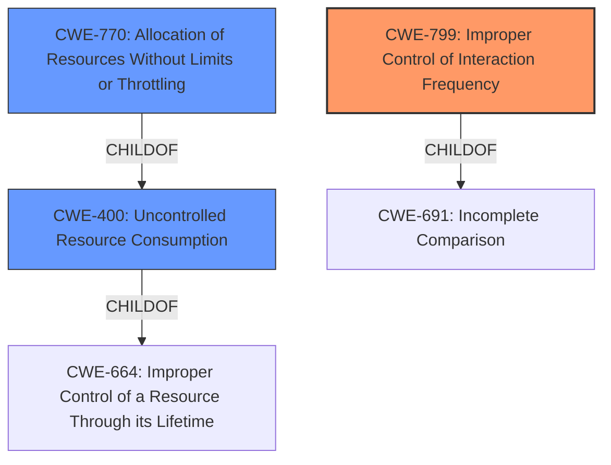

# Analysis Report for CVE-2021-3172

# Vulnerability Analysis Report: CVE-2021-3172

## Description


## Analysis (with Relationship Data)

# Summary
| CWE ID | CWE Name | Confidence | CWE Abstraction Level | CWE Vulnerability Mapping Label | CWE-Vulnerability Mapping Notes |
|---|---|---|---|---|---|
| CWE-799 | Improper Control of Interaction Frequency | 0.9 | Class | Allowed-with-Review | Primary CWE |
| CWE-770 | Allocation of Resources Without Limits or Throttling | 0.7 | Base | Allowed | Secondary Candidate |
| CWE-400 | Uncontrolled Resource Consumption | 0.6 | Class | Discouraged | Secondary Candidate |

## Evidence and Confidence

*   **Confidence Score:** 0.8
*   **Evidence Strength:** HIGH

## Relationship Analysis
The primary CWE, CWE-799 (Improper Control of Interaction Frequency), is a Class-level CWE, and the retriever result indicated that it might have more specific Base-level children that would be more appropriate. The analysis considered CWE-770 (Allocation of Resources Without Limits or Throttling), which is a child of CWE-400 (Uncontrolled Resource Consumption), and is related to resource management. Both CWE-770 and CWE-400 were considered as they relate to the potential for a denial-of-service attack.



## Vulnerability Chain
The vulnerability chain starts with a **lack of proper input validation and rate limiting** in the poll voting feature. This leads to the ability for an authenticated user to vote multiple times, which in turn allows for poll result manipulation and potentially a distributed denial-of-service (DDoS) attack.

## Summary of Analysis
The initial analysis focused on the vulnerability description, which clearly indicated a **lack of rate limiting** in the poll voting feature. The "CVE Reference Links Content Summary" section provided strong evidence for this, stating, "The root cause of the vulnerability is the lack of proper input validation and rate limiting in the poll voting feature of PHP-Fusion. Specifically, the application did not prevent a logged-in user from voting multiple times." This directly supports the selection of CWE-799 (Improper Control of Interaction Frequency) as the primary CWE.

The analysis also considered the potential for resource exhaustion, as the ability to vote multiple times could lead to a denial-of-service attack. However, the primary weakness is the **improper control of interaction frequency**, which enables the attacker to **cause** the denial of service. The fix implemented involved tracking user IP addresses and implementing a form token, further reinforcing the idea that the core issue is the lack of proper control over voting frequency.

CWE-799 is the most appropriate because the root cause is the **improper limitation on the number of times an actor can interact with the system**, leading to a denial of service.

Relevant CWE Information:

# Enhanced Context (25 CWEs)

## CWE-799: Improper Control of Interaction Frequency
**Abstraction Level**: Class
**Similarity Score**: 0.76
**Source**: dense

**Description**:
The product does not properly limit the number or frequency of interactions that it has with an actor, such as the number of incoming requests.

**Mapping Guidance**:
- Usage: Allowed-with-Review
- Rationale: This CWE entry is a Class and might have Base-level children that would be more appropriate

## CWE-400: Uncontrolled Resource Consumption
**Abstraction Level**: Class
**Similarity Score**: 0.75
**Source**: dense

**Description**:
The product does not properly control the allocation and maintenance of a limited resource, thereby enabling an actor to influence the amount of resources consumed, eventually leading to the exhaustion of available resources.

**Mapping Guidance**:
- Usage: Discouraged
- Rationale: CWE-400 is intended for incorrect behaviors in which the product is expected to track and restrict how many resources it consumes, but CWE-400 is often misused because it is conflated with the "technical impact" of vulnerabilities in which resource consumption occurs. It is sometimes used for low-information vulnerability reports. It is a level-1 Class (i.e., a child of a Pillar).

## CWE-770: Allocation of Resources Without Limits or Throttling
**Abstraction Level**: Base
**Similarity Score**: 7720.17
**Source**: sparse

**Description**:
The product allocates a reusable resource or group of resources on behalf of an actor without imposing any restrictions on the size or number of resources that can be allocated, in violation of the intended security policy for that actor.

**Mapping Guidance**:
- Usage: Allowed
- Rationale: This CWE entry is at the Base level of abstraction, which is a preferred level of abstraction for mapping to the root causes of vulnerabilities.


## CWE Relationship Analysis

Current CWEs represent these abstraction levels: .


### Vulnerability Chain Analysis

**Chain starting from CWE-400:**
- 400 (Uncontrolled Resource Consumption) - ROOT


**Chain starting from CWE-799:**
- 799 (Improper Control of Interaction Frequency) - ROOT


### CWE Relationship Diagram

```mermaid
graph TD
    classDef primary fill:#f96,stroke:#333,stroke-width:2px
    classDef secondary fill:#69f,stroke:#333
    classDef tertiary fill:#9e9,stroke:#333
```


*Report generated on 2025-03-30 20:54:05*
