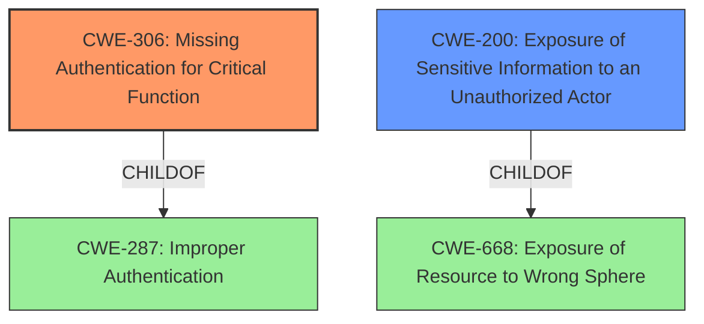

# Analysis for CVE-2021-31814

# Summary
| CWE ID | CWE Name | Confidence | CWE Abstraction Level | CWE Vulnerability Mapping Label | CWE-Vulnerability Mapping Notes |
|---|---|---|---|---|---|
| CWE-306 | Missing Authentication for Critical Function | 1.0 | Base | Primary | Allowed |
| CWE-200 | Exposure of Sensitive Information to an Unauthorized Actor | 0.7 | Class | Secondary | Discouraged |

## Evidence and Confidence

*   **Confidence Score:** 0.9
*   **Evidence Strength:** HIGH

## Relationship Analysis
The primary relationship influencing the CWE selection is the ChildOf relationship between CWE-306 and CWE-287 (Improper Authentication). CWE-306 is a more specific case of CWE-287, indicating a **missing authentication** mechanism for a critical function, which directly aligns with the vulnerability description. CWE-200 is a parent of CWE-668, highlighting how sensitive information is exposed, a consequence of the missing authentication.

## Vulnerability Chain
The vulnerability chain starts with the **missing authentication** on the OpenVPN management interface, leading to the ability to terminate VPN sessions (Denial of Service) and read logs (Information Leak).
  - Root Cause: **Missing Authentication** (CWE-306)
  - Impact 1: Denial of Service
  - Impact 2: Information Leak (CWE-200)

## Summary of Analysis
The initial analysis identified the **lack of authentication** on the OpenVPN management interface as the primary weakness. This assessment is based on the CVE Reference Links Content Summary, which states, "The root cause is the **lack of authentication** on the OpenVPN management interface within the Stormshield SSL VPN Client." The graph relationships confirm that CWE-306 is a specific type of authentication issue and is the most appropriate choice.

The selection of CWE-306 is at the optimal level of specificity because it directly reflects the root cause, which is the **missing authentication** for a critical function (OpenVPN management interface). While CWE-287 (Improper Authentication) is a parent, it's less specific. CWE-200 (Exposure of Sensitive Information to an Unauthorized Actor) is considered a secondary weakness because it's a consequence of the **missing authentication**, where an attacker can read logs and view the status of active VPN connections.

Relevant CWE Information:

# Enhanced Context (25 CWEs)

## CWE-1240: Use of a Cryptographic Primitive with a Risky Implementation
**Abstraction Level**: Base
**Similarity Score**: 0.80

This CWE is not applicable because the vulnerability is not related to the implementation of a cryptographic algorithm but rather the absence of authentication.

## CWE-345: Insufficient Verification of Data Authenticity
**Abstraction Level**: Class
**Similarity Score**: 0.79

This CWE is not applicable as the primary issue is the absence of authentication, not the verification of data authenticity.

## CWE-319: Cleartext Transmission of Sensitive Information
**Abstraction Level**: Base
**Similarity Score**: 0.79

This CWE is not applicable because the vulnerability is not about transmitting sensitive information in cleartext.

## CWE-303: Incorrect Implementation of Authentication Algorithm
**Abstraction Level**: Base
**Similarity Score**: 0.78

This CWE is not applicable because the vulnerability is not related to an incorrect implementation of an authentication algorithm but rather the absence of authentication.

## CWE-1391: Use of Weak Credentials
**Abstraction Level**: Class
**Similarity Score**: 0.78

This CWE is not applicable as there is no mention of credentials being used in this vulnerability.

## CWE-330: Use of Insufficiently Random Values
**Abstraction Level**: Class
**Similarity Score**: 0.78

This CWE is not applicable because the vulnerability is not about the use of random values.

## CWE-203: Observable Discrepancy
**Abstraction Level**: Base
**Similarity Score**: 0.78

This CWE is not applicable because the vulnerability is not about an observable discrepancy but rather the absence of authentication.

## CWE-328: Use of Weak Hash
**Abstraction Level**: Base
**Similarity Score**: 0.77

This CWE is not applicable because the vulnerability is not about the use of a weak hash function.

## CWE-807: Reliance on Untrusted Inputs in a Security Decision
**Abstraction Level**: Base
**Similarity Score**: 0.77

This CWE is not applicable because the vulnerability is not about relying on untrusted inputs.

## CWE-311: Missing Encryption of Sensitive Data
**Abstraction Level**: Class
**Similarity Score**: 0.77

This CWE is not applicable because the vulnerability is not about missing encryption.

## CWE-200: Exposure of Sensitive Information to an Unauthorized Actor
**Abstraction Level**: Class
**Similarity Score**: 6096.19

This CWE is applicable as a secondary classification because the **missing authentication** leads to sensitive information being exposed. The "CVE Reference Links Content Summary" section states that the attacker can "read logs and view the status of active VPN connections," which aligns with the description of CWE-200: "The product exposes sensitive information to an actor that is not explicitly authorized to have access to that information." While CWE-200 is discouraged as a primary CWE, it can be used to represent the impact of the vulnerability.

## CWE-327: Use of a Broken or Risky Cryptographic Algorithm
**Abstraction Level**: Class
**Similarity Score**: 6087.72

This CWE is not applicable because the vulnerability is not about a broken or risky cryptographic algorithm.

## CWE-863: Incorrect Authorization
**Abstraction Level**: Class
**Similarity Score**: 6046.96

This CWE is not applicable because the vulnerability's root cause is the **lack of authentication**, not an incorrect authorization mechanism.

## CWE-367: Time-of-check Time-of-use (TOCTOU) Race Condition
**Abstraction Level**: Base
**Similarity Score**: 6030.47

This CWE is not applicable because the vulnerability is not related to a time-of-check time-of-use race condition.

## CWE-639: Authorization Bypass Through User-Controlled Key
**Abstraction Level**: Base
**Similarity Score**: 5943.53

This CWE is not applicable because the vulnerability is not about authorization bypass through a user-controlled key.

## CWE-613: Insufficient Session Expiration
**Abstraction Level**: base
**Similarity Score**: 4.33

This CWE is not applicable because the vulnerability is not related to session expiration.

## CWE-252: Unchecked Return Value
**Abstraction Level**: base
**Similarity Score**: 3.80

This CWE is not applicable because the vulnerability is not related to unchecked return values.

## CWE-1289: Improper Validation of Unsafe Equivalence in Input
**Abstraction Level**: base
**Similarity Score**: 3.64

This CWE is not applicable because the vulnerability is not related to improper validation of equivalence in input.

## CWE-178: Improper Handling of Case Sensitivity
**Abstraction Level**: base
**Similarity Score**: 3.64

This CWE is not applicable because the vulnerability is not related to case sensitivity.

## CWE-289: Authentication Bypass by Alternate Name
**Abstraction Level**: base
**Similarity Score**: 2.73

This CWE is not applicable because the vulnerability is not related to authentication bypass by alternate name.

## CWE-416: Use After Free
**Abstraction Level**: variant
**Similarity Score**: 2.68

This CWE is not applicable because the vulnerability is not related to use-after-free issues.

## CWE-499: Serializable Class Containing Sensitive Data
**Abstraction Level**: variant
**Similarity Score**: 2.68

This CWE is not applicable because the vulnerability is not related to serializable classes containing sensitive data.

## CWE-498: Cloneable Class Containing Sensitive Information
**Abstraction Level**: variant
**Similarity Score**: 2.68

This CWE is not applicable because the vulnerability is not related to cloneable classes containing sensitive information.

## CWE-942: Permissive Cross-domain Policy with Untrusted Domains
**Abstraction Level**: variant
**Similarity Score**: 2.6