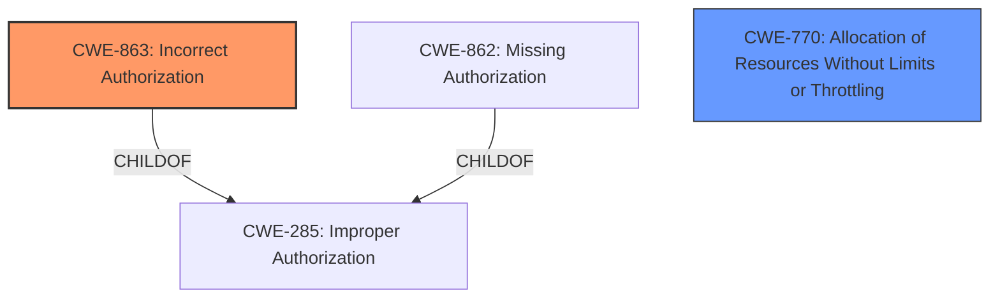

# Raw Analyzer Response for CVE-2021-31876

# Summary
| CWE ID  | CWE Name                                                   | Confidence | CWE Abstraction Level | CWE Vulnerability Mapping Label | CWE-Vulnerability Mapping Notes |
|---------|------------------------------------------------------------|------------|-----------------------|---------------------------------|-----------------------------------|
| CWE-863 | Incorrect Authorization                                    | 0.8        | Class                 | Primary                         | Allowed-with-Review             |
| CWE-770 | Allocation of Resources Without Limits or Throttling       | 0.6        | Base                  | Secondary                       | Allowed                           |

## Evidence and Confidence

*   **Confidence Score:** 0.7
*   **Evidence Strength:** HIGH

## Relationship Analysis
The primary relationship that impacts the decision is the hierarchical relationship between CWE-285 (Improper Authorization) and its children, CWE-862 (Missing Authorization) and CWE-863 (Incorrect Authorization). The vulnerability description points to an **incorrect implementation** of the BIP125 replacement policy, leading to **incorrect authorization**, making CWE-863 a more specific and appropriate choice than its parent. Also, there is a peer relationship between CWE-789 and CWE-1325, where both relate to allocation of memory with excessive size value. This relationship led to the consideration of the root cause of the excessive allocation, which is CWE-770.

## Vulnerability Chain
The vulnerability chain starts with the **incorrect implementation** of the BIP125 replacement policy (CWE-863), which leads to a failure to properly authorize transaction replacements. The attacker can then exploit this by pinning transactions. An attacker can also exhaust resources by creating a large number of these unreplaceable transactions (CWE-770), leading to a denial of service.

## Summary of Analysis
The initial analysis focused on the **incorrect implementation** of the BIP125 replacement policy. The evidence from the "Vulnerability Description Key Phrases" section states "rootcause: **does not properly implement the replacement policy specified in BIP125**". Also, the "CVE Reference Links Content Summary" section states "**Incorrect implementation of BIP125**: Bitcoin Core's mempool logic fails to recognize that a child transaction inherits replaceability from a replaceable parent." This directly supports the selection of CWE-863 (Incorrect Authorization), as it reflects the **incorrect** authorization check performed by the system.

The Retriever Results also listed CWE-863 as the top combined result. While other CWEs like CWE-770 (Allocation of Resources Without Limits or Throttling) and CWE-1284 (Improper Validation of Specified Quantity in Input) were considered, they represent potential impacts or contributing factors rather than the root cause.

The choice of CWE-863 is at the appropriate level of specificity, as it directly addresses the authorization issue. CWE-285 (Improper Authorization) is a more general class, while CWE-862 (Missing Authorization) doesn't accurately describe the scenario, as the system does perform an authorization check, but it does so incorrectly.

The selection of CWE-770 is based on the "impact" description which states "denial of service attack". Also, the "CVE Reference Links Content Summary" section states "Attackers leverage the discrepancy in how inherited RBF signaling is handled. The attack relies on a low-fee child transaction that is not replaceable, preventing replacement of the parent." This allows an attacker to create a large number of transactions, which can lead to resource exhaustion.

Relevant CWE Information:

# Enhanced Context (25 CWEs)
The following CWEs were identified as potentially relevant to this vulnerability:

## CWE-1289: Improper Validation of Unsafe Equivalence in Input
**Abstraction Level**: Base
**Similarity Score**: 0.75
**Source**: dense

**Description**:
The product receives an input value that is used as a resource identifier or other type of reference, but it does not validate or incorrectly validates that the input is equivalent to a potentially-unsafe value.

**Mapping Guidance**:
- Usage: Allowed
- Rationale: This CWE entry is at the Base level of abstraction, which is a preferred level of abstraction for mapping to the root causes of vulnerabilities.

## CWE-274: Improper Handling of Insufficient Privileges
**Abstraction Level**: Base
**Similarity Score**: 0.75
**Source**: dense

**Description**:
The product does not handle or incorrectly handles when it has insufficient privileges to perform an operation, leading to resultant weaknesses.

**Mapping Guidance**:
- Usage: Discouraged
- Rationale: This CWE entry could be deprecated in a future version of CWE.

## CWE-280: Improper Handling of Insufficient Permissions or Privileges 
**Abstraction Level**: Base
**Similarity Score**: 0.75
**Source**: dense

**Description**:
The product does not handle or incorrectly handles when it has insufficient privileges to access resources or functionality as specified by their permissions. This may cause it to follow unexpected code paths that may leave the product in an invalid state.

**Mapping Guidance**:
- Usage: Allowed
- Rationale: This CWE entry is at the Base level of abstraction, which is a preferred level of abstraction for mapping to the root causes of vulnerabilities.

## CWE-404: Improper Resource Shutdown or Release
**Abstraction Level**: Class
**Similarity Score**: 0.74
**Source**: dense

**Description**:
The product does not release or incorrectly releases a resource before it is made available for re-use.

**Mapping Guidance**:
- Usage: Allowed-with-Review
- Rationale: This CWE entry is a Class and might have Base-level children that would be more appropriate

## CWE-807: Reliance on Untrusted Inputs in a Security Decision
**Abstraction Level**: Base
**Similarity Score**: 0.74
**Source**: dense

**Description**:
The product uses a protection mechanism that relies on the existence or values of an input, but the input can be modified by an untrusted actor in a way that bypasses the protection mechanism.

**Mapping Guidance**:
- Usage: Allowed
- Rationale: This CWE entry is at the Base level of abstraction, which is a preferred level of abstraction for mapping to the root causes of vulnerabilities.

## CWE-345: Insufficient Verification of Data Authenticity
**Abstraction Level**: Class
**Similarity Score**: 0.74
**Source**: dense

**Description**:
The product does not sufficiently verify the origin or authenticity of data, in a way that causes it to accept invalid data.

**Mapping Guidance**:
- Usage: Discouraged
- Rationale: This CWE entry is a level-1 Class (i.e., a child of a Pillar). It might have lower-level children that would be more appropriate

## CWE-1390: Weak Authentication
**Abstraction Level**: Class
**Similarity Score**: 0.74
**Source**: dense

**Description**:
The product uses an authentication mechanism to restrict access to specific users or identities, but the mechanism does not sufficiently prove that the claimed identity is correct.

**Mapping Guidance**:
- Usage: Allowed-with-Review
- Rationale: This CWE entry is a Class and might have Base-level children that would be more appropriate

## CWE-668: Exposure of Resource to Wrong Sphere
**Abstraction Level**: Class
**Similarity Score**: 0.74
**Source**: dense

**Description**:
The product exposes a resource to the wrong control sphere, providing unintended actors with inappropriate access to the resource.

**Mapping Guidance**:
- Usage: Discouraged
- Rationale: CWE-668 is high-level and is often misused as a catch-all when lower-level CWE IDs might be applicable. It is sometimes used for low-information vulnerability reports [REF-1287]. It is a level-1 Class (i.e., a child of a Pillar). It is not useful for trend analysis.

## CWE-703: Improper Check or Handling of Exceptional Conditions
**Abstraction Level**: Pillar
**Similarity Score**: 0.74
**Source**: dense

**Description**:
The product does not properly anticipate or handle exceptional conditions that rarely occur during normal operation of the product.

**Mapping Guidance**:
- Usage: Discouraged
- Rationale: This CWE entry is extremely high-level, a Pillar.

## CWE-303: Incorrect Implementation of Authentication Algorithm
**Abstraction Level**: Base
**Similarity Score**: 0.74
**Source**: dense

**Description**:
The requirements for the product dictate the use of an established authentication algorithm, but the implementation of the algorithm is incorrect.

**Mapping Guidance**:
- Usage: Allowed