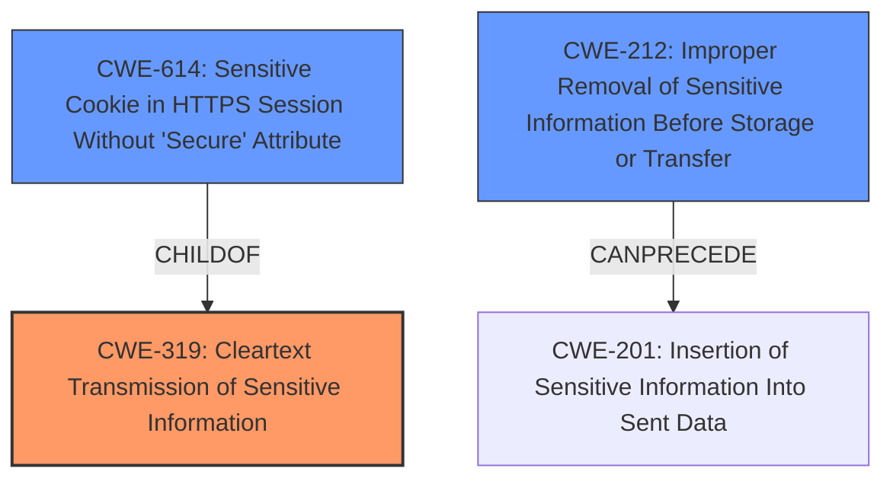

# Raw Analyzer Response for CVE-2021-31898

# Summary
| CWE ID  | CWE Name                                                      | Confidence | CWE Abstraction Level | CWE Vulnerability Mapping Label | CWE-Vulnerability Mapping Notes |
| :-------- | :------------------------------------------------------------ | :--------- | :---------------------- | :------------------------------ | :-------------------------------- |
| CWE-319   | Cleartext Transmission of Sensitive Information             | 1          | Base                    | Allowed                       | Primary CWE                      |
| CWE-614   | Sensitive Cookie in HTTPS Session Without 'Secure' Attribute | 0.7        | Variant                 | Allowed                       | Secondary candidate              |
| CWE-212   | Improper Removal of Sensitive Information Before Storage or Transfer | 0.6        | Base                    | Allowed                       | Secondary candidate              |

## Evidence and Confidence

*   **Confidence Score:** 0.9
*   **Evidence Strength:** HIGH

## Relationship Analysis
The primary relationship is that CWE-614 is a ChildOf CWE-319, indicating a more specific case of transmitting sensitive information in cleartext. CWE-212 has a CanPrecede relationship to CWE-201 (Insertion of Sensitive Information Into Sent Data) which could be a related weakness, but is not the primary concern here. Choosing CWE-319 as the primary CWE is justified because the vulnerability explicitly involves transmitting data without encryption, and it's at the Base level.

## Vulnerability Chain
The vulnerability chain starts with the **insecure** use of HTTP instead of HTTPS, leading to the **transmission of sensitive information in cleartext**. This can then lead to potential interception of data by attackers.

## Summary of Analysis
The vulnerability description clearly states that "HTTP requests were used instead of HTTPS." The CVE Reference Links Content Summary further reinforces this by stating, "The vulnerability is caused by the use of HTTP requests instead of HTTPS requests in WebStorm." This **weakness** directly aligns with the description of CWE-319, "Cleartext Transmission of Sensitive Information," which involves transmitting sensitive data without encryption. The use of HTTP, an **insecure** protocol, directly exposes data to potential eavesdropping, satisfying the conditions for CWE-319.

CWE-614, "Sensitive Cookie in HTTPS Session Without 'Secure' Attribute," was considered because it's a more specific variant of sending sensitive information without proper protection. However, the provided vulnerability description doesn't explicitly mention cookies. While cookies might be involved, the core issue is the general use of HTTP, making CWE-319 a more accurate primary classification.

CWE-212, "Improper Removal of Sensitive Information Before Storage or Transfer," was also considered. While sensitive information is being transferred, the core issue isn't about failing to remove it, but about transmitting it **insecurely** in the first place.

I am confident in selecting CWE-319 as the primary CWE because it directly addresses the root cause of the vulnerability, which is the use of HTTP instead of HTTPS, leading to the **cleartext transmission of sensitive information.**

Relevant CWE Information:

# Enhanced Context (25 CWEs)

## CWE-436: Interpretation Conflict
**Abstraction Level**: Class
**Similarity Score**: 0.76
**Source**: dense

**Description**:
Product A handles inputs or steps differently than Product B, which causes A to perform incorrect actions based on its perception of B's state.

**Mapping Guidance**:
- Usage: Allowed-with-Review
- Rationale: This CWE entry is a Class and might have Base-level children that would be more appropriate

## CWE-74: Improper Neutralization of Special Elements in Output Used by a Downstream Component ('Injection')
**Abstraction Level**: Class
**Similarity Score**: 0.75
**Source**: dense

**Description**:
The product constructs all or part of a command, data structure, or record using externally-influenced input from an upstream component, but it does not neutralize or incorrectly neutralizes special elements that could modify how it is parsed or interpreted when it is sent to a downstream component.

**Mapping Guidance**:
- Usage: Discouraged
- Rationale: CWE-74 is high-level and often misused when lower-level weaknesses are more appropriate.

## CWE-1289: Improper Validation of Unsafe Equivalence in Input
**Abstraction Level**: Base
**Similarity Score**: 0.75
**Source**: dense

**Description**:
The product receives an input value that is used as a resource identifier or other type of reference, but it does not validate or incorrectly validates that the input is equivalent to a potentially-unsafe value.

**Mapping Guidance**:
- Usage: Allowed
- Rationale: This CWE entry is at the Base level of abstraction, which is a preferred level of abstraction for mapping to the root causes of vulnerabilities.

## CWE-444: Inconsistent Interpretation of HTTP Requests ('HTTP Request/Response Smuggling')
**Abstraction Level**: Base
**Similarity Score**: 0.75
**Source**: dense

**Description**:
The product acts as an intermediary HTTP agent
         (such as a proxy or firewall) in the data flow between two
         entities such as a client and server, but it does not
         interpret malformed HTTP requests or responses in ways that
         are consistent with how the messages will be processed by
         those entities that are at the ultimate destination.

**Mapping Guidance**:
- Usage: Allowed
- Rationale: This CWE entry is at the Base level of abstraction, which is a preferred level of abstraction for mapping to the root causes of vulnerabilities.

## CWE-113: Improper Neutralization of CRLF Sequences in HTTP Headers ('HTTP Request/Response Splitting')
**Abstraction Level**: Variant
**Similarity Score**: 0.75
**Source**: dense

**Description**:
The product receives data from an HTTP agent/component (e.g., web server, proxy, browser, etc.), but it does not neutralize or incorrectly neutralizes CR and LF characters before the data is included in outgoing HTTP headers.

**Mapping Guidance**:
- Usage: Allowed
- Rationale: This CWE entry is at the Variant level of abstraction, which is a preferred level of abstraction for mapping to the root causes of vulnerabilities.

## CWE-226: Sensitive Information in Resource Not Removed Before Reuse
**Abstraction Level**: Base
**Similarity Score**: 0.75
**Source**: dense

**Description**:
The product releases a resource such as memory or a file so that it can be made available for reuse, but it does not clear or "zeroize" the information contained in the resource before the product performs a critical state transition or makes the resource available for reuse by other entities.

**Mapping Guidance**:
- Usage: Allowed
- Rationale: This CWE entry is at the Base level of abstraction, which is a preferred level of abstraction for mapping to the root causes of vulnerabilities.

## CWE-41: Improper Resolution of Path Equivalence
**Abstraction Level**: Base
**Similarity Score**: 0.74
**Source**: dense

**Description**:
The product is vulnerable to file system contents disclosure through path equivalence. Path equivalence involves the use of special characters in file and directory names. The associated manipulations are intended to generate multiple names for the same object.

**Mapping Guidance**:
- Usage: Allowed
- Rationale: This CWE entry is at the Base level of abstraction, which is a preferred level of abstraction for mapping to the root causes of vulnerabilities.

## CWE-668: Exposure of Resource to Wrong Sphere
**Abstraction Level**: Class
**Similarity Score**: 0.74
**Source**: dense

**Description**:
The product exposes a resource to the wrong control sphere, providing unintended actors with inappropriate access to the resource.

**Mapping Guidance**:
- Usage: Discouraged
- Rationale: CWE-668 is high-level and is often misused as a catch-all when lower-level CWE IDs might be applicable. It is sometimes used for low-information vulnerability reports [REF-1287]. It is a level-1 Class (i.e., a child of a Pillar). It is not useful for trend analysis.

## CWE-184: Incomplete List of Disallowed Inputs
**Abstraction Level**: Base
**Similarity Score**: 0.74
**Source**: dense

**Description**:
The product implements a protection mechanism that relies on a list of inputs (or properties of inputs) that are not allowed by policy or otherwise require other action to neutralize before additional processing takes place, but the list is incomplete.

**Mapping Guidance**: