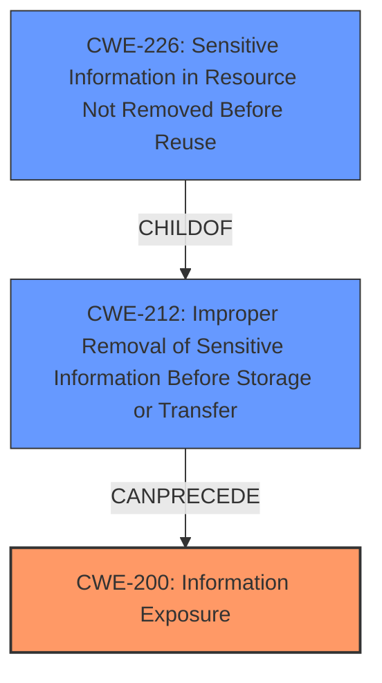

# Enhanced Analysis for CVE-2021-31955

# Summary
| CWE ID | CWE Name | Confidence | CWE Abstraction Level | CWE Vulnerability Mapping Label | CWE-Vulnerability Mapping Notes |
|---|---|---|---|---|---|
| CWE-200 | Information Exposure | 0.7 | Class | Primary | Allowed-with-Review |
| CWE-226 | Sensitive Information in Resource Not Removed Before Reuse | 0.6 | Base | Secondary | Allowed |

## Evidence and Confidence

*   **Confidence Score:** 0.7
*   **Evidence Strength:** LOW

## Relationship Analysis
The primary relationship influencing the choice is that CWE-200 (Information Exposure) is a high-level class, and CWE-226 (Sensitive Information in Resource Not Removed Before Reuse) is a base-level weakness that can lead to information exposure. The graph shows that CWE-226 is a ChildOf CWE-212 (Improper Removal of Sensitive Information Before Storage or Transfer), which in turn can lead to CWE-200 (Information Exposure). However, there is not enough information to be more specific than CWE-200.



## Vulnerability Chain
The vulnerability chain is:
1.  **Root Cause:** The specific root cause is not evident from the vulnerability description.
2.  **Weakness:** Information Disclosure
3.  **Impact:** Sensitive information is exposed.

## Summary of Analysis
The vulnerability description indicates an "Information Disclosure Vulnerability" within the Windows Kernel.

The primary match from "CWE for similar CVE Descriptions" is CWE-NVD-noinfo, which is not a true CWE. The top CWEs include CWE-668 (Incorrect Permission Assignment) and CWE-362 (Race Condition), but these are not directly supported by the description.

The **Vulnerability Description Key Phrases** lists the **impact** as Information Disclosure.

The retriever results suggest several CWEs, including CWE-226, CWE-909, CWE-665, and CWE-362. CWE-226 (Sensitive Information in Resource Not Removed Before Reuse) is a base-level CWE, but there isn't enough evidence to confirm this is the actual root cause. CWE-200 (Information Exposure) is a Class-level CWE, which is the most appropriate level given the information available. I am choosing this CWE because the vulnerability description directly states Information Disclosure.

CWE-200 is preferred over CWE-NVD-noinfo, because CWE-NVD-noinfo is not a real CWE.

I also considered CWE-209 (Generation of Error Message Containing Sensitive Information) and CWE-212 (Improper Removal of Sensitive Information Before Storage or Transfer), but neither is a close match.

I am selecting CWE-200 with a confidence of 0.7 due to the limited information available. I will also include CWE-226 (Sensitive Information in Resource Not Removed Before Reuse) with a confidence of 0.6 as a potential root cause.

Relevant CWE Information:

# Enhanced Context (25 CWEs)

## CWE-226: Sensitive Information in Resource Not Removed Before Reuse
**Abstraction Level**: Base
**Similarity Score**: 0.79
**Source**: dense

**Description**:
The product releases a resource such as memory or a file so that it can be made available for reuse, but it does not clear or "zeroize" the information contained in the resource before the product performs a critical state transition or makes the resource available for reuse by other entities.

**Mapping Guidance**:
- Usage: Allowed
- Rationale: This CWE entry is at the Base level of abstraction, which is a preferred level of abstraction for mapping to the root causes of vulnerabilities.

## CWE-200: Information Exposure
**Abstraction Level**: Class
**Status:** Draft

### Description
An information exposure (or information leakage) vulnerability occurs when sensitive information is unintentionally exposed to an actor that is not authorized to have it.

### Extended Description

This can take many forms:

*   A web site reveals credit card numbers in the clear.
*   A program stores passwords in a world-readable file.
*   A program reveals portions of its memory, such as by failing to clear a buffer before providing it to another program.
*   A program reveals its source code or internal configuration to unauthorized users.

Information exposure can lead to a variety of negative consequences, including identity theft, financial loss, damage to reputation, and legal liability.

### Alternative Terms
Information Leak
Information Leakage

### Relationships
ParentOf: CWE-201: Insertion of Sensitive Information Into Sent Data
ParentOf: CWE-209: Generation of Error Message Containing Sensitive Information

### Mapping Guidance
**Usage:** Allowed-with-Review
**Rationale:** This CWE entry is a Class and might have Base-level children that would be more appropriate
**Comments:** Examine children of this entry to see if there is a better fit
**Reasons:**
- Acceptable-Use

### Potential Mitigations

#### Phase: Implementation
Ensure that sensitive information is not stored in clear text. Use strong encryption to protect sensitive data at rest.
Ensure that sensitive information is not transmitted in clear text. Use strong encryption to protect sensitive data in transit.
Ensure that sensitive information is not exposed in error messages or other output. Sanitize output to remove sensitive information.
Follow secure coding practices to prevent information leaks.
#### Phase: Architecture and Design
Use a threat model to identify potential information exposure vulnerabilities.
Implement access controls to restrict access to sensitive information.
Store sensitive information in a secure location.

### Observed Examples

*   **CVE-2023-32233:** A vulnerability in the web UI of a network management product could allow an unauthenticated, remote attacker to view sensitive configuration information.
*   **CVE-2023-32232:** A vulnerability in the web UI of a network management product could allow an authenticated, remote attacker to view sensitive configuration information.
*   **CVE-2023-32231:** A vulnerability in the web UI of a network management product could allow an authenticated, remote attacker to modify sensitive configuration information.


## CWE Relationship Analysis

Current CWEs represent these abstraction levels: .


### Vulnerability Chain Analysis

**Chain starting from CWE-201:**
- 201 (Insertion of Sensitive Information Into Sent Data) - ROOT


**Chain starting from CWE-200:**
- 200 (Exposure of Sensitive Information to an Unauthorized Actor) - ROOT


### CWE Relationship Diagram

```mermaid
graph TD
    classDef primary fill:#f96,stroke:#333,stroke-width:2px
    classDef secondary fill:#69f,stroke:#333
    classDef tertiary fill:#9e9,stroke:#333
```