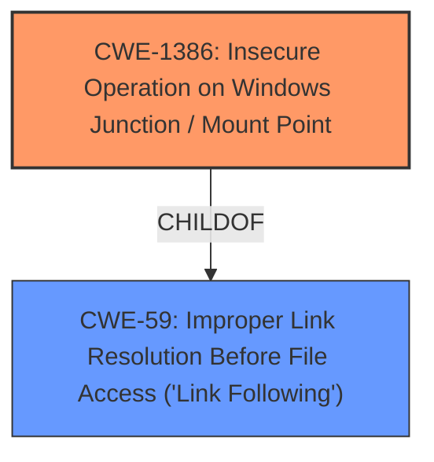

# Analysis Report for CVE-2021-31956

# Vulnerability Analysis Report: CVE-2021-31956

## Description


## Analysis (with Relationship Data)

# Summary
| CWE ID | CWE Name | Confidence | CWE Abstraction Level | CWE Vulnerability Mapping Label | CWE-Vulnerability Mapping Notes |
|---|---|---|---|---|---|
| CWE-1386 | Insecure Operation on Windows Junction / Mount Point | 0.75 | Base | Allowed | Primary CWE |
| CWE-59 | Improper Link Resolution Before File Access ('Link Following') | 0.6 | Base | Allowed | Secondary Candidate |

## Evidence and Confidence

*   **Confidence Score:** 0.7
*   **Evidence Strength:** MEDIUM

## Relationship Analysis
The primary CWE is CWE-1386, which is a child of CWE-59. The vulnerability description mentions an elevation of privilege in Windows NTFS, which can potentially occur due to insecure operations on junctions or mount points.



## Vulnerability Chain
The vulnerability involves an insecure operation on Windows junctions or mount points, leading to elevation of privilege. The chain is as follows:
1.  Insecure operation on junction/mount point (CWE-1386)
2.  Elevation of privilege (Impact)

## Summary of Analysis
The analysis is based on the vulnerability description and the provided CWE information. The vulnerability description key phrases include "impact: elevation of privilege" and "product: Windows", "component: NTFS".
The top CWE match is CWE-NVD-noinfo, which is not a real CWE. The Retriever Results list CWE-1386 as the top candidate.

CWE-1386 (Insecure Operation on Windows Junction / Mount Point) is a Base level CWE that describes how a product opens a file or directory but doesn't properly prevent the name from being associated with a junction or mount point to a destination outside the intended control sphere. This aligns with the vulnerability description and can lead to an elevation of privilege.

CWE-59 (Improper Link Resolution Before File Access ('Link Following')) is a Base level CWE and a parent of CWE-1386. The description states that the product attempts to access a file based on the filename but doesn't properly prevent that filename from identifying a link or shortcut that resolves to an unintended resource. While it is broader than CWE-1386, it is still a plausible match since junctions and mount points are types of links.

The decision to use CWE-1386 as the primary CWE is due to the specific mention of Windows NTFS and the potential for insecure operations on junctions or mount points. This aligns better with the description of CWE-1386.
I have less confidence in the assessment because there is little information to go on besides the phrases in "Vulnerability Description Key Phrases".

Relevant CWE Information:

# Enhanced Context (25 CWEs)

## CWE-59: Improper Link Resolution Before File Access ('Link Following')
**Abstraction Level**: Base
**Similarity Score**: 0.81
**Source**: dense

**Description**:
The product attempts to access a file based on the filename, but it does not properly prevent that filename from identifying a link or shortcut that resolves to an unintended resource.

**Mapping Guidance**:
- Usage: Allowed
- Rationale: This CWE entry is at the Base level of abstraction, which is a preferred level of abstraction for mapping to the root causes of vulnerabilities.

## CWE-1386: Insecure Operation on Windows Junction / Mount Point
**Abstraction Level**: Base
**Similarity Score**: 4462.34
**Source**: sparse

**Description**:
The product opens a file or directory, but it does not properly prevent the name from being associated with a junction or mount point to a destination that is outside of the intended control sphere.

**Mapping Guidance**:
- Usage: Allowed
- Rationale: This CWE entry is at the Base level of abstraction, which is a preferred level of abstraction for mapping to the root causes of vulnerabilities.


## CWE Relationship Analysis

Current CWEs represent these abstraction levels: .


### Vulnerability Chain Analysis

**Chain starting from CWE-1386:**
- 1386 (Insecure Operation on Windows Junction / Mount Point) - ROOT


**Chain starting from CWE-59:**
- 59 (Improper Link Resolution Before File Access ('Link Following')) - ROOT


### CWE Relationship Diagram

```mermaid
graph TD
    classDef primary fill:#f96,stroke:#333,stroke-width:2px
    classDef secondary fill:#69f,stroke:#333
    classDef tertiary fill:#9e9,stroke:#333
```


*Report generated on 2025-03-30 22:49:13*
