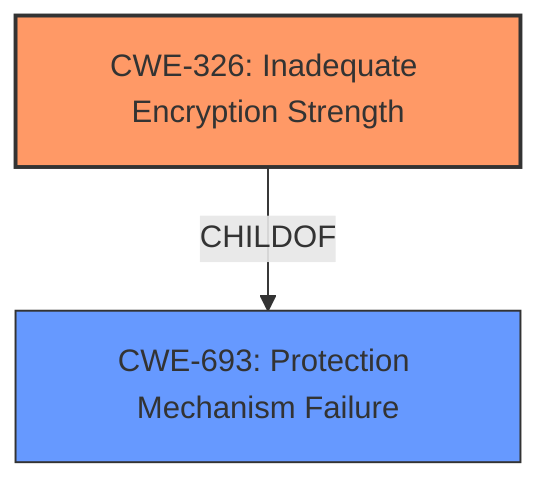

# Raw Analyzer Response for CVE-2021-32010

# Summary
| CWE ID  | CWE Name                                            | Confidence | CWE Abstraction Level | CWE Vulnerability Mapping Label | CWE-Vulnerability Mapping Notes |
|---------|-----------------------------------------------------|------------|-----------------------|---------------------------------|---------------------------------|
| CWE-326 | Inadequate Encryption Strength                      | 1          | Class                 | Primary CWE                     | Allowed-with-Review           |

## Evidence and Confidence

*   **Confidence Score:** 1
*   **Evidence Strength:** HIGH

## Relationship Analysis
The primary CWE selected is CWE-326 (**Inadequate Encryption Strength**). This is a Class-level CWE. There are no child CWEs listed that would be more specific. The vulnerability description explicitly states "**Inadequate Encryption Strength** vulnerability" which makes this the most appropriate selection.

## Vulnerability Chain
The chain of root cause and weaknesses that followed for the Vulnerability Description:
  - Root Cause: **Inadequate Encryption Strength**
  - Impact: Man in the middle attacks

## Summary of Analysis
The initial analysis strongly pointed towards CWE-326 (**Inadequate Encryption Strength**) due to the explicit mention of the term in the vulnerability description. The retriever results also listed CWE-326 as the top candidate.

The evidence is the vulnerability description which states: "**Inadequate Encryption Strength** vulnerability in TLS stack of Secomea SiteManager, LinkManager, GateManager may facilitate man in the middle attacks."

CWE-326 is at the optimal level of specificity because it directly addresses the **root cause** identified in the vulnerability description. While it is a Class-level CWE, there are no more specific Base or Variant level CWEs available that would be a better fit.

Relevant CWE Information:

# Enhanced Context (25 CWEs)

## CWE-326: Inadequate Encryption Strength
**Abstraction:** Class
**Similarity Score**: 0.76
**Source**: dense

**Description**:
The product stores or transmits sensitive data using an encryption scheme that is theoretically sound, but is not strong enough for the level of protection required.

**Mapping Guidance**:
- Usage: Allowed-with-Review
- Rationale: This CWE entry is a Class and might have Base-level children that would be more appropriate