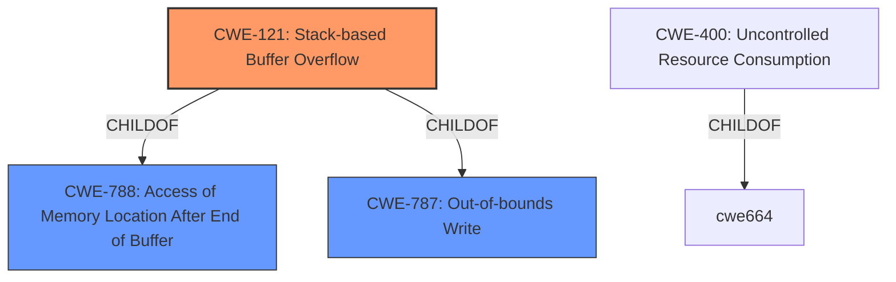

# Enhanced Analysis for CVE-2021-32040

# Summary
| CWE ID | CWE Name | Confidence | CWE Abstraction Level | CWE Vulnerability Mapping Label | CWE-Vulnerability Mapping Notes |
|---|---|---|---|---|---|
| CWE-121 | Stack-based Buffer Overflow | 0.8 | Variant | Allowed | Primary CWE |
| CWE-400 | Uncontrolled Resource Consumption | 0.6 | Class | Discouraged | Secondary Candidate |

## Evidence and Confidence

*   **Confidence Score:** 0.7
*   **Evidence Strength:** MEDIUM

## Relationship Analysis
The primary relationship that influences the selection is the ChildOf relationship between CWE-121 and its parents, particularly CWE-787 (Improper Access of out-bounds Memory). While CWE-787 is broader, the description specifically mentions a **stack overflow**, making CWE-121 a more precise variant. CWE-400 is a Class-level CWE and is too general.



## Vulnerability Chain
The vulnerability chain starts with the possibility of an **extremely long aggregation pipeline** due to unspecified issues in the aggregation stages. This leads to large stack frames, resulting in a **stack overflow**, ultimately causing MongoDB to crash, leading to a DoS.

## Summary of Analysis
The initial analysis focused on identifying the root cause of the vulnerability. The description clearly states that an **extremely long aggregation pipeline** can cause a **stack overflow**. The CVE Reference Links Content Summary mentions that the vulnerability lies in the processing logic of the aggregation pipeline stages.

The retriever results suggested several CWEs, including CWE-121 (Stack-based Buffer Overflow), CWE-190 (Integer Overflow or Wraparound), and CWE-400 (Uncontrolled Resource Consumption).

CWE-121 is the most appropriate because the vulnerability description explicitly mentions a **stack overflow**. The description of CWE-121 states: "A stack-based buffer overflow condition is a condition where the buffer being overwritten is allocated on the stack." The "Vulnerability Description Key Phrases" section also highlights "**stack overflow**" as a **rootcause**.

CWE-400 was considered because a long aggregation pipeline consuming resources could lead to resource exhaustion. However, the specific mechanism of a **stack overflow** makes CWE-121 a more precise match.

The decision is primarily based on the explicit mention of a **stack overflow** in the vulnerability description. The evidence is strong enough to justify selecting CWE-121 as the primary CWE.

Relevant CWE Information:

# Enhanced Context (25 CWEs)

## CWE-404: Improper Resource Shutdown or Release
**Abstraction Level**: Class
**Similarity Score**: 0.78
**Source**: dense

**Description**:
The product does not release or incorrectly releases a resource before it is made available for re-use.
**Why not used:** This CWE focuses on the improper release of resources, which is not the primary issue described in the vulnerability.

## CWE-664: Improper Control of a Resource Through its Lifetime
**Abstraction Level**: Pillar
**Similarity Score**: 0.78
**Source**: dense

**Description**:
The product does not maintain or incorrectly maintains control over a resource throughout its lifetime of creation, use, and release.
**Why not used:** This CWE is too high-level and doesn't directly address the **stack overflow** issue.

## CWE-789: Memory Allocation with Excessive Size Value
**Abstraction Level**: Variant
**Similarity Score**: 0.77
**Source**: dense

**Description**:
The product allocates memory based on an untrusted, large size value, but it does not ensure that the size is within expected limits, allowing arbitrary amounts of memory to be allocated.
**Why not used:** While related to memory allocation, the core issue is the **stack overflow** due to the size of stack frames, not necessarily the size of a single memory allocation.

## CWE-668: Exposure of Resource to Wrong Sphere
**Abstraction Level**: Class
**Similarity Score**: 0.77
**Source**: dense

**Description**:
The product exposes a resource to the wrong control sphere, providing unintended actors with inappropriate access to the resource.
**Why not used:** This CWE is not relevant to the described vulnerability.

## CWE-405: Asymmetric Resource Consumption (Amplification)
**Abstraction Level**: Class
**Similarity Score**: 0.76
**Source**: dense

**Description**:
The product does not properly control situations in which an adversary can cause the product to consume or produce excessive resources without requiring the adversary to invest equivalent work or otherwise prove authorization, i.e., the adversary's influence is "asymmetric."
**Why not used:** This CWE is not directly related to the **stack overflow** caused by the long aggregation pipeline.

## CWE-226: Sensitive Information in Resource Not Removed Before Reuse
**Abstraction Level**: Base
**Similarity Score**: 0.76
**Source**: dense

**Description**:
The product releases a resource such as memory or a file so that it can be made available for reuse, but it does not clear or "zeroize" the information contained in the resource before the product performs a critical state transition or makes the resource available for reuse by other entities.
**Why not used:** This CWE is not relevant to the described vulnerability.

## CWE-754: Improper Check for Unusual or Exceptional Conditions
**Abstraction Level**: Class
**Similarity Score**: 0.76
**Source**: dense

**Description**:
The product does not check or incorrectly checks for unusual or exceptional conditions that are not expected to occur frequently during day to day operation of the product.
**Why not used:** This CWE is too general and does not directly address the **stack overflow** caused by the long aggregation pipeline.

## CWE-1289: Improper Validation of Unsafe Equivalence in Input
**Abstraction Level**: Base
**Similarity Score**: 0.75
**Source**: dense

**Description**:
The product receives an input value that is used as a resource identifier or other type of reference, but it does not validate or incorrectly validates that the input is equivalent to a potentially-unsafe value.
**Why not used:** This CWE is not relevant to the described vulnerability.

## CWE-1325: Improperly Controlled Sequential Memory Allocation
**Abstraction Level**: Base
**Similarity Score**: 0.75
**Source**: dense

**Description**:
The product manages a group of objects or resources and performs a separate memory allocation for each object, but it does not properly limit the total amount of memory that is consumed by all of the combined objects.
**Why not used:** The specific issue is the stack overflow from the size of the stack frames, not just the sequential memory allocation itself.

## CWE-667: Improper Locking
**Abstraction Level**: Class
**Similarity Score**: 0.75
**Source**: dense

**Description**:
The product does not properly acquire or release a lock on a resource, leading to unexpected resource state changes and behaviors.
**Why not used:** This CWE is not relevant to the described vulnerability.

## CWE-789: Memory Allocation with Excessive Size Value
**Abstraction Level**: Variant
**Similarity Score**: 7287.49
**Source**: sparse

**Description**:
The product allocates memory based on an untrusted, large size value, but it does not ensure that the size is within expected limits, allowing arbitrary amounts of memory to be allocated.
**Why not used:** While related to memory allocation, the core issue is the **stack overflow** due to the size of stack frames, not necessarily the size of a single memory allocation.

## CWE-190: Integer Overflow or Wraparound
**Abstraction Level**: Base
**Similarity Score**: 7153.35
**Source**: sparse

**Description**:
The product performs a calculation that can produce an integer overflow or wraparound when the logic assumes that the resulting value will always be larger than the original value.
**Why not used:** The vulnerability does not explicitly involve an integer overflow or wraparound.

## CWE-770: Allocation of Resources Without Limits or Throttling
**Abstraction Level**: Base
**Similarity Score**: 7079.13
**Source**: sparse

**Description**:
The product allocates a reusable resource or group of resources on behalf of an actor without imposing any restrictions on the size or number of resources that can be allocated, in violation of the intended security policy for that actor.
**


## CWE Relationship Analysis

Current CWEs represent these abstraction levels: .


### Vulnerability Chain Analysis

**Chain starting from CWE-190:**
- 190 (Integer Overflow or Wraparound) - ROOT


**Chain starting from CWE-1325:**
- 1325 (Improperly Controlled Sequential Memory Allocation) - ROOT


### CWE Relationship Diagram

```mermaid
graph TD
    classDef primary fill:#f96,stroke:#333,stroke-width:2px
    classDef secondary fill:#69f,stroke:#333
    classDef tertiary fill:#9e9,stroke:#333
```