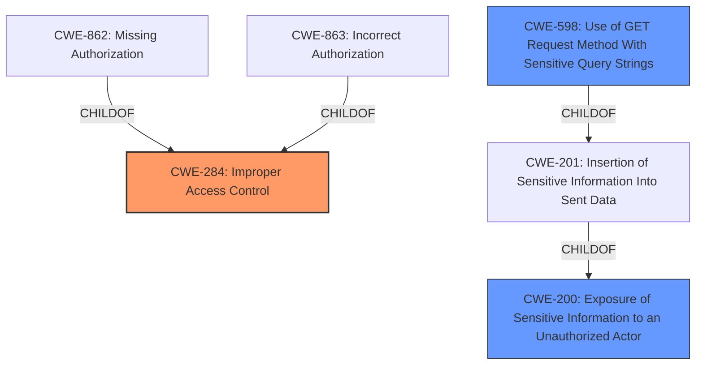

# Analysis Report for CVE-2021-32504

# Vulnerability Analysis Report: CVE-2021-32504

## Description


## Analysis (with Relationship Data)

# Summary
| CWE ID | CWE Name | Confidence | CWE Abstraction Level | CWE Vulnerability Mapping Label | CWE-Vulnerability Mapping Notes |
|---|---|---|---|---|---|
| CWE-284 | Improper Access Control | 0.9 | Class | Primary | Allowed-with-Review |
| CWE-598 | Use of GET Request Method With Sensitive Query Strings | 0.7 | Variant | Secondary | Allowed |
| CWE-200 | Exposure of Sensitive Information to an Unauthorized Actor | 0.6 | Class | Secondary | Discouraged |

## Evidence and Confidence

*   **Confidence Score:** 0.8
*   **Evidence Strength:** MEDIUM

## Relationship Analysis
The primary CWE selected is CWE-284, which represents a high-level classification of improper access control. While the description indicates that sensitive URLs are accessible to unauthenticated users, this is a general category. CWE-598 is a variant of CWE-201 (Insertion of Sensitive Information Into Sent Data) and is a child of CWE-200 (Exposure of Sensitive Information to an Unauthorized Actor). CWE-200 is a Class-level CWE. The relationship between CWE-284 and its potential child CWEs like CWE-862 (Missing Authorization) and CWE-863 (Incorrect Authorization) was considered, but the provided evidence doesn't specify whether authorization is entirely missing or incorrectly implemented.



## Vulnerability Chain
The vulnerability chain begins with **improper access control** (CWE-284), leading to the exposure of sensitive web URLs. Since the access is via GET request, sensitive information can get exposed via query strings (CWE-598).

## Summary of Analysis
The initial analysis focused on identifying the root cause of the vulnerability, which is **improper access control**. The vulnerability description explicitly mentions that "Unauthenticated users can access sensitive web URLs," which points to a problem in access control mechanisms.

The retriever results suggested several CWEs, including CWE-425 (Direct Request ('Forced Browsing')), CWE-306 (Missing Authentication for Critical Function), and CWE-22 (Improper Limitation of a Pathname to a Restricted Directory ('Path Traversal')). However, these CWEs are not the most appropriate based on the provided evidence. CWE-425 describes a situation where authorization is not adequately enforced on all restricted URLs, which is similar but not exactly the same as **improper access control**. CWE-306 refers to a complete lack of authentication, which is not explicitly stated in the description. CWE-22 involves path traversal, which is not related to the described vulnerability.

CWE-200 (Exposure of Sensitive Information to an Unauthorized Actor) was also considered, but it is a high-level CWE and the description notes that it's often misused. The access via GET request leads to CWE-598 (Use of GET Request Method With Sensitive Query Strings).

The selected CWEs (CWE-284, CWE-598, and CWE-200) are at an appropriate level of specificity given the available information. Further investigation could reveal whether the **improper access control** is due to missing or incorrect authorization, which would allow for a more specific CWE to be assigned (e.g., CWE-862 or CWE-863). The evidence from the vulnerability description is "Unauthenticated users can access sensitive web URLs through GET request, which should be restricted to maintenance users only" and "**rootcause:** **improper access control**".

Relevant CWE Information:


## CWE Relationship Analysis

Current CWEs represent these abstraction levels: .


### Vulnerability Chain Analysis

**Chain starting from CWE-201:**
- 201 (Insertion of Sensitive Information Into Sent Data) - ROOT


**Chain starting from CWE-862:**
- 862 (Missing Authorization) - ROOT


### CWE Relationship Diagram

```mermaid
graph TD
    classDef primary fill:#f96,stroke:#333,stroke-width:2px
    classDef secondary fill:#69f,stroke:#333
    classDef tertiary fill:#9e9,stroke:#333
```


*Report generated on 2025-03-30 15:15:08*
