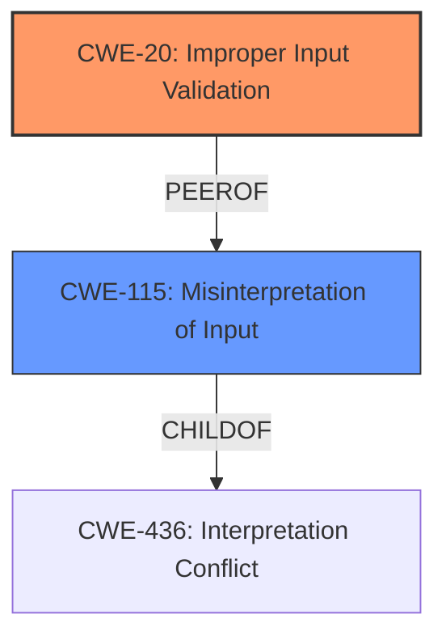

# Analysis Report for CVE-2021-32586

# Vulnerability Analysis Report: CVE-2021-32586

## Description


## Analysis (with Relationship Data)

# Summary
| CWE ID | CWE Name | Confidence | CWE Abstraction Level | CWE Vulnerability Mapping Label | CWE-Vulnerability Mapping Notes |
|---|---|---|---|---|---|
| CWE-20 | Improper Input Validation | 0.9 | Class | Primary | Discouraged, but used due to lack of more specific information. |
| CWE-115 | Misinterpretation of Input | 0.7 | Base | Secondary | Allowed |

## Evidence and Confidence

*   **Confidence Score:** 0.8
*   **Evidence Strength:** MEDIUM

## Relationship Analysis
The primary relationship that impacted the decision was the hierarchical relationship between CWE-20 and its potential children. While CWE-20 is a Class-level CWE and discouraged, the lack of specific details in the vulnerability description made it difficult to select a more specific Base or Variant CWE. CWE-115 was also considered as a peer, which is a base class.



## Vulnerability Chain
The vulnerability chain starts with **improper input validation** (CWE-20), leading to the potential alteration of the environment of the underlying script interpreter. This suggests that the **improper input validation** allows an attacker to inject or manipulate the environment variables or parameters passed to the script, potentially leading to unauthorized code execution or other malicious activities. The weakness chain is:

1.  **Improper Input Validation (CWE-20):** The FortiMail web server CGI facilities **do not properly validate** HTTP requests.
2.  **Misinterpretation of Input (CWE-115):** Due to the lack of validation, crafted HTTP requests are misinterpreted.
3.  **Impact:** This allows an unauthenticated attacker to alter the environment of the underlying script interpreter.

## Summary of Analysis
The initial analysis focused on identifying the **root cause** of the vulnerability, which is the **improper input validation** in the web server CGI facilities of FortiMail. The retriever results and the vulnerability description key phrases strongly suggested CWE-20 as a potential candidate. However, CWE-20 is a Class-level CWE, and the mapping guidance discourages its use when more specific CWEs are available.

Despite this, the lack of detailed information about the specific type of input that is not being validated made it difficult to select a more specific CWE. The vulnerability description states that an unauthenticated attacker can alter the environment of the underlying script interpreter via specifically crafted HTTP requests. This suggests that the **improper input validation** allows an attacker to inject or manipulate the environment variables or parameters passed to the script.

Other CWEs, such as CWE-78 (Improper Neutralization of Special Elements used in an OS Command) and CWE-22 (Improper Limitation of a Pathname to a Restricted Directory), were considered but ultimately rejected because they did not accurately reflect the nature of the vulnerability. CWE-78 is related to OS command injection, which is not explicitly mentioned in the vulnerability description. CWE-22 is related to path traversal, which is also not directly mentioned.

CWE-115 (Misinterpretation of Input) was considered because it fits the scenario where crafted HTTP requests are misinterpreted by the server. It is added as a secondary CWE to reflect this aspect of the vulnerability.

The final decision to use CWE-20 as the primary CWE was based on the fact that it is the most accurate representation of the **root cause** given the available information. The evidence supporting this decision comes from the vulnerability description key phrases, which explicitly mention **improper input validation**.

Relevant evidence from the vulnerability description includes:

*   "An **improper input validation** vulnerability..."
*   "...may allow an unauthenticated attacker to alter the environment of the underlying script interpreter via specifically crafted HTTP requests."

This evidence clearly indicates that the **root cause** of the vulnerability is **improper input validation**.

The selection of CWE-20, despite the discouraged usage, is justified by the lack of more specific information and the need to accurately represent the **root cause** of the vulnerability based on the available evidence.


## CWE Relationship Analysis

Current CWEs represent these abstraction levels: .


### Vulnerability Chain Analysis

**Chain starting from CWE-436:**
- 436 (Interpretation Conflict) - ROOT


**Chain starting from CWE-115:**
- 115 (Misinterpretation of Input) - ROOT


### CWE Relationship Diagram

```mermaid
graph TD
    classDef primary fill:#f96,stroke:#333,stroke-width:2px
    classDef secondary fill:#69f,stroke:#333
    classDef tertiary fill:#9e9,stroke:#333
```


*Report generated on 2025-03-31 04:57:37*
