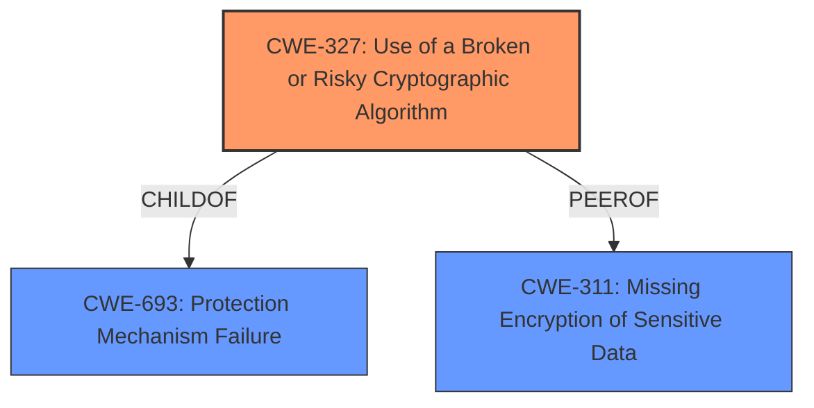

# Raw Analyzer Response for CVE-2021-32593

# Summary
| CWE ID | CWE Name | Confidence | CWE Abstraction Level | CWE Vulnerability Mapping Label | CWE-Vulnerability Mapping Notes |
|---|---|---|---|---|---|
| CWE-327 | Use of a Broken or Risky Cryptographic Algorithm | 1.0 | Class | Primary | Allowed-with-Review |

## Evidence and Confidence

*   **Confidence Score:** 1.0
*   **Evidence Strength:** HIGH

## Relationship Analysis
The primary CWE, CWE-327, is a Class-level CWE. No more specific CWEs apply.

## Vulnerability Chain
The chain of root cause and weaknesses:
1.  Root Cause: **broken or risky cryptographic algorithm** [CWE-327]
2.  Impact: decrypt and forge protocol communication messages

## Summary of Analysis
The vulnerability description clearly states that the root cause is the use of a **broken or risky cryptographic algorithm** [CWE-327] in the Dynamic Tunnel Protocol of FortiWAN. This leads to the ability for an unauthenticated remote attacker to decrypt and forge protocol communication messages.

The evidence for this assessment is strong, coming directly from the "Vulnerability Description", "Vulnerability Description Key Phrases", and "CVE Reference Links Content Summary". Specifically, the key phrases identify the **broken or risky cryptographic algorithm** as the root cause and the ability to decrypt and forge messages as the impact. The CVE summary further reinforces this by explicitly stating that the root cause is the use of a broken or risky cryptographic algorithm, leading to improper cryptographic operations.

The Retriever Results also listed CWE-327 as a candidate, but other CWEs were also considered:
*   CWE-639: Authorization Bypass Through User-Controlled Key - Does not apply. The vulnerability is related to cryptographic algorithm, not authorization.
*   CWE-321: Use of Hard-coded Cryptographic Key - While related to cryptography, this is not a hard-coded key issue. The issue is the algorithm itself.
*   CWE-328: Use of Weak Hash - Not applicable, as the vulnerability focuses on a broken or risky *encryption* algorithm, not a hash.
*   CWE-1240: Use of a Cryptographic Primitive with a Risky Implementation - Similar to CWE-327, but CWE-327 is more directly applicable as the algorithm itself is broken/risky.
*   CWE-325: Missing Cryptographic Step - The issue is not a missing step in an algorithm, but the use of a weak algorithm.
*   CWE-208: Observable Timing Discrepancy - Not applicable. This is not a timing-related issue.
*   CWE-1204: Generation of Weak Initialization Vector (IV) - The issue is not IV generation, but the algorithm choice itself.
*   CWE-347: Improper Verification of Cryptographic Signature - The problem is not with signature verification.
*   CWE-203: Observable Discrepancy - The core issue is the broken crypto, not observability.

CWE-327, "Use of a Broken or Risky Cryptographic Algorithm", is at the Class level of abstraction. While more specific Base or Variant level CWEs might exist under CWE-327, none of them were identified by Retriever or in the provided documentation. Therefore, CWE-327 is the most specific CWE that accurately represents the vulnerability, given the information available. The usage is "Allowed-with-Review" and the documentation states to "Examine children of this entry to see if there is a better fit". In this case, there is not a better fit.

Relevant CWE Information:
- CWE-327 Use of a Broken or Risky Cryptographic Algorithm: The product uses a **broken or risky cryptographic algorithm** or protocol.