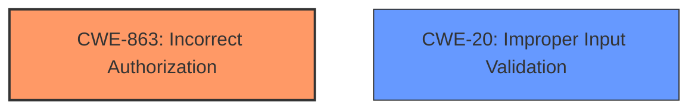

# Raw Analyzer Response for CVE-2021-32777

# Summary
| CWE ID | CWE Name | Confidence | CWE Abstraction Level | CWE Vulnerability Mapping Label | CWE-Vulnerability Mapping Notes |
|---|---|---|---|---|---|
| CWE-863 | Incorrect Authorization | 0.8 | Class | Primary | Allowed-with-Review |
| CWE-20 | Improper Input Validation | 0.6 | Class | Secondary | Allowed |

## Evidence and Confidence

*   **Confidence Score:** 0.7
*   **Evidence Strength:** MEDIUM

## Relationship Analysis
The primary CWE is CWE-863, Incorrect Authorization, which is a Class-level CWE. While more specific CWEs could exist, the provided information does not allow for a more precise classification. CWE-863 is related to authorization bypass, which is a direct consequence of the described vulnerability.

CWE-20, Improper Input Validation is considered as a secondary CWE because the root cause involves **incorrect** handling of multiple header values, which relates to how the input is processed.

## Vulnerability Chain
The vulnerability chain starts with the **incorrect** handling of HTTP headers by the `ext-authz` extension. This leads to an authorization bypass and potential escalation of privileges.

`Incorrect Header Handling` -> `Authorization Bypass` -> `Privilege Escalation`

## Summary of Analysis
The initial assessment considered several CWEs, but CWE-863 (Incorrect Authorization) was chosen as the primary CWE because it directly reflects the vulnerability's impact. The `ext-authz` extension **incorrectly** handles multiple value request headers, leading to an authorization bypass. The vulnerability description clearly states that "only the last header value is sent," which directly bypasses the authorization mechanism that relies on multiple header values.

The selection is based on the evidence presented in the vulnerability description and CVE Reference Links Content Summary. The **root cause** is the **incorrect** header handling, which leads to the **impact** of authorization bypass.

CWE-20 (Improper Input Validation) was considered as a secondary CWE since the vulnerability stems from not correctly handling input (HTTP headers with multiple values).

The chosen CWEs are at an appropriate level of specificity given the available information. A more detailed CWE might be applicable if the exact mechanism of **incorrect** header handling was known.

Relevant CWE Information:

# Enhanced Context (25 CWEs)

## CWE-807: Reliance on Untrusted Inputs in a Security Decision
**Abstraction Level**: Base
**Similarity Score**: 0.75
**Source**: dense
*Description: The product uses a protection mechanism that relies on the existence or values of an input, but the input can be modified by an untrusted actor in a way that bypasses the protection mechanism.*

This CWE could be related, but it's more focused on the reliance on untrusted inputs rather than the **incorrect** processing of trusted inputs. Not selected.

## CWE-799: Improper Control of Interaction Frequency
**Abstraction Level**: Class
**Similarity Score**: 0.75
**Source**: dense
*Description: The product does not properly limit the number or frequency of interactions that it has with an actor, such as the number of incoming requests.*

This CWE is not relevant to the described vulnerability. Not selected.

## CWE-1289: Improper Validation of Unsafe Equivalence in Input
**Abstraction Level**: Base
**Similarity Score**: 0.75
**Source**: dense
*Description: The product receives an input value that is used as a resource identifier or other type of reference, but it does not validate or incorrectly validates that the input is equivalent to a potentially-unsafe value.*

While there's **improper validation**, it's more about the **incorrect** interpretation of header values rather than validating equivalence. Not selected.

## CWE-405: Asymmetric Resource Consumption (Amplification)
**Abstraction Level**: Class
**Similarity Score**: 0.75
**Source**: dense
*Description: The product does not properly control situations in which an adversary can cause the product to consume or produce excessive resources without requiring the adversary to invest equivalent work or otherwise prove authorization, i.e., the adversary's influence is "asymmetric."*

Not relevant, as there is no resource consumption issue. Not selected.

## CWE-303: Incorrect Implementation of Authentication Algorithm
**Abstraction Level**: Base
**Similarity Score**: 0.74
**Source**: dense
*Description: The requirements for the product dictate the use of an established authentication algorithm, but the implementation of the algorithm is incorrect.*

Not applicable as it focuses on authentication algorithms, while this issue relates to authorization and header handling. Not selected.

## CWE-1390: Weak Authentication
**Abstraction Level**: Class
**Similarity Score**: 0.74
**Source**: dense
*Description: The product uses an authentication mechanism to restrict access to specific users or identities, but the mechanism does not sufficiently prove that the claimed identity is correct.*

Not directly applicable since the issue is with authorization after authentication, not the authentication process itself. Not selected.

## CWE-639: Authorization Bypass Through User-Controlled Key
**Abstraction Level**: Base
**Similarity Score**: 0.74
**Source**: dense
*Description: The system's authorization functionality does not prevent one user from gaining access to another user's data or record by modifying the key value identifying the data.*

This is closer, but the issue isn't about modifying a key value but about **incorrectly** handling header values. Not selected.

## CWE-668: Exposure of Resource to Wrong Sphere
**Abstraction Level**: Class
**Similarity Score**: 0.74
**Source**: dense
*Description: The product exposes a resource to the wrong control sphere, providing unintended actors with inappropriate access to the resource.*

Too high-level and doesn't accurately describe the technical details. Not selected.

## CWE-274: Improper Handling of Insufficient Privileges
**Abstraction Level**: Base
**Similarity Score**: 0.74
**Source**: dense
*Description: The product does not handle or incorrectly handles when it has insufficient privileges to perform an operation, leading to resultant weaknesses.*

Not relevant as the issue is not about handling insufficient privileges. Not selected.

## CWE-204: Observable Response Discrepancy
**Abstraction Level**: Base
**Similarity Score**: 0.73
**Source**: dense
*Description: The product provides different responses to incoming requests in a way that reveals internal state information to an unauthorized actor outside of the intended control sphere.*

Not applicable as there is no information leakage. Not selected.

## CWE-113: Improper Neutralization of CRLF Sequences in HTTP Headers ('HTTP Request/Response Splitting')
**Abstraction Level**: Variant
**Similarity Score**: 8369.06
**Source**: sparse
*Description: The product receives data from an HTTP agent/component (e.g., web server, proxy, browser, etc.), but it does not neutralize or incorrectly neutralizes CR and LF characters before the data is included in outgoing HTTP headers.*

Not relevant, as the vulnerability is not related to CRLF injection. Not selected.

## CWE-444: Inconsistent Interpretation of HTTP Requests ('HTTP Request/Response Smuggling')
**Abstraction Level**: Base
**Similarity Score**: 8210.79
**Source**: sparse
*Description: The product acts as an intermediary HTTP agent
         (such as a proxy or firewall) in the data flow between two
         entities such as a client and server, but it does not
         interpret malformed HTTP requests or responses in ways that
         are consistent with how the messages will be processed by
         those entities that are at the ultimate destination.*

While Envoy is a proxy, the issue is not about inconsistent interpretation of requests but about **incorrect** header handling. Not selected.

## CWE-79: Improper Neutralization of Input During Web Page Generation ('Cross-site Scripting')
**Abstraction Level**: Base
**Similarity Score**: 8093.49
**Source**: sparse
*Description: The product does not neutralize or incorrectly neutralizes user-controllable input before it is placed in output that is used as a web page that is served to other users.*

Not relevant, as the vulnerability does not involve cross-site scripting. Not selected.

## CWE-863: Incorrect Authorization
**Abstraction Level**: Class
**Similarity Score**: 7941.23
**Source**: sparse
*Description: The product performs an authorization check when an actor attempts to access a resource or perform an action, but it does not correctly perform the check.*

Selected as primary CWE as described above.

## CWE-201: Insertion of Sensitive Information Into Sent Data
**Abstraction Level**: Base
**Similarity Score**: 7760.02
**Source**: sparse
*Description: The code transmits data to another actor, but a portion of the data includes sensitive information that should not be accessible to that actor.*

Not relevant, as the vulnerability does not involve the exposure of sensitive