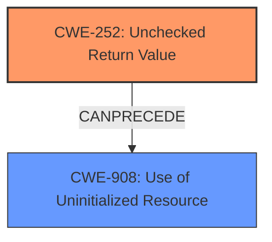

# Raw Analyzer Response for CVE-2021-32845

# Summary
| CWE ID | CWE Name | Confidence | CWE Abstraction Level | CWE Vulnerability Mapping Label | CWE-Vulnerability Mapping Notes |
|---|---|---|---|---|---|
| CWE-252 | Unchecked Return Value | 1.0 | Base | Allowed | Primary CWE |
| CWE-908 | Use of Uninitialized Resource | 0.9 | Base | Allowed | Secondary Candidate |

## Evidence and Confidence

*   **Confidence Score:** 0.95
*   **Evidence Strength:** HIGH

## Relationship Analysis
The primary relationship that influenced my decision was the chain relationship between **CWE-252 [Unchecked Return Value]** and **CWE-908 [Use of Uninitialized Resource]**. The vulnerability description clearly indicates that the **failure to check the return value** of `vq_getchain` directly leads to the **use of an uninitialized `iovec` structure**. While **CWE-908 [Use of Uninitialized Resource]** is a valid concern, it is a consequence of the **missing check (CWE-252 [Unchecked Return Value])**.

## Vulnerability Chain
The vulnerability chain starts with:
1.  **Missing Error Handling:** The **root cause** is the **failure to check the return value of `vq_getchain` (CWE-252 [Unchecked Return Value])**.
2.  **Uninitialized Memory Use:** This leads to the **use of an uninitialized `iovec` structure (CWE-908 [Use of Uninitialized Resource])**.
3.  **Impact:** The uninitialized structure is then used in a read operation, potentially causing a denial-of-service (DoS) or memory corruption on the host.

## Summary of Analysis
Initially, the uninitialized memory use (CWE-908 [Use of Uninitialized Resource]) seemed like a primary weakness. However, after carefully considering the evidence and relationship analysis, it became clear that the **root cause** is the **missing error handling (CWE-252 [Unchecked Return Value])** that allows the program to proceed with uninitialized data. The "CVE Reference Links Content Summary" section explicitly states this root cause: "The vulnerability arises from a missing check on the return value of the `vq_getchain` function." This evidence, combined with the CWE relationship data (CWE-252 [Unchecked Return Value] CanPrecede CWE-908 [Use of Uninitialized Resource]), strongly supports classifying **CWE-252 [Unchecked Return Value]** as the primary CWE.
The selection of CWE-252 [Unchecked Return Value] is at the optimal level of specificity because it precisely describes the programming error that led to the vulnerability. It is a Base level CWE, which aligns with the recommendation to choose the lowest level of abstraction that accurately represents the weakness. The analysis is based on the provided evidence, especially the rootcause and weakness phrases from the "Vulnerability Description Key Phrases" and the "CVE Reference Links Content Summary."

Other considered CWEs:

*   **CWE-824 [Access of Uninitialized Pointer]**: Considered but deemed less appropriate than CWE-908 [Use of Uninitialized Resource]. While technically correct (the `iov` contains pointers), CWE-908 [Use of Uninitialized Resource] is a more general description of the problem.
*   **CWE-476 [NULL Pointer Dereference]**: This CWE was not chosen because the uninitialized `iovec` doesn't necessarily contain a NULL pointer, just an unpredictable value.
*   **CWE-125 [Out-of-bounds Read]**: This CWE was not chosen because the vulnerability initially stems from using uninitialized data, not directly from reading out of bounds, although that could be a consequence.
*   **CWE-190 [Integer Overflow or Wraparound]**: This CWE was not chosen because integer overflow is not mentioned in the description.
*   **CWE-394 [Unexpected Status Code or Return Value]**: Considered but deemed less appropriate than **CWE-252 [Unchecked Return Value]**. While both relate to return values, **CWE-252 [Unchecked Return Value]** directly addresses the *lack* of a check, whereas **CWE-394 [Unexpected Status Code or Return Value]** focuses on cases where the return value *is* checked, but not properly.

Relevant CWE Information:

## CWE-191: Integer Underflow (Wrap or Wraparound)
**Abstraction Level**: Base
**Similarity Score**: 0.80
**Source**: dense

**Description**:
The product subtracts one value from another, such that the result is less than the minimum allowable integer value, which produces a value that is not equal to the correct result.

**Mapping Guidance**:
- Usage: Allowed
- Rationale: This CWE entry is at the Base level of abstraction, which is a preferred level of abstraction for mapping to the root causes of vulnerabilities.

## CWE-190: Integer Overflow or Wraparound
**Abstraction Level**: Base
**Similarity Score**: 0.78
**Source**: dense

**Description**:
The product performs a calculation that can
         produce an integer overflow or wraparound when the logic
         assumes that the resulting value will always be larger than
         the original value. This occurs when an integer value is
         incremented to a value that is too large to store in the
         associated representation. When this occurs, the value may
         become a very small or negative number.

**Mapping Guidance**:
- Usage: Allowed
- Rationale: This CWE entry is at the Base level of abstraction, which is a preferred level of abstraction for mapping to the root causes of vulnerabilities.

## CWE-197: Numeric Truncation Error
**Abstraction Level**: Base
**Similarity Score**: 0.77
**Source**: dense

**Description**:
Truncation errors occur when a primitive is cast to a primitive of a smaller size and data is lost in the conversion.

**Mapping Guidance**:
- Usage: Allowed
- Rationale: This CWE entry is at the Base level of abstraction, which is a preferred level of abstraction for mapping to the root causes of vulnerabilities.

## CWE-131: Incorrect Calculation of Buffer Size
**Abstraction Level**: Base
**Similarity Score**: 0.77
**Source**: dense

**Description**:
The product does not correctly calculate the size to be used when allocating a buffer, which could lead to a buffer overflow.

**Mapping Guidance**:
- Usage: Allowed
- Rationale: This CWE entry is at the Base level of abstraction, which is a preferred level of abstraction for mapping to the root causes of vulnerabilities.

## CWE-681: Incorrect Conversion between Numeric Types
**Abstraction Level**: Base
**Similarity Score**: 0.76
**Source**: dense

**Description**:
When converting from one data type to another, such as long to integer, data can be omitted or translated in a way that produces unexpected values. If the resulting values are used in a sensitive context, then dangerous behaviors may occur.

**Mapping Guidance**:
- Usage: Allowed
- Rationale: This CWE entry is at the Base level of abstraction, which is a preferred level of abstraction for mapping to the root causes of vulnerabilities.

## CWE-252: Unchecked Return Value
**Abstraction Level**: Base
**Similarity Score**: 0.76
**Source**: dense

**Description**:
The product does not check the return value from a method or function, which can prevent it from detecting unexpected states and conditions.

**Mapping Guidance**:
- Usage: Allowed
- Rationale: This CWE entry is at the Base level of abstraction, which is a preferred level of abstraction for mapping to the root causes of vulnerabilities.

## CWE-667: Improper Locking
**Abstraction Level**: Class
**Similarity Score**: 0.76
**Source**: dense

**Description**:
The product does not properly acquire or release a lock on a resource, leading to unexpected resource state changes and behaviors.

**Mapping Guidance**:
- Usage: Allowed-with-Review
- Rationale: This CWE entry is a Class and might have Base-level children that would be more appropriate

## CWE-909: Missing Initialization of Resource
**Abstraction Level**: Class
**Similarity Score**: 0.76
**Source**: dense

**Description**:
The product does not initialize a critical resource.

**Mapping Guidance**:
- Usage: Allowed-with-Review
- Rationale: This CWE entry is a Class and might have Base-level children that would be more appropriate

## CWE-908: Use of Uninitialized Resource
**Abstraction Level**: Base
**Similarity Score**: 0.76
**Source**: dense

**Description**:
The product uses or accesses a resource that has not been initialized.

**