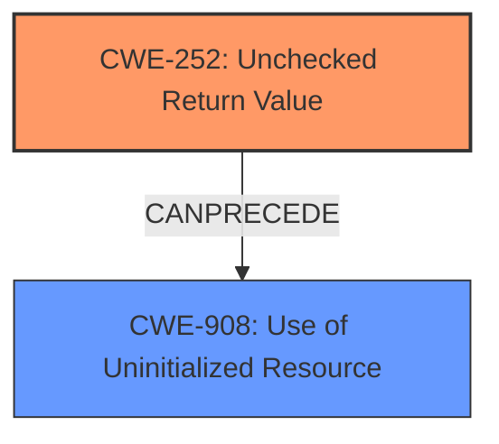

# Analysis for CVE-2021-32845

# Summary
| CWE ID | CWE Name | Confidence | CWE Abstraction Level | CWE Vulnerability Mapping Label | CWE-Vulnerability Mapping Notes |
|---|---|---|---|---|---|
| CWE-252 | Unchecked Return Value | 1.0 | Base | Allowed | Primary CWE |
| CWE-908 | Use of Uninitialized Resource | 0.9 | Base | Allowed | Secondary Candidate |

## Evidence and Confidence

*   **Confidence Score:** 0.95
*   **Evidence Strength:** HIGH

## Relationship Analysis
The primary relationship that influenced my decision was the chain relationship between **CWE-252 [Unchecked Return Value]** and **CWE-908 [Use of Uninitialized Resource]**. The vulnerability description clearly indicates that the **failure to check the return value** of `vq_getchain` directly leads to the **use of an uninitialized `iovec` structure**. While **CWE-908 [Use of Uninitialized Resource]** is a valid concern, it is a consequence of the **missing check (CWE-252 [Unchecked Return Value])**.



## Vulnerability Chain
The vulnerability chain starts with:
1.  **Missing Error Handling:** The **root cause** is the **failure to check the return value of `vq_getchain` (CWE-252 [Unchecked Return Value])**.
2.  **Uninitialized Memory Use:** This leads to the **use of an uninitialized `iovec` structure (CWE-908 [Use of Uninitialized Resource])**.
3.  **Impact:** The uninitialized structure is then used in a read operation, potentially causing a denial-of-service (DoS) or memory corruption on the host.

## Summary of Analysis
Initially, the uninitialized memory use (CWE-908 [Use of Uninitialized Resource]) seemed like a primary weakness. However, after carefully considering the evidence and relationship analysis, it became clear that the **root cause** is the **missing error handling (CWE-252 [Unchecked Return Value])** that allows the program to proceed with uninitialized data. The "CVE Reference Links Content Summary" section explicitly states this root cause: "The vulnerability arises from a missing check on the return value of the `vq_getchain` function." This evidence, combined with the CWE relationship data (CWE-252 [Unchecked Return Value] CanPrecede CWE-908 [Use of Uninitialized Resource]), strongly supports classifying **CWE-252 [Unchecked Return Value]** as the primary CWE.
The selection of CWE-252 [Unchecked Return Value] is at the optimal level of specificity because it precisely describes the programming error that led to the vulnerability. It is a Base level CWE, which aligns with the recommendation to choose the lowest level of abstraction that accurately represents the weakness. The analysis is based on the provided evidence, especially the rootcause and weakness phrases from the "Vulnerability Description Key Phrases" and the "CVE Reference Links Content Summary."

Other considered CWEs:

*   **CWE-824 [Access of Uninitialized Pointer]**: Considered but deemed less appropriate than CWE-908 [Use of Uninitialized Resource]. While technically correct (the `iov` contains pointers), CWE-908 [Use of Uninitialized Resource] is a more general description of the problem.
*   **CWE-476 [NULL Pointer Dereference]**: This CWE was not chosen because the uninitialized `iovec` doesn't necessarily contain a NULL pointer, just an unpredictable value.
*   **CWE-125 [Out-of-bounds Read]**: This CWE was not chosen because the vulnerability initially stems from using uninitialized data, not directly from reading out of bounds, although that could be a consequence.
*   **CWE-190 [Integer Overflow or Wraparound]**: This CWE was not chosen because integer overflow is not mentioned in the description.
*   **CWE-394 [Unexpected Status Code or Return Value]**: Considered but deemed less appropriate than **CWE-252 [Unchecked Return Value]**. While both relate to return values, **CWE-252 [Unchecked Return Value]** directly addresses the *lack* of a check, whereas **CWE-394 [Unexpected Status Code or Return Value]** focuses on cases where the return value *is* checked, but not properly.

Relevant CWE Information:

## CWE-191: Integer Underflow (Wrap or Wraparound)
**Abstraction Level**: Base
**Similarity Score**: 0.80
**Source**: dense

**Description**:
The product subtracts one value from another, such that the result is less than the minimum allowable integer value, which produces a value that is not equal to the correct result.

**Mapping Guidance**:
- Usage: Allowed
- Rationale: This CWE entry is at the Base level of abstraction, which is a preferred level of abstraction for mapping to the root causes of vulnerabilities.

## CWE-190: Integer Overflow or Wraparound
**Abstraction Level**: Base
**Similarity Score**: 0.78
**Source**: dense

**Description**:
The product performs a calculation that can
         produce an integer overflow or wraparound when the logic
         assumes that the resulting value will always be larger than
         the original value. This occurs when an integer value is
         incremented to a value that is too large to store in the
         associated representation. When this occurs, the value may
         become a very small or negative number.

**Mapping Guidance**:
- Usage: Allowed
- Rationale: This CWE entry is at the Base level of abstraction, which is a preferred level of abstraction for mapping to the root causes of vulnerabilities.

## CWE-197: Numeric Truncation Error
**Abstraction Level**: Base
**Similarity Score**: 0.77
**Source**: dense

**Description**:
Truncation errors occur when a primitive is cast to a primitive of a smaller size and data is lost in the conversion.

**Mapping Guidance**:
- Usage: Allowed
- Rationale: This CWE entry is at the Base level of abstraction, which is a preferred level of abstraction for mapping to the root causes of vulnerabilities.

## CWE-131: Incorrect Calculation of Buffer Size
**Abstraction Level**: Base
**Similarity Score**: 0.77
**Source**: dense

**Description**:
The product does not correctly calculate the size to be used when allocating a buffer, which could lead to a buffer overflow.

**Mapping Guidance**:
- Usage: Allowed
- Rationale: This CWE entry is at the Base level of abstraction, which is a preferred level of abstraction for mapping to the root causes of vulnerabilities.

## CWE-681: Incorrect Conversion between Numeric Types
**Abstraction Level**: Base
**Similarity Score**: 0.76
**Source**: dense

**Description**:
When converting from one data type to another, such as long to integer, data can be omitted or translated in a way that produces unexpected values. If the resulting values are used in a sensitive context, then dangerous behaviors may occur.

**Mapping Guidance**:
- Usage: Allowed
- Rationale: This CWE entry is at the Base level of abstraction, which is a preferred level of abstraction for mapping to the root causes of vulnerabilities.

## CWE-252: Unchecked Return Value
**Abstraction Level**: Base
**Similarity Score**: 0.76
**Source**: dense

**Description**:
The product does not check the return value from a method or function, which can prevent it from detecting unexpected states and conditions.

**Mapping Guidance**:
- Usage: Allowed
- Rationale: This CWE entry is at the Base level of abstraction, which is a preferred level of abstraction for mapping to the root causes of vulnerabilities.

## CWE-667: Improper Locking
**Abstraction Level**: Class
**Similarity Score**: 0.76
**Source**: dense

**Description**:
The product does not properly acquire or release a lock on a resource, leading to unexpected resource state changes and behaviors.

**Mapping Guidance**:
- Usage: Allowed-with-Review
- Rationale: This CWE entry is a Class and might have Base-level children that would be more appropriate

## CWE-909: Missing Initialization of Resource
**Abstraction Level**: Class
**Similarity Score**: 0.76
**Source**: dense

**Description**:
The product does not initialize a critical resource.

**Mapping Guidance**:
- Usage: Allowed-with-Review
- Rationale: This CWE entry is a Class and might have Base-level children that would be more appropriate

## CWE-908: Use of Uninitialized Resource
**Abstraction Level**: Base
**Similarity Score**: 0.76
**Source**: dense

**Description**:
The product uses or accesses a resource that has not been initialized.

**

# Enhanced Query for CVE-2021-32845

## Vulnerability Description
HyperKit is a toolkit for embedding hypervisor capabilities in an application. In versions 0.20210107 and prior of HyperKit, the implementation of `qnotify` at `pci_vtrnd_notify` fails to check the return value of `vq_getchain`. This leads to `struct iovec iov` being uninitialized and used to read memory in `len = (int) read(sc->vrsc_fd, iov.iov_base, iov.iov_len)` when an attacker is able to make `vq_getchain` fail. This issue may lead to a guest crashing the host causing a denial of service and, under certain circumstance, memory corruption. This issue is fixed in commit 41272a980197917df8e58ff90642d14dec8fe948.

### Vulnerability Description Key Phrases
- **rootcause:** **fails to check the return value of vq_getchain**
- **weakness:** **struct iovec iov being uninitialized**
- **impact:** guest crashing the host and memory corruption
- **product:** HyperKit
- **version:** 0.20210107 and prior
- **component:** qnotify at pci_vtrnd_notify

## CVE Reference Links Content Summary
Based on the provided content, here's an analysis of CVE-2021-32845:

**Summary:**

CVE-2021-32845 is one of four related vulnerabilities (CVE-2021-32843, CVE-2021-32844, CVE-2021-32845, and CVE-2021-32846) affecting the hyperkit virtualization platform. Specifically, CVE-2021-32845 refers to a vulnerability where the `pci_vtrnd_notify` function within the `vtrnd` (Virtio RNG) device driver doesn't properly handle errors from the `vq_getchain` function. This can lead to the use of uninitialized memory, potentially causing a denial-of-service (DoS) or memory corruption on the host.

**Root Cause:**

The vulnerability arises from a missing check on the return value of the `vq_getchain` function within the `pci_vtrnd_notify` function. If `vq_getchain` fails (e.g., due to no virtio queues being initialized by the guest), it can return a negative value, which is not handled and leads to using an uninitialized `iovec` structure. The code proceeds to use this uninitialized structure in a subsequent read operation, potentially causing a crash or memory corruption.

**Weaknesses/Vulnerabilities:**

*   **Uninitialized Memory Use:** The primary weakness is the use of an uninitialized `iovec` structure (`iov`). This structure is intended to hold memory addresses for I/O operations, but if `vq_getchain` fails, it isn't properly initialized, leading to undefined behavior.
*   **Missing Error Handling:** The code fails to check the return value of `vq_getchain` which can return negative values on error.

**Impact of Exploitation:**

*   **Denial of Service (DoS):** The vulnerability can lead to a crash of the host system, causing a denial of service.
*  **Memory Corruption:** In certain situations, the use of uninitialized memory may lead to memory corruption, which can potentially be exploited further.

**Attack Vectors:**

*   **Malicious Guest OS:** A compromised guest operating system can trigger the vulnerability. This involves a malicious guest not setting up the `virtio` queues correctly and then sending a notification that would invoke the vulnerable code path.
*   **Specifically, the guest needs to avoid creating the virtio queues that are read by `vq_getchain`, leading to its failure and the use of uninitialized data.**

**Required Attacker Capabilities/Position:**

*   **Guest Access:** The attacker must have control over the guest operating system running within the hyperkit virtual machine.
*   **Knowledge of Virtio:** The attacker needs to have some understanding of how `virtio` queues are initialized and used to manipulate the guest to trigger the vulnerability.

**Technical Details:**

*   The `vtrnd` device is used to provide randomness to the guest OS. It uses a virtio queue to transfer this data.
*   The vulnerable code resides in the `pci_vtrnd_notify` function in `pci_virtio_rnd.c`.
*   The `vq_getchain` function is used to retrieve the iovec structure describing the memory region that will receive the random data.
*   The `read()` system call uses the uninitialized iovec to read data, leading to the crash.

**Code Snippet:**

```c
static void
pci_vtrnd_notify(void *vsc, struct vqueue_info *vq)
{
  struct iovec iov;
  struct pci_vtrnd_softc *sc;
  int len;
  uint16_t idx;
  
  sc = vsc;
  
  if (sc->vrsc_fd < 0) {
    vq_endchains(vq, 0);
    return;
  }
  
  while (vq_has_descs(vq)) {
    vq_getchain(vq, &idx, &iov, 1, NULL); //Vulnerable line. Return value not checked.
    
    len = (int) read(sc->vrsc_fd, iov.iov_base, iov.iov_len); // Uses the possibly uninitialized iov.
    DPRINTF(("vtrnd: vtrnd_notify(): %d\r\n", len));
    
    /* Catastrophe if unable to read from /dev/random */
    assert(len > 0);
    
    /*
    * Release this chain and handle more
    */
    vq_relchain(vq, idx, (uint32_t)len);
  }
  vq_endchains(vq, 1); /* Generate interrupt if appropriate. */
}

```

**Patch:**
The vulnerability was fixed by checking the return value of `vq_getchain` and exiting early if it is negative.

```c
    while (vq_has_descs(vq)) {
        n = vq_getchain(vq, &idx, &iov, 1, NULL);
        if (n < 0) {
            fprintf(stderr, "vtrnd: vtrnd_notify(): n %d\r\n", n);
            return;
        }
```

**Additional Notes:**

*   The provided content includes proof-of-concept code and build instructions, which further highlight how to trigger the vulnerability.
*   The issue was discovered and reported by a member of the GitHub Security Lab (GHSL).
*   The fix is included in the `various-fixes` pull request #313 for the `hyperkit` repository.

In summary, CVE-2021-32845 is a critical vulnerability in `hyperkit` that could lead to host DoS or memory corruption due to a lack of error handling and resulting use of uninitialized data, which could be triggered by a malicious guest.

## Retriever Results

### Top Combined Results

| Rank | CWE ID | Name | Abstraction | Usage  | Retrievers | Individual Scores |
|------|--------|------|-------------|-------|------------|-------------------|
| 1 | 252 | Unchecked Return Value | Base | Allowed | sparse | 1.093 |
| 2 | 394 | Unexpected Status Code or Return Value | Base | Allowed | sparse | 0.753 |
| 3 | 824 | Access of Uninitialized Pointer | Base | Allowed | sparse | 0.577 |
| 4 | 909 | Missing Initialization of Resource | Class | Allowed-with-Review | sparse | 0.570 |
| 5 | 125 | Out-of-bounds Read | Base | Allowed | sparse | 0.564 |
| 6 | 908 | Use of Uninitialized Resource | Base | Allowed | dense | 0.536 |
| 7 | 129 | Improper Validation of Array Index | Variant | Allowed | graph | 0.002 |
| 8 | 476 | NULL Pointer Dereference | Base | Allowed | sparse | 0.551 |
| 9 | 754 | Improper Check for Unusual or Exceptional Conditions | Class | Allowed-with-Review | sparse | 0.548 |
| 10 | 190 | Integer Overflow or Wraparound | Base | Allowed | sparse | 0.538 |


# Complete CWE Specifications


## CWE-252: Unchecked Return Value
**Abstraction:** Base
**Status:** Draft

### Description
The product does not check the return value from a method or function, which can prevent it from detecting unexpected states and conditions.

### Extended Description
Two common programmer assumptions are "this function call can never fail" and "it doesn't matter if this function call fails". If an attacker can force the function to fail or otherwise return a value that is not expected, then the subsequent program logic could lead to a vulnerability, because the product is not in a state that the programmer assumes. For example, if the program calls a function to drop privileges but does not check the return code to ensure that privileges were successfully dropped, then the program will continue to operate with the higher privileges.

### Alternative Terms
None

### Relationships
ChildOf -> CWE-754
ChildOf -> CWE-754
CanPrecede -> CWE-476

### Mapping Guidance
**Usage:** Allowed
**Rationale:** This CWE entry is at the Base level of abstraction, which is a preferred level of abstraction for mapping to the root causes of vulnerabilities.
**Comments:** Carefully read both the name and description to ensure that this mapping is an appropriate fit. Do not try to 'force' a mapping to a lower-level Base/Variant simply to comply with this preferred level of abstraction.
**Reasons:**
- Acceptable-Use


### Observed Examples
- **CVE-2020-17533:** Chain: unchecked return value (CWE-252) of some functions for policy enforcement leads to authorization bypass (CWE-862)
- **CVE-2020-6078:** Chain: The return value of a function returning a pointer is not checked for success (CWE-252) resulting in the later use of an uninitialized variable (CWE-456) and a null pointer dereference (CWE-476)
- **CVE-2019-15900:** Chain: sscanf() call is used to check if a username and group exists, but the return value of sscanf() call is not checked (CWE-252), causing an uninitialized variable to be checked (CWE-457), returning success to allow authorization bypass for executing a privileged (CWE-863).


## CWE-394: Unexpected Status Code or Return Value
**Abstraction:** Base
**Status:** Draft

### Description
The product does not properly check when a function or operation returns a value that is legitimate for the function, but is not expected by the product.

### Extended Description
Not provided

### Alternative Terms
None

### Relationships
ChildOf -> CWE-754

### Mapping Guidance
**Usage:** Allowed
**Rationale:** This CWE entry is at the Base level of abstraction, which is a preferred level of abstraction for mapping to the root causes of vulnerabilities.
**Comments:** Carefully read both the name and description to ensure that this mapping is an appropriate fit. Do not try to 'force' a mapping to a lower-level Base/Variant simply to comply with this preferred level of abstraction.
**Reasons:**
- Acceptable-Use


### Additional Notes
**[Relationship]** Usually primary, but can be resultant from issues such as behavioral change or API abuse. This can produce resultant vulnerabilities.


### Observed Examples
- **CVE-2004-1395:** Certain packets (zero byte and other lengths) cause a recvfrom call to produce an unexpected return code that causes a server's listening loop to exit.
- **CVE-2002-2124:** Unchecked return code from recv() leads to infinite loop.
- **CVE-2005-2553:** Kernel function does not properly handle when a null is returned by a function call, causing it to call another function that it shouldn't.


## CWE-824: Access of Uninitialized Pointer
**Abstraction:** Base
**Status:** Incomplete

### Description
The product accesses or uses a pointer that has not been initialized.

### Extended Description


If the pointer contains an uninitialized value, then the value might not point to a valid memory location. This could cause the product to read from or write to unexpected memory locations, leading to a denial of service. If the uninitialized pointer is used as a function call, then arbitrary functions could be invoked. If an attacker can influence the portion of uninitialized memory that is contained in the pointer, this weakness could be leveraged to execute code or perform other attacks.


Depending on memory layout, associated memory management behaviors, and product operation, the attacker might be able to influence the contents of the uninitialized pointer, thus gaining more fine-grained control of the memory location to be accessed.


### Alternative Terms
None

### Relationships
ChildOf -> CWE-119
ChildOf -> CWE-119
ChildOf -> CWE-119
ChildOf -> CWE-119
CanPrecede -> CWE-125
CanPrecede -> CWE-787

### Mapping Guidance
**Usage:** Allowed
**Rationale:** This CWE entry is at the Base level of abstraction, which is a preferred level of abstraction for mapping to the root causes of vulnerabilities.
**Comments:** Carefully read both the name and description to ensure that this mapping is an appropriate fit. Do not try to 'force' a mapping to a lower-level Base/Variant simply to comply with this preferred level of abstraction.
**Reasons:**
- Acceptable-Use


### Additional Notes
**[Maintenance]** There are close relationships between incorrect pointer dereferences and other weaknesses related to buffer operations. There may not be sufficient community agreement regarding these relationships. Further study is needed to determine when these relationships are chains, composites, perspective/layering, or other types of relationships. As of September 2010, most of the relationships are being captured as chains.

**[Terminology]** Many weaknesses related to pointer dereferences fall under the general term of "memory corruption" or "memory safety." As of September 2010, there is no commonly-used terminology that covers the lower-level variants.


### Observed Examples
- **CVE-2024-32878:** LLM product has a free of an uninitialized pointer
- **CVE-2010-0211:** chain: unchecked return value (CWE-252) leads to free of invalid, uninitialized pointer (CWE-824).
- **CVE-2009-2768:** Pointer in structure is not initialized, leading to NULL pointer dereference (CWE-476) and system crash.


## CWE-909: Missing Initialization of Resource
**Abstraction:** Class
**Status:** Incomplete

### Description
The product does not initialize a critical resource.

### Extended Description
Many resources require initialization before they can be properly used. If a resource is not initialized, it could contain unpredictable or expired data, or it could be initialized to defaults that are invalid. This can have security implications when the resource is expected to have certain properties or values.

### Alternative Terms
None

### Relationships
ChildOf -> CWE-665
ChildOf -> CWE-665
CanPrecede -> CWE-908

### Mapping Guidance
**Usage:** Allowed-with-Review
**Rationale:** This CWE entry is a Class and might have Base-level children that would be more appropriate
**Comments:** Examine children of this entry to see if there is a better fit
**Reasons:**
- Abstraction


### Observed Examples
- **CVE-2020-20739:** A variable that has its value set in a conditional statement is sometimes used when the conditional fails, sometimes causing data leakage
- **CVE-2005-1036:** Chain: Bypass of access restrictions due to improper authorization (CWE-862) of a user results from an improperly initialized (CWE-909) I/O permission bitmap


## CWE-125: Out-of-bounds Read
**Abstraction:** Base
**Status:** Draft

### Description
The product reads data past the end, or before the beginning, of the intended buffer.

### Extended Description
Not provided

### Alternative Terms
OOB read: Shorthand for "Out of bounds" read

### Relationships
ChildOf -> CWE-119
ChildOf -> CWE-119
ChildOf -> CWE-119
ChildOf -> CWE-119

### Mapping Guidance
**Usage:** Allowed
**Rationale:** This CWE entry is at the Base level of abstraction, which is a preferred level of abstraction for mapping to the root causes of vulnerabilities.
**Comments:** Carefully read both the name and description to ensure that this mapping is an appropriate fit. Do not try to 'force' a mapping to a lower-level Base/Variant simply to comply with this preferred level of abstraction.
**Reasons:**
- Acceptable-Use


### Observed Examples
- **CVE-2023-1018:** The reference implementation code for a Trusted Platform Module does not implement length checks on data, allowing for an attacker to read 2 bytes past the end of a buffer.
- **CVE-2020-11899:** Out-of-bounds read in IP stack used in embedded systems, as exploited in the wild per CISA KEV.
- **CVE-2014-0160:** Chain: "Heartbleed" bug receives an inconsistent length parameter (CWE-130) enabling an out-of-bounds read (CWE-126), returning memory that could include private cryptographic keys and other sensitive data.


## CWE-908: Use of Uninitialized Resource
**Abstraction:** Base
**Status:** Incomplete

### Description
The product uses or accesses a resource that has not been initialized.

### Extended Description
When a resource has not been properly initialized, the product may behave unexpectedly. This may lead to a crash or invalid memory access, but the consequences vary depending on the type of resource and how it is used within the product.

### Alternative Terms
None

### Relationships
ChildOf -> CWE-665
ChildOf -> CWE-665

### Mapping Guidance
**Usage:** Allowed
**Rationale:** This CWE entry is at the Base level of abstraction, which is a preferred level of abstraction for mapping to the root causes of vulnerabilities.
**Comments:** Carefully read both the name and description to ensure that this mapping is an appropriate fit. Do not try to 'force' a mapping to a lower-level Base/Variant simply to comply with this preferred level of abstraction.
**Reasons:**
- Acceptable-Use


### Observed Examples
- **CVE-2019-9805:** Chain: Creation of the packet client occurs before initialization is complete (CWE-696) resulting in a read from uninitialized memory (CWE-908), causing memory corruption.
- **CVE-2008-4197:** Use of uninitialized memory may allow code execution.
- **CVE-2008-2934:** Free of an uninitialized pointer leads to crash and possible code execution.


## CWE-129: Improper Validation of Array Index
**Abstraction:** Variant
**Status:** Draft

### Description
The product uses untrusted input when calculating or using an array index, but the product does not validate or incorrectly validates the index to ensure the index references a valid position within the array.

### Extended Description
Not provided

### Alternative Terms
out-of-bounds array index
index-out-of-range
array index underflow

### Relationships
ChildOf -> CWE-1285
ChildOf -> CWE-20
CanPrecede -> CWE-119
CanPrecede -> CWE-823
CanPrecede -> CWE-789

### Mapping Guidance
**Usage:** Allowed
**Rationale:** This CWE entry is at the Variant level of abstraction, which is a preferred level of abstraction for mapping to the root causes of vulnerabilities.
**Comments:** Carefully read both the name and description to ensure that this mapping is an appropriate fit. Do not try to 'force' a mapping to a lower-level Base/Variant simply to comply with this preferred level of abstraction.
**Reasons:**
- Acceptable-Use


### Additional Notes
**[Relationship]** This weakness can precede uncontrolled memory allocation (CWE-789) in languages that automatically expand an array when an index is used that is larger than the size of the array, such as JavaScript.

**[Theoretical]** An improperly validated array index might lead directly to the always-incorrect behavior of "access of array using out-of-bounds index."


### Observed Examples
- **CVE-2005-0369:** large ID in packet used as array index
- **CVE-2001-1009:** negative array index as argument to POP LIST command
- **CVE-2003-0721:** Integer signedness error leads to negative array index


## CWE-476: NULL Pointer Dereference
**Abstraction:** Base
**Status:** Stable

### Description
The product dereferences a pointer that it expects to be valid but is NULL.

### Extended Description
Not provided

### Alternative Terms
NPD: Common abbreviation for Null Pointer Dereference
null deref: Common abbreviation for Null Pointer Dereference
NPE: Common abbreviation for Null Pointer Exception
nil pointer dereference: used for access of nil in Go programs

### Relationships
ChildOf -> CWE-710
ChildOf -> CWE-754
ChildOf -> CWE-754

### Mapping Guidance
**Usage:** Allowed
**Rationale:** This CWE entry is at the Base level of abstraction, which is a preferred level of abstraction for mapping to the root causes of vulnerabilities.
**Comments:** Carefully read both the name and description to ensure that this mapping is an appropriate fit. Do not try to 'force' a mapping to a lower-level Base/Variant simply to comply with this preferred level of abstraction.
**Reasons:**
- Acceptable-Use


### Observed Examples
- **CVE-2005-3274:** race condition causes a table to be corrupted if a timer activates while it is being modified, leading to resultant NULL dereference; also involves locking.
- **CVE-2002-1912:** large number of packets leads to NULL dereference
- **CVE-2005-0772:** packet with invalid error status value triggers NULL dereference


## CWE-754: Improper Check for Unusual or Exceptional Conditions
**Abstraction:** Class
**Status:** Incomplete

### Description
The product does not check or incorrectly checks for unusual or exceptional conditions that are not expected to occur frequently during day to day operation of the product.

### Extended Description


The programmer may assume that certain events or conditions will never occur or do not need to be worried about, such as low memory conditions, lack of access to resources due to restrictive permissions, or misbehaving clients or components. However, attackers may intentionally trigger these unusual conditions, thus violating the programmer's assumptions, possibly introducing instability, incorrect behavior, or a vulnerability.


Note that this entry is not exclusively about the use of exceptions and exception handling, which are mechanisms for both checking and handling unusual or unexpected conditions.


### Alternative Terms
None

### Relationships
ChildOf -> CWE-703
CanPrecede -> CWE-416

### Mapping Guidance
**Usage:** Allowed-with-Review
**Rationale:** This CWE entry is a Class and might have Base-level children that would be more appropriate
**Comments:** Examine children of this entry to see if there is a better fit
**Reasons:**
- Abstraction


### Additional Notes
**[Relationship]** Sometimes, when a return value can be used to indicate an error, an unchecked return value is a code-layer instance of a missing application-layer check for exceptional conditions. However, return values are not always needed to communicate exceptional conditions. For example, expiration of resources, values passed by reference, asynchronously modified data, sockets, etc. may indicate exceptional conditions without the use of a return value.


### Observed Examples
- **CVE-2023-49286:** Chain: function in web caching proxy does not correctly check a return value (CWE-253) leading to a reachable assertion (CWE-617)
- **CVE-2007-3798:** Unchecked return value leads to resultant integer overflow and code execution.
- **CVE-2006-4447:** Program does not check return value when invoking functions to drop privileges, which could leave users with higher privileges than expected by forcing those functions to fail.


## CWE-190: Integer Overflow or Wraparound
**Abstraction:** Base
**Status:** Stable

### Description
The product performs a calculation that can
         produce an integer overflow or wraparound when the logic
         assumes that the resulting value will always be larger than
         the original value. This occurs when an integer value is
         incremented to a value that is too large to store in the
         associated representation. When this occurs, the value may
         become a very small or negative number.

### Extended Description
Not provided

### Alternative Terms
Overflow: The terms "overflow" and "wraparound" are used interchangeably by some people, but they can have more precise distinctions by others. See Terminology Notes.
Wraparound: The terms "overflow" and "wraparound" are used interchangeably by some people, but they can have more precise distinctions by others. See Terminology Notes.
wrap, wrap-around, wrap around: Alternate spellings of "wraparound"

### Relationships
ChildOf -> CWE-682
ChildOf -> CWE-682
ChildOf -> CWE-20
CanPrecede -> CWE-119

### Mapping Guidance
**Usage:** Allowed
**Rationale:** This CWE entry is at the Base level of abstraction, which is a preferred level of abstraction for mapping to the root causes of vulnerabilities.
**Comments:** Be careful of terminology problems with "overflow," "underflow," and "wraparound" - see Terminology Notes. Carefully read both the name and description to ensure that this mapping is an appropriate fit. Do not try to 'force' a mapping to a lower-level Base/Variant simply to comply with this preferred level of abstraction.
**Reasons:**
- Acceptable-Use
**Suggested Alternatives:**
- CWE-191: Integer Underflow (Wrap or Wraparound). Consider CWE-191 when the result is less than the minimum value that can be represented (sometimes called "underflows").


### Additional Notes
**[Relationship]** Integer overflows can be primary to buffer overflows when they cause less memory to be allocated than expected.

**[Terminology]** 

"Integer overflow" is sometimes used to cover several types of errors, including signedness errors, or buffer overflows that involve manipulation of integer data types instead of characters. Part of the confusion results from the fact that 0xffffffff is -1 in a signed context. Other confusion also arises because of the role that integer overflows have in chains.


A "wraparound" is a well-defined, standard behavior that follows specific rules for how to handle situations when the intended numeric value is too large or too small to be represented, as specified in standards such as C11.


"Overflow" is sometimes conflated with "wraparound" but typically indicates a non-standard or undefined behavior.


The "overflow" term is sometimes used to indicate cases where either the maximum or the minimum is exceeded, but others might only use "overflow" to indicate exceeding the maximum while using "underflow" for exceeding the minimum.


Some people use "overflow" to mean any value outside the representable range - whether greater than the maximum, or less than the minimum - but CWE uses "underflow" for cases in which the intended result is less than the minimum.


See [REF-1440] for additional explanation of the ambiguity of terminology.


**[Other]** While there may be circumstances in which the logic intentionally relies on wrapping - such as with modular arithmetic in timers or counters - it can have security consequences if the wrap is unexpected. This is especially the case if the integer overflow can be triggered using user-supplied inputs.


### Observed Examples
- **CVE-2021-43537:** Chain: in a web browser, an unsigned 64-bit integer is forcibly cast to a 32-bit integer (CWE-681) and potentially leading to an integer overflow (CWE-190). If an integer overflow occurs, this can cause heap memory corruption (CWE-122)
- **CVE-2022-21668:** Chain: Python library does not limit the resources used to process images that specify a very large number of bands (CWE-1284), leading to excessive memory consumption (CWE-789) or an integer overflow (CWE-190).
- **CVE-2022-0545:** Chain: 3D renderer has an integer overflow (CWE-190) leading to write-what-where condition (CWE-123) using a crafted image.

