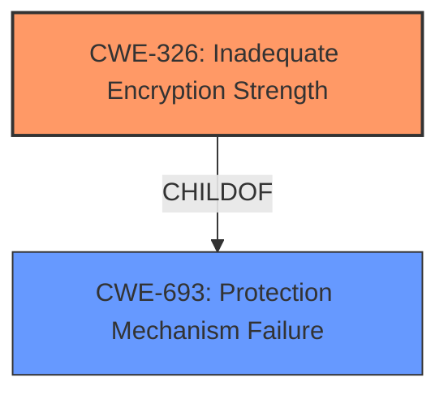

# Analysis for CVE-2021-32945

# Summary
| CWE ID | CWE Name | Confidence | CWE Abstraction Level | CWE Vulnerability Mapping Label | CWE-Vulnerability Mapping Notes |
|---|---|---|---|---|---|
| CWE-326 | Inadequate Encryption Strength | 1.0 | Class | Allowed-with-Review | Primary CWE |

## Evidence and Confidence

*   **Confidence Score:** 1.0
*   **Evidence Strength:** HIGH

## Relationship Analysis
The primary relationship that influenced the decision was the ChildOf relationship between CWE-326 and CWE-693: Protection Mechanism Failure. CWE-326 is a Class level CWE, and the mapping guidance suggests examining children for a better fit. However, given the provided information, CWE-326 remains the most accurate.

## Vulnerability Chain
The vulnerability chain consists of:
1.  **Root Cause:** **Inadequate encryption strength.**
2.  **Weakness:** The encryption used is weak, allowing an attacker to decipher it.
3.  **Impact:** Successful exploitation allows an attacker to gain access to the system.

## Summary of Analysis
The analysis is based on the provided evidence from the "CVE Reference Links Content Summary" section, which states:

*   **Root Cause:** Inadequate encryption strength.
*   **Weakness:** The encryption used is weak, allowing an attacker to decipher it.
*   **Impact:** Successful exploitation allows an attacker to gain access to the system.

The retriever results also listed CWE-326 as the top candidate.

The selection of CWE-326 is at the optimal level of specificity, as it directly addresses the **weakness** described in the vulnerability description. The description states that the **encryption** used is **weak**, and this allows an attacker to decipher it. While CWE-326 is a Class-level CWE, there isn't a more specific Base or Variant that fits better based on the information available.