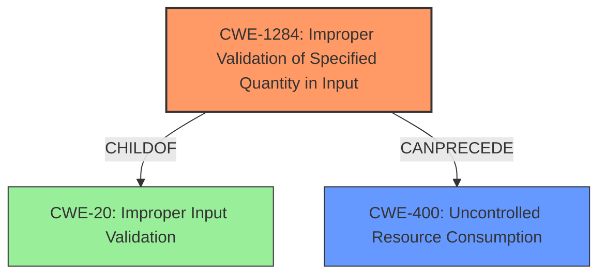

# Analysis for CVE-2021-32970

# Summary
| CWE ID  | CWE Name                                                        | Confidence | CWE Abstraction Level | CWE Vulnerability Mapping Label | CWE-Vulnerability Mapping Notes |
|---------|-----------------------------------------------------------------|------------|-----------------------|---------------------------------|-----------------------------------|
| CWE-1284 | Improper Validation of Specified Quantity in Input               | 0.8        | Base                  | Allowed                         | Primary CWE                       |
| CWE-400 | Uncontrolled Resource Consumption                               | 0.6        | Class                 | Discouraged                     | Secondary CWE                      |

## Evidence and Confidence

*   **Confidence Score:** 0.7
*   **Evidence Strength:** HIGH

## Relationship Analysis
The primary weakness identified is **CWE-1284 (Improper Validation of Specified Quantity in Input)**, a Base level CWE. This is because the **root cause** is that the data copied lacks validation, which can be interpreted as not validating the quantity of data being copied. **CWE-400 (Uncontrolled Resource Consumption)** is a Class level CWE and represents the impact of the vulnerability, which is a denial-of-service condition.

## Vulnerability Chain
The chain of events is as follows:
1.  **Root Cause:** **CWE-1284 (Improper Validation of Specified Quantity in Input)** - Data is copied without validation, implying a failure to validate the amount of data.
2.  **Impact:** **CWE-400 (Uncontrolled Resource Consumption)** - This leads to a denial-of-service condition due to uncontrolled resource consumption.

## Summary of Analysis
The vulnerability description clearly states that "**Data can be copied without validation**" in the built-in web server, potentially leading to a denial-of-service (DoS) condition.

The primary weakness is **CWE-1284 (Improper Validation of Specified Quantity in Input)**. The description indicates that the data being copied is not validated, and this lack of validation leads to a denial-of-service, which implies that an excessive amount of data can be copied, exhausting resources. This matches the **root cause** described in **CWE-1284**.

**CWE-400 (Uncontrolled Resource Consumption)** is also selected but as a secondary weakness representing the impact (denial-of-service). While the description mentions DoS, the **root cause** is the lack of validation. **CWE-400** is a Class-level CWE and is often misused.

**CWE-20 (Improper Input Validation)** was considered but not selected as the primary CWE. While it is true that the vulnerability involves a lack of input validation, **CWE-1284** is more specific because it focuses on the validation of a quantity, which is implied by the ability to cause a denial-of-service. The mapping guidance for **CWE-20** also suggests considering children like **CWE-1284**.

The selection of **CWE-1284** and **CWE-400** provides a clear and accurate representation of the vulnerability, from **root cause** to impact, at the appropriate level of specificity.