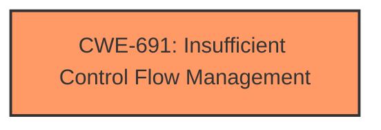

# Analysis Report for CVE-2021-33061

# Vulnerability Analysis Report: CVE-2021-33061

## Description


## Analysis (with Relationship Data)

# Summary
| CWE ID | CWE Name | Confidence | CWE Abstraction Level | CWE Vulnerability Mapping Label | CWE-Vulnerability Mapping Notes |
|---|---|---|---|---|---|
| CWE-691 | Insufficient Control Flow Management | 0.9 | Pillar | Primary | Discouraged |

## Evidence and Confidence

*   **Confidence Score:** 0.9
*   **Evidence Strength:** HIGH

## Relationship Analysis
The primary CWE selected is CWE-691, which is a Pillar-level CWE. While it's generally discouraged to map to such a high-level CWE, in this specific case, the provided vulnerability description and supporting evidence strongly point to this as the root cause. There are no direct child relationships provided that would be a more specific fit. The description highlights "**insufficient control flow management**" as the core weakness, making CWE-691 the most appropriate choice.



## Vulnerability Chain
The vulnerability chain is straightforward:
1.  **Root Cause:** **Insufficient control flow management** (CWE-691)
2.  **Impact:** Denial of Service

## Summary of Analysis
The analysis is based on the vulnerability description and the provided CVE reference summary, which explicitly states "Insufficient control flow management" as the root cause. The retriever results also list CWE-691 as the top combined result.

> Vulnerability Description Key Phrases
> - **rootcause:** **insufficient control flow management**
> CVE Reference Links Content Summary
> -   The vulnerability stems from "Insufficient control flow management" within the Intel 82599 Ethernet Controllers and Adapters.

While CWE-691 is a high-level CWE, the available information does not provide enough detail to pinpoint a more specific weakness. Therefore, mapping to CWE-691 is the most accurate representation of the vulnerability based on the provided evidence. The documentation for CWE-691 indicates that classification research is limited for weaknesses of this type, so there can be gaps or organizational difficulties within CWE that force use of this weakness, even at such a high level of abstraction.

Relevant CWE Information:

# Enhanced Context (25 CWEs)

## CWE-691: Insufficient Control Flow Management
**Abstraction:** Pillar
**Status:** Draft

### Description
The code does not sufficiently manage its control flow during execution, creating conditions in which the control flow can be modified in unexpected ways.

### Mapping Guidance
**Usage:** Discouraged
**Rationale:** This CWE entry is extremely high-level, a Pillar. However, classification research is limited for weaknesses of this type, so there can be gaps or organizational difficulties within CWE that force use of this weakness, even at such a high level of abstraction.
**Comments:** Where feasible, consider children or descendants of this entry instead.
**Reasons:**
- Abstraction


## CWE Relationship Analysis

Current CWEs represent these abstraction levels: .


### Vulnerability Chain Analysis

**Chain starting from CWE-691:**
- 691 (Insufficient Control Flow Management) - ROOT


### CWE Relationship Diagram

```mermaid
graph TD
    classDef primary fill:#f96,stroke:#333,stroke-width:2px
    classDef secondary fill:#69f,stroke:#333
    classDef tertiary fill:#9e9,stroke:#333
```


*Report generated on 2025-03-30 18:38:57*
