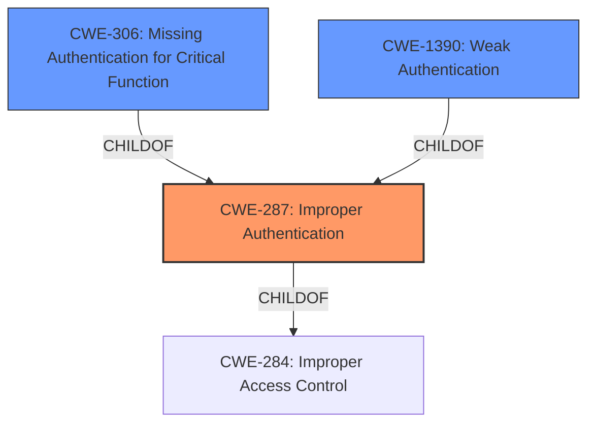

# Analysis Report for CVE-2021-33076

# Vulnerability Analysis Report: CVE-2021-33076

## Description


## Analysis (with Relationship Data)

# Summary
| CWE ID  | CWE Name                                                    | Confidence | CWE Abstraction Level | CWE Vulnerability Mapping Label | CWE-Vulnerability Mapping Notes |
| :-------- | :---------------------------------------------------------- | :---------- | :-------------------- | :------------------------------ | :------------------------------ |
| CWE-287   | Improper Authentication                                     | 0.7         | Class                 | Primary                         | Discouraged                   |
| CWE-306   | Missing Authentication for Critical Function              | 0.6         | Base                  | Secondary                       | Allowed                         |
| CWE-1390  | Weak Authentication                                         | 0.6         | Base                  | Secondary                       | Allowed                         |

## Evidence and Confidence

*   **Confidence Score:** 0.7
*   **Evidence Strength:** MEDIUM

## Relationship Analysis
The primary CWE is CWE-287 Improper Authentication, which is a Class-level CWE. While it is discouraged to map to Class-level CWEs, the description clearly indicates a problem with authentication. CWE-287 has two suggested alternatives, CWE-306 Missing Authentication for Critical Function and CWE-1390 Weak Authentication, which are both Base-level CWEs and are more specific. Depending on whether authentication is completely missing, or is present but weak, one of these two CWEs may be applicable. All three of these CWEs are children of CWE-284 Improper Access Control.



## Vulnerability Chain
The vulnerability chain starts with **improper authentication in firmware**, which could lead to **escalation of privilege** when an **unauthenticated user** has **physical access**.

## Summary of Analysis
The vulnerability description clearly states "**Improper authentication in firmware**". The description goes on to say this may allow an **unauthenticated user** to potentially enable **escalation of privilege via physical access**.

CWE-287 Improper Authentication is a Class-level CWE that describes the situation where "When an actor claims to have a given identity, the product does not prove or insufficiently proves that the claim is correct." The mapping guidance discourages direct mapping to CWE-287 and suggests considering children or descendants, beginning with CWE-1390: Weak Authentication or CWE-306: Missing Authentication for Critical Function.

Given the limited information, it is not clear whether authentication is completely missing (CWE-306) or present but weak (CWE-1390). Therefore, CWE-287 is chosen as the primary CWE, with CWE-306 and CWE-1390 as secondary candidates. Further investigation would be needed to determine the most appropriate Base-level CWE.

The evidence is sufficient to support the selection of CWE-287, but further investigation is needed to select between CWE-306 and CWE-1390.

Other CWEs considered but not used:
*   CWE-691: Insufficient Control Flow Management - This is a very high-level CWE and does not directly relate to the **improper authentication** issue.
*   CWE-693: Protection Mechanism Failure - Similar to CWE-691, this is a high-level CWE and less specific than CWE-287.
*   CWE-1258: Exposure of Sensitive System Information Due to Uncleared Debug Information - This CWE is not relevant as the vulnerability description does not involve uncleared debug information.
*   CWE-453: Insecure Default Variable Initialization - This CWE is not relevant as the vulnerability description does not mention insecure variable initialization.
*   CWE-1256: Improper Restriction of Software Interfaces to Hardware Features - This CWE is not relevant as the vulnerability is about authentication and not hardware interfaces.
*   CWE-613: Insufficient Session Expiration - This CWE is not relevant as the vulnerability is about initial authentication, not session management.
*   CWE-284: Improper Access Control - This is a parent of CWE-287, but CWE-287 is more specific.
*   CWE-248: Uncaught Exception - This CWE is not relevant as the vulnerability description does not involve exceptions.
*   CWE-119: Improper Restriction of Operations within the Bounds of a Memory Buffer - This CWE is not relevant as the vulnerability description does not involve buffer operations.
*   CWE-639: Authorization Bypass Through User-Controlled Key - This CWE is not relevant as the vulnerability description does not involve user-controlled keys.
*   CWE-322: Key Exchange without Entity Authentication - This CWE is not relevant as the vulnerability description does not involve key exchange.
*   CWE-193: Off-by-one Error, CWE-131: Incorrect Calculation of Buffer Size, CWE-190: Integer Overflow or Wraparound, CWE-825: Expired Pointer Dereference, CWE-170: Improper Null Termination, CWE-1257: Improper Access Control Applied to Mirrored or Aliased Memory Regions, CWE-1260: Improper Handling of Overlap Between Protected Memory Ranges, CWE-703: Improper Check or Handling of Exceptional Conditions, CWE-667: Improper Locking, CWE-805: Buffer Access with Incorrect Length Value, CWE-191: Integer Underflow (Wrap or Wraparound) - These CWEs were also considered but were deemed not relevant due to not relating to the specific vulnerability description which highlighted **improper authentication**.


## CWE Relationship Analysis

Current CWEs represent these abstraction levels: .


### Vulnerability Chain Analysis

**Chain starting from CWE-1257:**
- 1257 (Improper Access Control Applied to Mirrored or Aliased Memory Regions) - ROOT


**Chain starting from CWE-119:**
- 119 (Improper Restriction of Operations within the Bounds of a Memory Buffer) - ROOT


### CWE Relationship Diagram

```mermaid
graph TD
    classDef primary fill:#f96,stroke:#333,stroke-width:2px
    classDef secondary fill:#69f,stroke:#333
    classDef tertiary fill:#9e9,stroke:#333
```


*Report generated on 2025-03-31 08:04:36*
