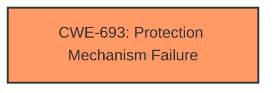

# Analysis Report for CVE-2021-33081

# Vulnerability Analysis Report: CVE-2021-33081

## Description


## Analysis (with Relationship Data)

# Summary
| CWE ID | CWE Name | Confidence | CWE Abstraction Level | CWE Vulnerability Mapping Label | CWE-Vulnerability Mapping Notes |
|---|---|---|---|---|---|
| CWE-693 | Protection Mechanism Failure | 0.75 | Pillar | Allowed | Discouraged |

## Evidence and Confidence

*   **Confidence Score:** 0.75
*   **Evidence Strength:** MEDIUM

## Relationship Analysis
The primary relationship that influenced my decision was the abstraction level. CWE-693 is a Pillar, representing a high-level category. There are no direct parent-child or chain relationships for this particular vulnerability that are strongly indicative of a more specific CWE. The high-level nature of the vulnerability description limits our ability to select a more specific CWE at the Base or Variant level.



## Vulnerability Chain
The vulnerability chain is relatively simple:

1.  **Root Cause:** **Protection mechanism failure** (CWE-693)
2.  **Impact:** Information disclosure

There are no explicitly mentioned intermediate steps in the vulnerability description.

## Summary of Analysis
The initial assessment strongly points to a **protection mechanism failure** as the root cause of the vulnerability, leading to potential information disclosure. The provided description states "**Protection mechanism failure** in firmware for some Intel(R) SSD DC Products may allow a privileged user to potentially enable information disclosure via local access." The key phrase "**Protection mechanism failure**" aligns directly with CWE-693: Protection Mechanism Failure.

The Retriever Results also list CWE-693 as the top combined result, but it is noted as a Pillar level CWE. While ideally we'd want to find a more specific Base or Variant CWE, the limited details prevent this.

CWE-NVD-Other was the top CWE for similar CVE Descriptions. However, CWE-NVD-Other is not a real CWE, so that was not considered as a match.

The decision to assign CWE-693 is based on the direct match of the vulnerability description's root cause with the CWE's definition. The official mapping guidance for CWE-693 discourages its use due to its high abstraction level (Pillar). However, the lack of more specific details in the vulnerability description makes it difficult to select a more granular CWE. Therefore, I am selecting CWE-693 with a lower confidence score, acknowledging the limitations of the available information.

Relevant CWE Information:

# Enhanced Context (25 CWEs)
The following CWEs were identified as potentially relevant to this vulnerability:

## CWE-693: Protection Mechanism Failure
**Abstraction:** Pillar
**Status:** Draft

### Description
The product does not use or incorrectly uses a protection mechanism that provides sufficient defense against directed attacks against the product.

### Extended Description
This weakness covers three distinct situations. A "missing" protection mechanism occurs when the application does not define any mechanism against a certain class of attack. An "insufficient" protection mechanism might provide some defenses - for example, against the most common attacks - but it does not protect against everything that is intended. Finally, an "ignored" mechanism occurs when a mechanism is available and in active use within the product, but the developer has not applied it in some code path.

### Alternative Terms
None

### Relationships
None

### Mapping Guidance
**Usage:** Discouraged
**Rationale:** This CWE entry is extremely high-level, a Pillar.
**Comments:** Consider children or descendants of this entry instead.
**Reasons:**
- Abstraction

### Additional Notes
**[Research Gap]** The concept of protection mechanisms is well established, but protection mechanism failures have not been studied comprehensively. It is suspected that protection mechanisms can have significantly different types of weaknesses than the weaknesses that they are intended to prevent.


## CWE Relationship Analysis

Current CWEs represent these abstraction levels: .


### Vulnerability Chain Analysis

**Chain starting from CWE-693:**
- 693 (Protection Mechanism Failure) - ROOT


### CWE Relationship Diagram

```mermaid
graph TD
    classDef primary fill:#f96,stroke:#333,stroke-width:2px
    classDef secondary fill:#69f,stroke:#333
    classDef tertiary fill:#9e9,stroke:#333
```


*Report generated on 2025-03-30 22:26:00*
