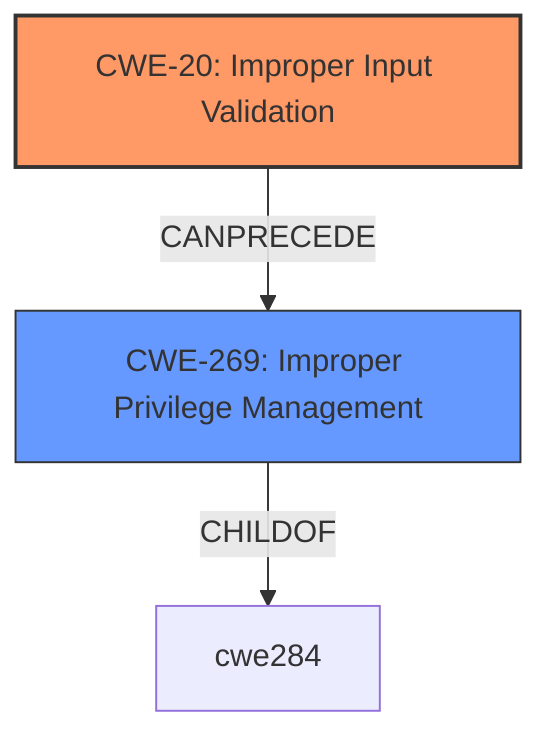

# Enhanced Analysis for CVE-2021-33108

# Summary
| CWE ID | CWE Name | Confidence | CWE Abstraction Level | CWE Vulnerability Mapping Label | CWE-Vulnerability Mapping Notes |
|---|---|---|---|---|---|
| CWE-20 | Improper Input Validation | 0.9 | Class | Primary | Discouraged |
| CWE-269 | Improper Privilege Management | 0.6 | Class | Secondary | Discouraged |

## Evidence and Confidence

*   **Confidence Score:** 0.75
*   **Evidence Strength:** HIGH

## Relationship Analysis
The primary relationship that influenced my decision was the hierarchical relationship of CWE-20 as a Class-level weakness. While the description points to **improper input validation**, the context of a "privileged user" exploiting this for "escalation of privilege" also brings in CWE-269. However, CWE-269 is also a class-level CWE and discouraged. The chain relationships are not explicitly defined but the **improper input validation** leads to the **escalation of privilege**.



## Vulnerability Chain
The vulnerability chain starts with **improper input validation** (CWE-20), which then leads to **escalation of privilege** for a privileged user.

## Summary of Analysis
The initial analysis focused on the identified **root cause** of **improper input validation** in the Intel(R) In-Band Manageability software, which allows a privileged user to escalate their privileges. This led to the initial consideration of CWE-20. The key phrase "**Improper input validation**" and the CVE Reference Links Content Summary's emphasis on "Insufficient validation of input data" strongly support this classification.

However, because the exploit is local and is performed by a privileged user to escalate privileges, this indicates that the application's privilege management is also a factor. Hence CWE-269 was also considered.

The final decision favored CWE-20 as the primary weakness because the **improper input validation** is the direct cause that enables the **escalation of privilege**. CWE-269 is a contributing factor but is secondary to the input validation issue. Both CWE-20 and CWE-269 are class-level CWEs and discouraged. Ideally, a more specific CWE would be used, but I don't have enough information to select one, as the description lacks details on the specific type of input and the nature of the validation failure.

Relevant CWE Information:

# Enhanced Context (25 CWEs)

## CWE-20: Improper Input Validation
**Technical Explanation:** The vulnerability stems from the software's failure to adequately validate input, which allows a privileged user to manipulate the system in a way that escalates their privileges. This could involve injecting malicious commands or data through the **improperly validated** input fields.
**Security Implications:** The impact is **escalation of privilege**, which allows an attacker to gain higher-level access to the system.
**Relationship Analysis:** CWE-20 is a Class-level weakness. It can lead to other weaknesses like command injection or buffer overflows.
**Mapping Guidance:** The MITRE mapping guidance discourages the use of CWE-20 when more specific CWEs are available. However, without further details on the nature of the input and validation, CWE-20 serves as a reasonable starting point.
**Justification:** The "**rootcause:** **Improper input validation**" is the key evidence that supports the selection of CWE-20.

## CWE-269: Improper Privilege Management
**Technical Explanation:** The software does not properly manage privileges, allowing a privileged user to escalate to an even higher level.
**Security Implications:** This leads to unauthorized access and control over system resources.
**Relationship Analysis:** CWE-269 is a Class-level weakness and a child of CWE-284 (Improper Access Control).
**Mapping Guidance:** The MITRE mapping guidance discourages the use of CWE-269 when more specific CWEs are available.
**Justification:** The "**impact:** escalation of privilege" and the fact that the "**attacker:** privileged user" indicate a privilege management issue.


## CWE Relationship Analysis

Current CWEs represent these abstraction levels: .


### Vulnerability Chain Analysis

**Chain starting from CWE-269:**
- 269 (Improper Privilege Management) - ROOT


**Chain starting from CWE-20:**
- 20 (Improper Input Validation) - ROOT


### CWE Relationship Diagram

```mermaid
graph TD
    classDef primary fill:#f96,stroke:#333,stroke-width:2px
    classDef secondary fill:#69f,stroke:#333
    classDef tertiary fill:#9e9,stroke:#333
```