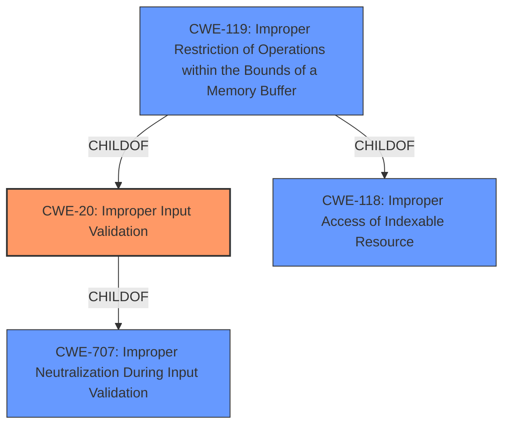

# Enhanced Analysis for CVE-2021-33113

# Summary
| CWE ID | CWE Name | Confidence | CWE Abstraction Level | CWE Vulnerability Mapping Label | CWE-Vulnerability Mapping Notes |
|---|---|---|---|---|---|
| CWE-20 | Improper Input Validation | 0.9 | Class | Primary | Discouraged |
| CWE-119 | Improper Restriction of Operations within the Bounds of a Memory Buffer | 0.5 | Class | Secondary | Discouraged |

## Evidence and Confidence

*   **Confidence Score:** 0.7
*   **Evidence Strength:** MEDIUM

## Relationship Analysis
The primary relationship considered was the parent-child relationship. CWE-20 is a child of CWE-707 (Improper Neutralization During Input Validation) and has several more specific children like CWE-1284, CWE-1285, CWE-1286, CWE-1287, CWE-1288, and CWE-1289. However, the provided information doesn't give enough details to pinpoint the exact type of **improper input validation**, thus the more general CWE-20 was selected.
CWE-119 is a child of CWE-118 and CWE-20.



## Vulnerability Chain
The vulnerability chain starts with **improper input validation** (CWE-20), which can lead to denial of service or information disclosure. A potential second weakness is **Improper Restriction of Operations within the Bounds of a Memory Buffer (CWE-119)**

## Summary of Analysis
The initial analysis identified **improper input validation** as the root cause, which aligns with the vulnerability description and the CVE reference links. The retriever results also ranked CWE-20 highly. However, CWE-20 is a Class-level CWE and is discouraged for use when more specific CWEs are available. Despite this, the provided information doesn't offer enough specifics to choose a more detailed CWE. Thus, CWE-20 is the most appropriate choice given the available evidence.

CWE-119 was considered as a secondary weakness because **improper input validation** often leads to buffer overflows or similar memory corruption issues. The CVE description mentions denial of service and information disclosure as potential impacts, which can result from out-of-bounds reads or writes. However, without more details, it's difficult to confirm this.

The selection of CWE-20 is based on the explicit mention of **"Improper input validation"** in the vulnerability description and the CVE reference links.

Relevant CWE Information:

# Enhanced Context (25 CWEs)

## CWE-20: Improper Input Validation
**Abstraction:** Class
**Similarity Score**: 2.98
**Source**: graph

**Description**:
CWE-20: Improper Input Validation

**Mapping Guidance**:
- Usage: Discouraged
- Rationale: CWE-20 is commonly misused in low-information vulnerability reports when lower-level CWEs could be used instead [REF-1287]. It is not useful for trend analysis. It is also a level-1 Class (i.e., a child of a Pillar).

## CWE-119: Improper Restriction of Operations within the Bounds of a Memory Buffer
**Abstraction:** Class
**Similarity Score**: 7172.77
**Source**: sparse

**Description**:
The product performs operations on a memory buffer, but it reads from or writes to a memory location outside the buffer's intended boundary. This may result in read or write operations on unexpected memory locations that could be linked to other variables, data structures, or internal program data.

**Mapping Guidance**:
- Usage: Discouraged
- Rationale: CWE-119 is commonly misused in low-information vulnerability reports when lower-level CWEs could be used instead, or when more details about the vulnerability are available.


## CWE Relationship Analysis

Current CWEs represent these abstraction levels: .


### Vulnerability Chain Analysis

**Chain starting from CWE-20:**
- 20 (Improper Input Validation) - ROOT


**Chain starting from CWE-707:**
- 707 (Improper Neutralization) - ROOT


### CWE Relationship Diagram

```mermaid
graph TD
    classDef primary fill:#f96,stroke:#333,stroke-width:2px
    classDef secondary fill:#69f,stroke:#333
    classDef tertiary fill:#9e9,stroke:#333
```