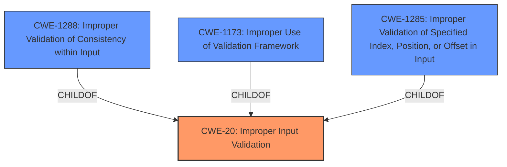

# Analysis for CVE-2021-33115

# Summary

| CWE ID | CWE Name | Confidence | CWE Abstraction Level | CWE Vulnerability Mapping Label | CWE-Vulnerability Mapping Notes |
|---|---|---|---|---|---|
| CWE-20 | Improper Input Validation | 0.75 | Class | Primary CWE | Discouraged |

## Evidence and Confidence

*   **Confidence Score:** 0.75
*   **Evidence Strength:** MEDIUM

## Relationship Analysis
The primary relationship considered was that CWE-20 is a Class-level CWE, and the mapping guidance discourages its use when more specific Base or Variant level CWEs are available. Several child CWEs of CWE-20 were considered, including CWE-1288, CWE-1173, and CWE-1285. While these were more specific, the information provided did not give enough specifics to support using one of those children CWEs.

## Vulnerability Chain
The vulnerability chain starts with **Improper input validation** (CWE-20), which allows an unauthenticated user to potentially enable escalation of privilege. The adjacent access attack vector highlights the context of the vulnerability, influencing the access control aspect.

## Summary of Analysis
The initial analysis focused on the **Improper input validation** as the root cause of the vulnerability, leading to potential privilege escalation. The adjacent access vector provides context.

The primary challenge was selecting the most specific and appropriate CWE. While CWE-20 is a Class-level CWE and its usage is discouraged, the available information lacked the details necessary to confidently assign a more specific Base or Variant CWE. The presence of **Improper input validation** in both the vulnerability description and CVE Reference Links Content Summary strongly supports the selection of CWE-20. The confidence is moderate because more information would be needed to select a more specific CWE.

Relevant CWE Information:

# Enhanced Context (25 CWEs)

## CWE-1288: Improper Validation of Consistency within Input

CWE-1288 was considered because it is a child of CWE-20 and represents a more specific type of **improper input validation**. However, the description requires multiple elements or fields that must be consistent with each other. The current vulnerability description does not provide enough information to determine whether this is the case. Therefore, it was not selected.

## CWE-1173: Improper Use of Validation Framework

CWE-1173 was considered because it is a child of CWE-20 and represents a more specific type of **improper input validation**. However, the description requires the product to use or incorrectly use an input validation framework. The current vulnerability description does not provide enough information to determine whether this is the case. Therefore, it was not selected.

## CWE-1285: Improper Validation of Specified Index, Position, or Offset in Input

CWE-1285 was considered because it is a child of CWE-20 and represents a more specific type of **improper input validation**. However, the description requires the input to specify an index, position, or offset into an indexable resource. The current vulnerability description does not provide enough information to determine whether this is the case. Therefore, it was not selected.

## CWE-20: Improper Input Validation

The vulnerability description explicitly states **"Improper input validation"** as the root cause. The CVE Reference Links Content Summary also confirms this. While the mapping guidance discourages the use of CWE-20, it is the most appropriate CWE given the limited information.