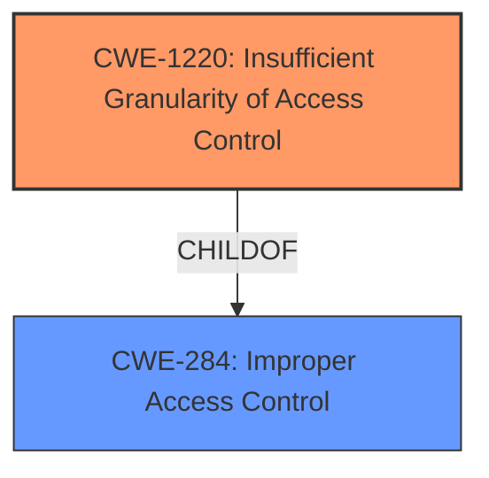

# Analysis for CVE-2021-33128

# Summary
| CWE ID  | CWE Name                                                  | Confidence | CWE Abstraction Level | CWE Vulnerability Mapping Label | CWE-Vulnerability Mapping Notes |
| :-------- | :-------------------------------------------------------- | :--------- | :---------------------- | :------------------------------ | :------------------------------ |
| CWE-1220 | Insufficient Granularity of Access Control               | 0.85       | Base                    | Allowed                         |  Primary CWE                 |
| CWE-284  | Improper Access Control                                   | 0.65       | Pillar                    | Discouraged                     | Secondary Candidate                  |

## Evidence and Confidence

*   **Confidence Score:** 0.8
*   **Evidence Strength:** HIGH

## Relationship Analysis
The primary relationship that influenced my decision was the ChildOf relationship between CWE-1220 and CWE-284. CWE-1220 is a more specific instance of CWE-284, providing better granularity. Although CWE-284 is listed as a discouraged CWE, the evidence points directly to an access control issue, making it a relevant, albeit less specific, classification.

## Vulnerability Chain
The vulnerability chain is fairly straightforward:
1.  **Root Cause**: **Improper access control**, specifically **insufficient granularity** (CWE-1220)
2.  **Impact**: Potential denial of service (DoS)

## Summary of Analysis
The initial analysis focused on the **improper access control**, which is the stated **rootcause** of the vulnerability. The "CVE Reference Links Content Summary" confirms this by stating the "**root cause of vulnerability** is **improper access control** in the firmware" and the "**core issue is a lack of proper access control**". The primary CWE match from the "CWE for similar CVE Descriptions" section being CWE-NVD-noinfo suggests the need for careful consideration of the available evidence to select a more descriptive CWE.

The "Retriever Results" highlight several potential CWEs, including CWE-691, CWE-248, CWE-693, CWE-284, CWE-119, CWE-1191, CWE-1257, CWE-453, CWE-287 and CWE-1220. After careful review, CWE-1220 and CWE-284 emerged as the most relevant.

CWE-284 is a high-level **Improper Access Control** (Pillar) that is discouraged because it is too generic. However, it is relevant as a general category.

CWE-1220 **Insufficient Granularity of Access Control** (Base) is a more specific child of CWE-284. The description of CWE-1220 directly aligns with the vulnerability, where access controls are implemented but lack the necessary granularity, allowing unauthorized access.

Therefore, CWE-1220 is the optimal choice as the primary CWE, representing the **root cause** with sufficient specificity.

Relevant CWE Information:

# Enhanced Context (25 CWEs)
The following CWEs were identified as potentially relevant to this vulnerability:

## CWE-1220: Insufficient Granularity of Access Control
**Abstraction Level**: Base
**Similarity Score**: 0.80
**Source**: dense

**Description**:
The product implements access controls via a policy or other feature with the intention to disable or restrict accesses (reads and/or writes) to assets in a system from untrusted agents. However, implemented access controls lack required granularity, which renders the control policy too broad because it allows accesses from unauthorized agents to the security-sensitive assets.

**Mapping Guidance**:
- Usage: Allowed
- Rationale: This CWE entry is at the Base level of abstraction, which is a preferred level of abstraction for mapping to the root causes of vulnerabilities.

## CWE-284: Improper Access Control
**Abstraction:** Pillar
**Status:** Incomplete

### Description
The product does not restrict or incorrectly restricts access to a resource from an unauthorized actor.