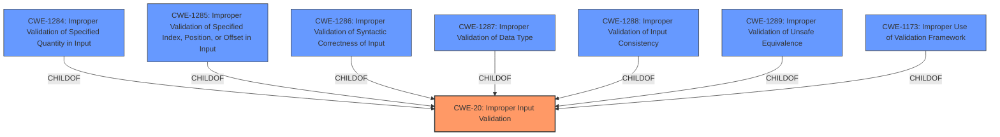

# Analysis Report for CVE-2021-33155

# Vulnerability Analysis Report: CVE-2021-33155

## Description


## Analysis (with Relationship Data)

# Summary
| CWE ID | CWE Name | Confidence | CWE Abstraction Level | CWE Vulnerability Mapping Label | CWE-Vulnerability Mapping Notes |
|---|---|---|---|---|---|
| CWE-20 | Improper Input Validation | 1.0 | Class | Primary | Discouraged |

## Evidence and Confidence

*   **Confidence Score:** 1.0
*   **Evidence Strength:** HIGH

## Relationship Analysis
The primary relationship influencing the CWE selection is that CWE-20 is a parent of several more specific CWEs related to input validation. However, without further information, it's difficult to pinpoint the exact type of **improper input validation**. While normally discouraged, CWE-20 is the most appropriate given the available evidence.



## Vulnerability Chain
The chain of events is as follows:
1.  **Root Cause:** **Improper input validation** (CWE-20) in the firmware.
2.  **Impact:** Denial of service.

## Summary of Analysis
The initial analysis correctly identified **improper input validation** as the root cause of the vulnerability. The provided evidence, specifically the "Vulnerability Description Key Phrases" and "CVE Reference Links Content Summary," clearly states this. The description explicitly mentions "**Improper input validation** in firmware... may allow an authenticated user to potentially enable denial of service."

The selection of CWE-20 is based on the vulnerability description stating "**Improper input validation**" as the root cause. The retriever results also list CWE-20, although with a discouraged usage.

While CWE-20 is generally discouraged due to its high-level nature, the lack of specific details about *how* the input validation is **improper** makes it the most appropriate choice. Without knowing the specific type of input or the validation error, a more specific CWE cannot be selected. This decision aligns with the MITRE mapping guidance, which suggests considering lower-level children when available but not forcing a mapping.

Other CWEs were considered but ultimately deemed less suitable. CWE-1288 (Improper Validation of Consistency within Input), CWE-1173 (Improper Use of Validation Framework), and CWE-1285 (Improper Validation of Specified Index, Position, or Offset in Input) were all plausible but lacked specific supporting evidence. These CWEs describe very specific scenarios for improper input validation, and without more context, they cannot be definitively selected.


## CWE Relationship Analysis

Current CWEs represent these abstraction levels: .


### Vulnerability Chain Analysis

**Chain starting from CWE-20:**
- 20 (Improper Input Validation) - ROOT


**Chain starting from CWE-1286:**
- 1286 (Improper Validation of Syntactic Correctness of Input) - ROOT


### CWE Relationship Diagram

```mermaid
graph TD
    classDef primary fill:#f96,stroke:#333,stroke-width:2px
    classDef secondary fill:#69f,stroke:#333
    classDef tertiary fill:#9e9,stroke:#333
```


*Report generated on 2025-03-30 21:31:11*
