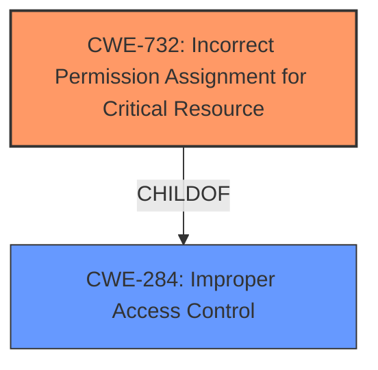

# Enhanced Analysis for CVE-2021-33164

# Summary
| CWE ID | CWE Name | Confidence | CWE Abstraction Level | CWE Vulnerability Mapping Label | CWE-Vulnerability Mapping Notes |
|---|---|---|---|---|---|
| CWE-732 | Incorrect Permission Assignment for Critical Resource | 0.85 | Base | Primary | Allowed |
| CWE-284 | Improper Access Control | 0.60 | Pillar | Secondary | Discouraged |

## Evidence and Confidence

*   **Confidence Score:** 0.80
*   **Evidence Strength:** HIGH

## Relationship Analysis
The primary CWE selected is CWE-732 (Incorrect Permission Assignment for Critical Resource), which is a child of CWE-284 (Improper Access Control). This reflects a hierarchical relationship where the more specific CWE-732 is preferred over its more general parent CWE-284. The CERT advisory mentions TOCTOU race conditions, which could point to CWE-367, but the provided information focuses more on the incorrect assignment of permissions as the root cause, making CWE-732 a more direct fit. The abstraction levels influenced the decision, favoring the base-level CWE-732 over the pillar-level CWE-284.



## Vulnerability Chain
The vulnerability chain starts with the root cause: **Improper Access Control**, specifically an **Incorrect Permission Assignment for Critical Resource** (CWE-732). This leads to a privileged user being able to escalate privileges, representing the impact. The local access vector serves as a prerequisite for exploiting the vulnerability.

## Summary of Analysis
The initial analysis identified **Improper Access Control** as the primary issue, based on the vulnerability description and CVE reference content. The retriever results suggested several CWEs, including CWE-1220 (Insufficient Granularity of Access Control), CWE-691 (Insufficient Control Flow Management), and CWE-284 (Improper Access Control). However, after reviewing the complete CWE specifications, CWE-732 (Incorrect Permission Assignment for Critical Resource), a child of CWE-284, was determined to be a more specific and accurate representation of the vulnerability, aligning with the "**rootcause:** **Improper access control**" and the ability of a privileged user to escalate privileges.

The CERT advisory's mention of a TOCTOU race condition initially suggested CWE-367, but the focus of the vulnerability is on the incorrect initial assignment of permissions, not a race condition that occurs during access. Therefore, CWE-732 more accurately captures the root cause.

The decision to select CWE-732 is based on its specificity and alignment with the root cause of the vulnerability, as evidenced by the "**rootcause:** **Improper access control**" phrase in the "Vulnerability Description Key Phrases" and the CVE Reference Links Content Summary indicating that the vulnerability lies in how the BIOS firmware handles access control, allowing a privileged user to bypass intended restrictions.

Relevant CWE Information:

# Enhanced Context (25 CWEs)

## CWE-1220: Insufficient Granularity of Access Control
**Abstraction Level**: Base
**Similarity Score**: 0.79
**Source**: dense

**Description**:
The product implements access controls via a policy or other feature with the intention to disable or restrict accesses (reads and/or writes) to assets in a system from untrusted agents. However, implemented access controls lack required granularity, which renders the control policy too broad because it allows accesses from unauthorized agents to the security-sensitive assets.

**Mapping Guidance**:
- Usage: Allowed
- Rationale: This CWE entry is at the Base level of abstraction, which is a preferred level of abstraction for mapping to the root causes of vulnerabilities.

## CWE-732: Incorrect Permission Assignment for Critical Resource
**Abstraction Level**: Base
**Status**: Draft

### Description
The product assigns permissions for a critical resource such that unintended actors are granted access, or expected actors are not granted access.

### Extended Description
A critical resource is one that requires specific access control to prevent unintended modification, disclosure, or destruction of the resource. Critical resources could include program executables, configuration files, sensitive data files, directories, and other resources that could have a security impact if accessed by unintended actors.

There are two distinct cases:

*   The product grants access to an actor that should not have access.
*   The product does not grant access to an actor that should have access.

In either case, the incorrect permission assignment can lead to security vulnerabilities.

### Alternative Terms
None

### Relationships
ChildOf -> CWE-284

### Mapping Guidance
**Usage**: Allowed
**Rationale**: This CWE entry is at the Base level of abstraction, which is a preferred level of abstraction for mapping to the root causes of vulnerabilities.
**Comments**: Carefully read both the name and description to ensure that this mapping is an appropriate fit. Do not try to 'force' a mapping to a lower-level Base/Variant simply to comply with this preferred level of abstraction.
**Reasons**:
*   Acceptable-Use

### Observed Examples
*   **CVE-2023-34051**: Incorrect permission assignment in a settings database for a project management tool allows a low-privilege user to modify critical settings, which could lead to privilege escalation.
*   **CVE-2023-28421**: Incorrect permission assignment on a file containing encryption keys allows an attacker to gain unauthorized access to sensitive data.
*   **CVE-2023-27997**: Incorrect default permissions on a log file allow an attacker to read sensitive information, such as API keys and passwords.


## CWE Relationship Analysis

Current CWEs represent these abstraction levels: .


### Vulnerability Chain Analysis

**Chain starting from CWE-1220:**
- 1220 (Insufficient Granularity of Access Control) - ROOT


**Chain starting from CWE-732:**
- 732 (Incorrect Permission Assignment for Critical Resource) - ROOT


### CWE Relationship Diagram

```mermaid
graph TD
    classDef primary fill:#f96,stroke:#333,stroke-width:2px
    classDef secondary fill:#69f,stroke:#333
    classDef tertiary fill:#9e9,stroke:#333
```