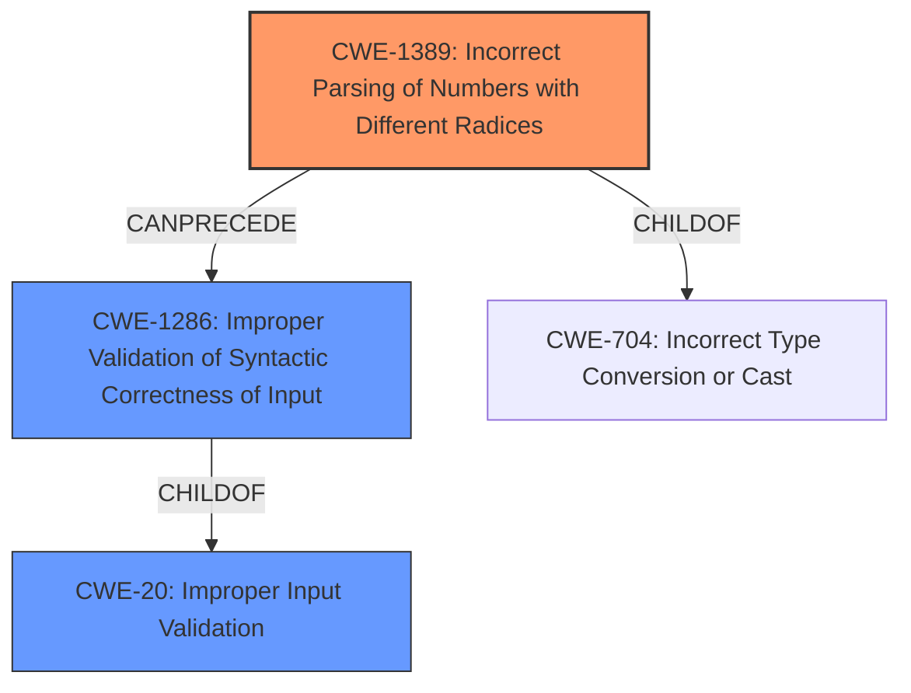

# Analysis Report for CVE-2021-33318

# Vulnerability Analysis Report: CVE-2021-33318

## Description


## Analysis (with Relationship Data)

# Summary
| CWE ID | CWE Name | Confidence | CWE Abstraction Level | CWE Vulnerability Mapping Label | CWE-Vulnerability Mapping Notes |
|---|---|---|---|---|---|
| CWE-1389 | Incorrect Parsing of Numbers with Different Radices | 0.9 | Base | Allowed | Primary CWE |
| CWE-1286 | Improper Validation of Syntactic Correctness of Input | 0.7 | Base | Allowed | Secondary CWE |
| CWE-20 | Improper Input Validation | 0.5 | Class | Discouraged | Secondary CWE |

## Evidence and Confidence

*   **Confidence Score:** 0.8
*   **Evidence Strength:** HIGH

## Relationship Analysis
The primary CWE is CWE-1389, which is a specific type of **improper input validation** where the software **incorrectly parses numeric input** with different radices. This relates to the broader class of **improper input validation** (CWE-20), but is more specific. CWE-1286 is a closely related issue, as it deals with the validation of syntactic correctness, which is a prerequisite for proper parsing.



## Vulnerability Chain
The vulnerability chain starts with the **insufficient input validation** of IP addresses and netmasks, specifically the **failure to account for different radices** (octal, hexadecimal). This leads to the **incorrect parsing** and storage of these values, ultimately bypassing IP-based security controls.

Root Cause: **Insufficient Input Validation** (CWE-20) & **Incorrect Parsing of Numbers with Different Radices** (CWE-1389)
Weakness: **Improper Validation of Syntactic Correctness** (CWE-1286)
Impact: Bypass of Allow/Deny Lists, potential SSRF, LFI, RFI, or DoS

## Summary of Analysis
The initial assessment identified the **root cause** as **insufficient input validation**, which aligns with the vulnerability description key phrases. The CVE Reference Links Content Summary further specifies that the library **does not properly validate or reformat IP addresses and netmasks** provided in octal or hexadecimal notation.

The retriever results highlight CWE-1389 (**Incorrect Parsing of Numbers with Different Radices**) and CWE-1286 (**Improper Validation of Syntactic Correctness of Input**) as strong candidates. Given the specific detail about octal/hexadecimal representations, CWE-1389 is the most precise match, as it describes the exact mechanism of the **vulnerability**. CWE-1286 is also relevant because the input is expected to be well-formed but isn't validated for syntactic correctness. CWE-20 (**Improper Input Validation**) is a broader category and is less specific than CWE-1389 and CWE-1286.

The relationship graph confirms that CWE-1389 and CWE-1286 are child concepts of CWE-20, with CWE-1389 further related to CWE-704 (**Incorrect Type Conversion or Cast**). This strengthens the case for prioritizing CWE-1389 and CWE-1286, as they are more detailed and directly relevant to the vulnerability's root cause.

Therefore, the chosen CWEs provide the optimal level of specificity by focusing on the **incorrect parsing** and **insufficient validation** of numeric inputs with different radices, rather than simply a general **lack of input validation**. The evidence clearly supports this classification, and the relationship analysis further solidifies the decision.

Relevant CWE Information:
CWE-1389: Incorrect Parsing of Numbers with Different Radices
CWE-1286: Improper Validation of Syntactic Correctness of Input
CWE-20: Improper Input Validation
CWE-1285: Improper Validation of Specified Index, Position, or Offset in Input
CWE-347: Improper Verification of Cryptographic Signature
CWE-554: ASP.NET Misconfiguration: Not Using Input Validation Framework
CWE-41: Improper Resolution of Path Equivalence
CWE-1333: Inefficient Regular Expression Complexity
CWE-1284: Improper Validation of Specified Quantity in Input
CWE-78: Improper Neutralization of Special Elements used in an OS Command ('OS Command Injection')


## CWE Relationship Analysis

Current CWEs represent these abstraction levels: .


### Vulnerability Chain Analysis

**Chain starting from CWE-41:**
- 41 (Improper Resolution of Path Equivalence) - ROOT


**Chain starting from CWE-704:**
- 704 (Incorrect Type Conversion or Cast) - ROOT


### CWE Relationship Diagram

```mermaid
graph TD
    classDef primary fill:#f96,stroke:#333,stroke-width:2px
    classDef secondary fill:#69f,stroke:#333
    classDef tertiary fill:#9e9,stroke:#333
```


*Report generated on 2025-03-31 01:51:18*
