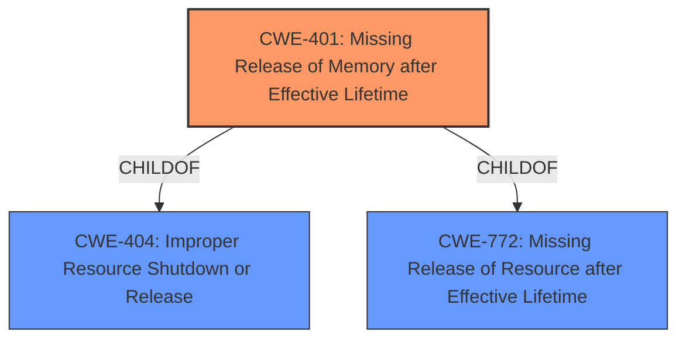

# Enhanced Analysis for CVE-2021-33437

# Summary
| CWE ID | CWE Name | Confidence | CWE Abstraction Level | CWE Vulnerability Mapping Label | CWE-Vulnerability Mapping Notes |
|---|---|---|---|---|---|
| CWE-401 | Missing Release of Memory after Effective Lifetime | 1.0 | Variant | Allowed | Primary CWE |

## Evidence and Confidence

*   **Confidence Score:** 1.0
*   **Evidence Strength:** HIGH

## Relationship Analysis
The primary relationship that influenced the decision was the child-of relationship between CWE-401 and CWE-404 (Improper Resource Shutdown or Release). CWE-401 is a variant of CWE-404, representing a specific case of resource mismanagement related to memory. Additionally, CWE-401 has a child-of relationship with CWE-772 (Missing Release of Resource after Effective Lifetime), which is a more general case of missing resource release. This indicates a hierarchical structure where CWE-401 provides the most specific and accurate description of the **memory leak** vulnerability.



## Vulnerability Chain
The vulnerability chain is straightforward:
1.  **Root Cause:** **Missing release of allocated memory** in the `frozen_cb()` function.
2.  **Weakness:** **Memory Leak**
3.  **Impact:** Denial of service due to memory exhaustion.

## Summary of Analysis
The initial analysis identified a **memory leak** in the `frozen_cb()` function. The CVE Reference Links Content Summary explicitly mentions a "memory leak" as a weakness and "Denial of service due to memory exhaustion" as the impact.

The Retriever Results listed CWE-401 (Missing Release of Memory after Effective Lifetime) as the top candidate with a high similarity score. The description of CWE-401, "The product does not sufficiently track and release allocated memory after it has been used, which slowly consumes remaining memory," aligns perfectly with the vulnerability description. The Mapping Guidance for CWE-401 indicates it is at the Variant level of abstraction, which is a preferred level for mapping.

The relationships between CWE-401 and its parent CWEs (CWE-772 and CWE-404) were considered. While CWE-772 and CWE-404 are relevant, CWE-401 is the most specific and accurate representation of the **memory leak** vulnerability.

The decision to select CWE-401 is based on direct evidence from the vulnerability description and the CVE Reference Links Content Summary, supported by the Retriever Results and the CWE specifications.

The selected CWE is at the optimal level of specificity because it directly addresses the **memory leak** issue described in the vulnerability.


## CWE Relationship Analysis

Current CWEs represent these abstraction levels: .


### Vulnerability Chain Analysis

**Chain starting from CWE-772:**
- 772 (Missing Release of Resource after Effective Lifetime) - ROOT


**Chain starting from CWE-404:**
- 404 (Improper Resource Shutdown or Release) - ROOT


### CWE Relationship Diagram

```mermaid
graph TD
    classDef primary fill:#f96,stroke:#333,stroke-width:2px
    classDef secondary fill:#69f,stroke:#333
    classDef tertiary fill:#9e9,stroke:#333
```