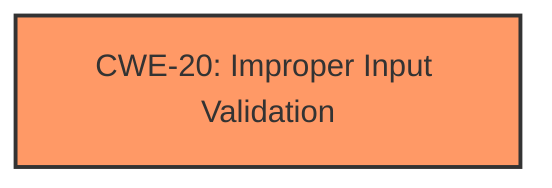

# Raw Analyzer Response for CVE-2021-33498

# Summary
| CWE ID | CWE Name | Confidence | CWE Abstraction Level | CWE Vulnerability Mapping Label | CWE-Vulnerability Mapping Notes |
|---|---|---|---|---|---|
| CWE-20 | Improper Input Validation | 0.9 | Class | Primary | Discouraged |

## Evidence and Confidence

*   **Confidence Score:** 0.9
*   **Evidence Strength:** HIGH

## Relationship Analysis
The primary CWE identified is CWE-20, which is a Class-level CWE. This means that it is a higher-level categorization, and there may be more specific CWEs that could apply. However, given the limited information, **missing H.264 input validation**, a class-level mapping is appropriate.

## Vulnerability Chain
The vulnerability chain starts with the **missing H.264 input validation** (CWE-20), which leads to a remote denial of service.

## Summary of Analysis
The analysis is based on the provided evidence that the vulnerability is due to **missing H.264 input validation**. The key phrase "missing H.264 input validation" strongly indicates that the input is not being properly validated.

The Retriever Results listed CWE-20 as a potential candidate. The vulnerability description states that the root cause is a **missing H.264 input validation**, which directly aligns with the description of CWE-20. The impact is a remote denial of service.

The mapping guidance for CWE-20 is Discouraged, and suggests alternatives such as:
- CWE-1284: Specified Quantity
- CWE-1285: Specified Index, Position, or Offset
- CWE-1286: Syntactic Correctness
- CWE-1287: Specified Type
- CWE-1288: Consistency within Input
- CWE-1289: Unsafe Equivalence

However, given the information provided, it is unclear if the missing validation is related to a specific quantity, index, syntax, or type. More information would be needed to make a more specific classification. For this reason, CWE-20 is the most appropriate.

Relevant CWE Information:

# Enhanced Context (25 CWEs)
The following CWEs were identified as potentially relevant to this vulnerability:

## CWE-129: Improper Validation of Array Index
**Abstraction Level**: Variant
**Similarity Score**: 0.142
**Source**: sparse

**Description**:
The product uses untrusted input when calculating or using an array index, but the product does not validate or incorrectly validates the index to ensure the index references a valid position within the array.
## CWE-20: Improper Input Validation
**Abstraction Level**: Class
**Similarity Score**: 0.124
**Source**: sparse

**Description**:
The product receives input or data, but it does
        not validate or incorrectly validates that the input has the
        properties that are required to process the data safely and
        correctly.
## CWE-1284: Improper Validation of Specified Quantity in Input
**Abstraction Level**: Base
**Similarity Score**: 0.111
**Source**: sparse

**Description**:
The product receives input that is expected to specify a quantity (such as size or length), but it does not validate or incorrectly validates that the quantity has the required properties.
## CWE-193: Off-by-one Error
**Abstraction Level**: Base
**Similarity Score**: 0.107
**Source**: sparse

**Description**:
A product calculates or uses an incorrect maximum or minimum value that is 1 more, or 1 less, than the correct value.
## CWE-476: NULL Pointer Dereference
**Abstraction Level**: Base
**Similarity Score**: 0.104
**Source**: sparse

**Description**:
The product dereferences a pointer that it expects to be valid but is NULL.
## CWE-346: Origin Validation Error
**Abstraction Level**: Class
**Similarity Score**: 0.553
**Source**: dense

**Description**:
The product does not properly verify that the source of data or communication is valid.
## CWE-1325: Improperly Controlled Sequential Memory Allocation
**Abstraction Level**: Base
**Similarity Score**: 0.003
**Source**: graph

**Description**:
The product manages a group of objects or resources and performs a separate memory allocation for each object, but it does not properly limit the total amount of memory that is consumed by all of the combined objects.
## CWE-22: Improper Limitation of a Pathname to a Restricted Directory ('Path Traversal')
**Abstraction Level**: Base
**Similarity Score**: 0.104
**Source**: sparse

**Description**:
The product uses external input to construct a pathname that is intended to identify a file or directory that is located underneath a restricted parent directory, but the product does not properly neutralize special elements within the pathname that can cause the pathname to resolve to a location that is outside of the restricted directory.
## CWE-345: Insufficient Verification of Data Authenticity
**Abstraction Level**: Class
**Similarity Score**: 0.101
**Source**: sparse

**Description**:
The product does not sufficiently verify the origin or authenticity of data, in a way that causes it to accept invalid data.
## CWE-1286: Improper Validation of Syntactic Correctness of Input
**Abstraction Level**: Base
**Similarity Score**: 0.099
**Source**: sparse

**Description**:
The product receives input that is expected to be well-formed - i.e., to comply with a certain syntax - but it does not validate or incorrectly validates that the input complies with the syntax.