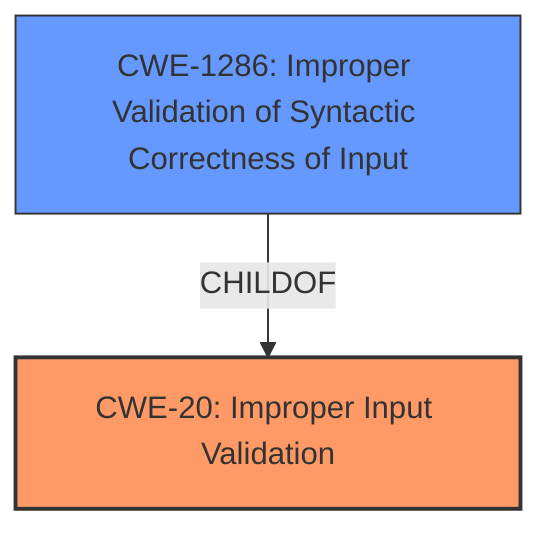

# Analysis for CVE-2021-33499

# Summary
| CWE ID | CWE Name | Confidence | CWE Abstraction Level | CWE Vulnerability Mapping Label | CWE-Vulnerability Mapping Notes |
|---|---|---|---|---|---|
| CWE-20 | Improper Input Validation | 0.8 | Class | Primary | Discouraged |
| CWE-1286 | Improper Validation of Syntactic Correctness of Input | 0.7 | Base | Secondary | Allowed |

## Evidence and Confidence

*   **Confidence Score:** 0.8
*   **Evidence Strength:** MEDIUM

## Relationship Analysis
The primary relationship that influenced my decision was the parent-child relationship between CWE-20 and CWE-1286. While CWE-20 is a broader class, CWE-1286 provides a more specific description of the **missing input validation** in terms of syntactic correctness. However, the description is too vague to completely rule out CWE-20.

## Vulnerability Chain
The vulnerability chain starts with the **missing H.264 input validation** (CWE-20 / CWE-1286), which leads to a remote denial of service.

## Summary of Analysis
The initial assessment identified CWE-20 as the primary candidate, supported by the "Top CWEs" section. However, the retriever results provided more specific candidates such as CWE-1286, "Improper Validation of Syntactic Correctness of Input." Given that the vulnerability description mentions **missing H.264 input validation**, which implies a **failure to validate the structure of the H.264 input**, CWE-1286 seems more fitting as a secondary candidate to CWE-20.

The evidence from the vulnerability description is:
- Vulnerability Description Key Phrases: "**rootcause:** **missing H.264 input validation**"
- Vulnerability Description: "Pexip Infinity before 26 allows remote denial of service because of **missing H.264 input validation**"

I am selecting CWE-20 as the primary because it is the best match and is listed as the primary CWE. I am selecting CWE-1286 as a secondary candidate as it is a specific case of CWE-20 where the input is not validated for syntactic correctness.

# Relevant CWE Information:

## Vulnerability Description
Pexip Infinity before 26 allows remote denial of service because of **missing H.264 input validation** (issue 2 of 2).

### Vulnerability Description Key Phrases
- **rootcause:** **missing H.264 input validation**
- **impact:** remote denial of service
- **product:** Pexip Infinity
- **version:** before 26

### CWE for similar CVE Descriptions
### Primary CWE Match
CWE-20

#### Top CWEs
- CWE-20 (Count: 13)

## CVE Reference Links Content Summary
The provided document does not contain any information about CVE-2021-33499. It does list several other CVEs, but not this one.

Response: UNRELATED

## Retriever Results

### Top Combined Results

| Rank | CWE ID | Name | Abstraction | Usage  | Retrievers | Individual Scores |
|------|--------|------|-------------|-------|------------|-------------------|
| 1 | 129 | Improper Validation of Array Index | Variant | Allowed | sparse | 0.139 |
| 2 | 20 | Improper Input Validation | Class | Discouraged | sparse | 0.125 |
| 3 | 1284 | Improper Validation of Specified Quantity in Input | Base | Allowed | sparse | 0.112 |
| 4 | 193 | Off-by-one Error | Base | Allowed | sparse | 0.107 |
| 5 | 22 | Improper Limitation of a Pathname to a Restricted Directory ('Path Traversal') | Base | Allowed | sparse | 0.105 |
| 6 | 346 | Origin Validation Error | Class | Allowed-with-Review | dense | 0.554 |
| 7 | 73 | External Control of File Name or Path | Base | Allowed | graph | 0.003 |
| 8 | 476 | NULL Pointer Dereference | Base | Allowed | sparse | 0.104 |
| 9 | 345 | Insufficient Verification of Data Authenticity | Class | Discouraged | sparse | 0.102 |
| 10 | 1286 | Improper Validation of Syntactic Correctness of Input | Base | Allowed | sparse | 0.100 |

# Complete CWE Specifications

## CWE-20: Improper Input Validation
The product receives input or data, but it does
        not validate or incorrectly validates that the input has the
        properties that are required to process the data safely and
        correctly.
This CWE applies because the Pexip Infinity software **fails to validate H.264 input**. This **lack of validation** can lead to unexpected input being processed, potentially causing a denial-of-service condition. The security implication is that an attacker can send malicious H.264 data to crash the system.

## CWE-1286: Improper Validation of Syntactic Correctness of Input
The product receives input that is expected to be well-formed - i.e., to comply with a certain syntax - but it does not validate or incorrectly validates that the input complies with the syntax.
This CWE is a more specific case of CWE-20 where the input is not validated for syntactic correctness. Since the vulnerability involves **missing H.264 input validation**, it can be argued that the system **fails to validate whether the H.264 input conforms to the expected syntax**. This could lead to parsing failures or other unexpected errors. The security implication is a potential denial of service due to malformed H.264 input.

### Other CWEs Considered But Not Used:

*   **CWE-129: Improper Validation of Array Index:** This CWE is not applicable because the vulnerability is not specifically related to array index validation.
*   **CWE-1284: Improper Validation of Specified Quantity in Input:** This CWE is not applicable because the vulnerability is not specifically related to the validation of a specified quantity.
*   **CWE-193: Off-by-one Error:** This CWE is not applicable because the vulnerability is not specifically related to an off-by-one error.
*   **CWE-22: Improper Limitation of a Pathname to a Restricted Directory ('Path Traversal'):** This CWE is not applicable because the vulnerability is not specifically related to path traversal.
*   **CWE-346: Origin Validation Error:** This CWE is not applicable because the vulnerability is not specifically related to origin validation.
*   **CWE-73: External Control of File Name or Path:** This CWE is not applicable because the vulnerability is not specifically related to external control of file names or paths.
*   **CWE-476: NULL Pointer Dereference:** This CWE is not applicable because the vulnerability is not specifically related to NULL pointer dereference.
*   **CWE-345: Insufficient Verification of Data Authenticity:** This CWE is not applicable because the vulnerability is not specifically related to data authenticity.