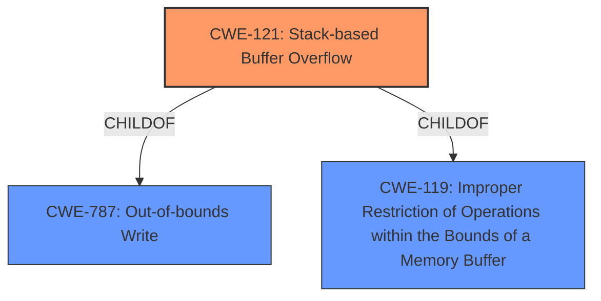

# Analysis for CVE-2021-33545

# Summary
| CWE ID | CWE Name | Confidence | CWE Abstraction Level | CWE Vulnerability Mapping Label | CWE-Vulnerability Mapping Notes |
|---|---|---|---|---|---|
| CWE-121 | Stack-based Buffer Overflow | 1.0 | Variant | Primary | Allowed |
| CWE-119 | Improper Restriction of Operations within the Bounds of a Memory Buffer | 0.7 | Class | Secondary | Discouraged |

## Evidence and Confidence

*   **Confidence Score:** 1.0
*   **Evidence Strength:** HIGH

## Relationship Analysis
The primary CWE is CWE-121, which is a child of CWE-787 (Out-of-bounds Write) and CWE-119 (Improper Restriction of Operations within the Bounds of a Memory Buffer). CWE-119 is a class-level CWE that is often misused, making the more specific CWE-121 a better choice.

## Vulnerability Chain
The vulnerability chain starts with a **stack-based buffer overflow** (CWE-121) in the counter parameter, which leads to remote code execution.

## Summary of Analysis
The vulnerability description clearly states a **stack-based buffer overflow** condition in the counter parameter, leading to remote code execution. The "CVE Reference Links Content Summary" confirms the root cause as a "stack-based buffer overflow vulnerability" and lists CWE-121 as a weakness.

The initial analysis and the provided evidence strongly support the selection of CWE-121 (Stack-based Buffer Overflow) as the primary CWE. This aligns with the vulnerability description, which explicitly mentions a **stack-based buffer overflow**.
CWE-119 is a more generic class-level CWE, and while it applies, CWE-121 provides a more specific classification of the weakness. The graph relationships confirm that CWE-121 is a child of CWE-119, making it a more precise choice.

Relevant CWE Information:

# Enhanced Context (25 CWEs)
The following CWEs were identified as potentially relevant to this vulnerability:

## CWE-124: Buffer Underwrite ('Buffer Underflow')
**Abstraction Level**: Base

## CWE-805: Buffer Access with Incorrect Length Value
**Abstraction Level**: Base

## CWE-131: Incorrect Calculation of Buffer Size
**Abstraction Level**: Base

## CWE-191: Integer Underflow (Wrap or Wraparound)
**Abstraction Level**: Base

## CWE-130: Improper Handling of Length Parameter Inconsistency
**Abstraction Level**: Base

## CWE-126: Buffer Over-read
**Abstraction Level**: Variant

## CWE-193: Off-by-one Error
**Abstraction Level**: Base

## CWE-127: Buffer Under-read
**Abstraction Level**: Variant

## CWE-680: Integer Overflow to Buffer Overflow
**Abstraction Level**: Compound

## CWE-681: Incorrect Conversion between Numeric Types
**Abstraction Level**: Base

## CWE-190: Integer Overflow or Wraparound
**Abstraction Level**: Base

## CWE-125: Out-of-bounds Read
**Abstraction Level**: Base

## CWE-193: Off-by-one Error
**Abstraction Level**: Base

## CWE-124: Buffer Underwrite ('Buffer Underflow')
**Abstraction Level**: Base

## CWE-1284: Improper Validation of Specified Quantity in Input
**Abstraction Level**: Base

## CWE-128: Wrap-around Error
**Abstraction Level**: base

## CWE-170: Improper Null Termination
**Abstraction Level**: base

## CWE-120: Buffer Copy without Checking Size of Input ('Classic Buffer Overflow')
**Abstraction Level**: base

## CWE-123: Write-what-where Condition
**Abstraction Level**: base

## CWE-1284: Improper Validation of Specified Quantity in Input
**Abstraction Level**: base

## CWE-617: Reachable Assertion
**Abstraction Level**: base

## CWE-463: Deletion of Data Structure Sentinel
**Abstraction Level**: base

## CWE-1339: Insufficient Precision or Accuracy of a Real Number
**Abstraction Level**: base

## CWE-190: Integer Overflow or Wraparound
**Abstraction Level**: Base

## CWE-787: Out-of-bounds Write
**Abstraction Level**: base

**CWE-119 (Improper Restriction of Operations within the Bounds of a Memory Buffer)**: This is a class-level CWE, and while it broadly applies to buffer overflows, it is less specific than CWE-121. The mapping guidance discourages its use when lower-level CWEs are available.

**CWE-190 (Integer Overflow or Wraparound)**: This CWE is not directly related to the described vulnerability, which is a **buffer overflow**, not an integer overflow.

**CWE-120 (Buffer Copy without Checking Size of Input ('Classic Buffer Overflow'))**: This CWE describes a specific type of buffer overflow where the size of the input is not checked before copying it to a buffer. While it could be a contributing factor, the description focuses on the **stack allocation** aspect, making CWE-121 more appropriate.

**CWE-787 (Out-of-bounds Write)**: This is a more general case of writing outside the intended buffer boundary, and is a parent of CWE-121.

**CWE-121 (Stack-based Buffer Overflow)**: The vulnerability description explicitly states a **stack-based buffer overflow**, making this the most accurate and specific classification. The "CVE Reference Links Content Summary" also confirms this classification.