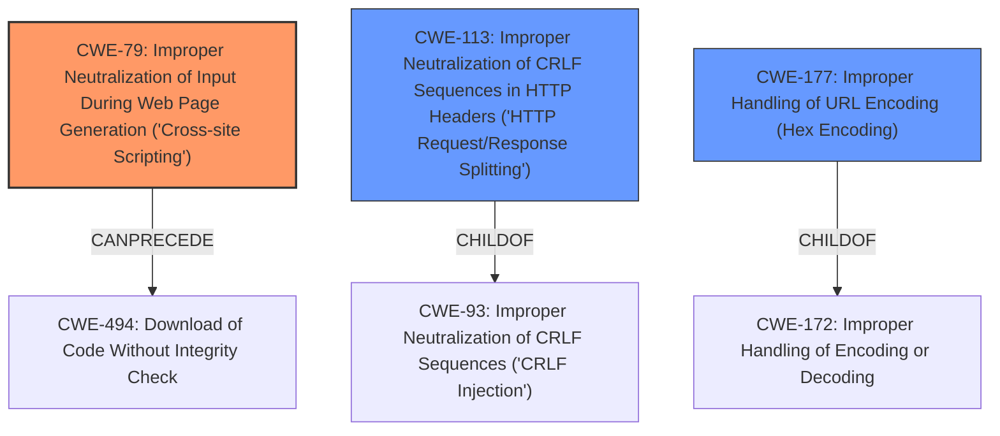

# Raw Analyzer Response for CVE-2021-33604

# Summary
| CWE ID | CWE Name | Confidence | CWE Abstraction Level | CWE Vulnerability Mapping Label | CWE-Vulnerability Mapping Notes |
|---|---|---|---|---|---|
| CWE-79 | Improper Neutralization of Input During Web Page Generation ('Cross-site Scripting') | 0.9 | Base | Allowed | Primary CWE |
| CWE-113 | Improper Neutralization of CRLF Sequences in HTTP Headers ('HTTP Request/Response Splitting') | 0.7 | Variant | Allowed | Secondary Candidate |
| CWE-177 | Improper Handling of URL Encoding (Hex Encoding) | 0.6 | Variant | Allowed | Secondary Candidate |

## Evidence and Confidence

*   **Confidence Score:** 0.8
*   **Evidence Strength:** HIGH

## Relationship Analysis
The primary CWE is CWE-79, which represents the root cause of the XSS vulnerability due to **improper neutralization** of user-controlled input. CWE-113 (Improper Neutralization of CRLF Sequences) and CWE-177 (Improper Handling of URL Encoding) were considered as potential related weaknesses, with the URL encoding issue (CWE-177) contributing to the possibility of exploiting the XSS vulnerability, and the header splitting (CWE-113) as a potential adjacent risk.

## Vulnerability Chain
The vulnerability chain starts with the **URL encoding error** in the development mode handler, leading to **improper URL sanitization**. This allows an attacker to inject malicious JavaScript code via a crafted URL, resulting in **arbitrary JavaScript execution** within the developer's browser (XSS).

## Summary of Analysis
The analysis is based on the provided vulnerability description and CVE reference content summary, which provides sufficient evidence to support the classification. The root cause is identified as a **URL encoding error** leading to XSS.

The CVE Reference Links Content Summary states:
"**Root Cause of Vulnerability:**
The vulnerability stems from a URL encoding error in the development mode handler of Vaadin Flow server. Specifically, the webpack dev-server does not escape the `"` character, which is not a valid URL character, and this limitation was not being checked when requests were passed to it via `DevModeHandlerImpl`."

"**Weaknesses/Vulnerabilities Present:**
*   **Improper URL Sanitization:** The application fails to properly sanitize URLs before passing them to the webpack dev server.
*   **Reflected Cross-Site Scripting (XSS):** The lack of proper encoding allows an attacker to inject malicious JavaScript code into the URL, which is then reflected back and executed within the context of the user's browser."

The primary weakness is clearly the reflected XSS (CWE-79), caused by **improper neutralization** of input during web page generation. CWE-177 (Improper Handling of URL Encoding) is a contributing factor by allowing malicious characters to be passed in the URL. CWE-113 is considered because it involves **improper neutralization** of CRLF sequences, which can lead to HTTP request/response splitting, although the primary vulnerability is XSS. The selected CWEs are at the base or variant level, providing an appropriate level of specificity.

Relevant CWE Information:
- **CWE-79:** This is the primary CWE as the vulnerability allows for arbitrary JavaScript execution due to **improper neutralization** of user input in a web page. The description of CWE-79 perfectly matches the vulnerability: "The product does not neutralize or incorrectly neutralizes user-controllable input before it is placed in output that is used as a web page that is served to other users."
- **CWE-113:** While not the primary issue, CRLF injection could be a potential secondary concern, especially given the URL encoding issues. However, the focus of the vulnerability is more directly on XSS.
- **CWE-177:** Is a possible root cause because the **improper handling of URL encoding** allows the malicious input to be passed to the web server.