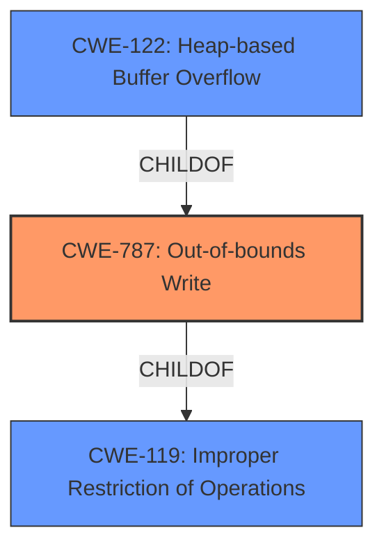

# Raw Analyzer Response for CVE-2021-33657

# Summary
| CWE ID | CWE Name | Confidence | CWE Abstraction Level | CWE Vulnerability Mapping Label | CWE-Vulnerability Mapping Notes |
|---|---|---|---|---|---|
| CWE-787 | Out-of-bounds Write | 0.9 | Base | Allowed | Primary CWE |
| CWE-122 | Heap-based Buffer Overflow | 0.7 | Variant | Allowed | Secondary Candidate |
| CWE-119 | Improper Restriction of Operations within the Bounds of a Memory Buffer | 0.5 | Class | Discouraged | Secondary Candidate |

## Evidence and Confidence

*   **Confidence Score:** 0.8
*   **Evidence Strength:** HIGH

## Relationship Analysis
The primary CWE is CWE-787, representing the **out-of-bounds write** directly caused by the vulnerability. CWE-122 is a more specific variant of buffer overflow occurring on the heap. CWE-119 is a broader class encompassing various buffer-related issues. The hierarchical relationship guided the selection of CWE-787 as the most accurate and specific representation of the vulnerability.

## Vulnerability Chain
The vulnerability chain starts with the **improper handling of color mapping** in SDL, leading to an **out-of-bounds write**, which can then result in a crash, denial of service, or even code execution.

## Summary of Analysis
The analysis focused on identifying the root cause and the specific type of memory error. The evidence clearly points to an **out-of-bounds write** vulnerability, making CWE-787 the most appropriate choice.

The vulnerability description indicates a **heap overflow** in SDL versions 2.x to 2.0.18, triggered by a malicious .BMP file. The CVE reference links content summary confirms the root cause as an issue in SDL's handling of color mapping, specifically in the `Map1to1` and `Map1toN` functions in `SDL_pixels.c`. The code **does not always allocate a full 256-entry map for color palettes**, leading to **out-of-bounds access** when color values exceed the allocated range. The impact includes arbitrary code execution due to the out-of-bounds write. The fix involves always creating a full 256-entry map.

Based on this evidence:

*   **CWE-787: Out-of-bounds Write** is the most appropriate primary CWE. The description clearly states that the code writes to an invalid memory location when a color index is outside the bounds of the allocated map. This directly matches the definition of CWE-787.
    *   "When a color index is outside the bounds of the allocated map, the program will write to an invalid memory location."
*   **CWE-122: Heap-based Buffer Overflow** is a secondary candidate. While the vulnerability is a heap overflow, the more specific issue is the **out-of-bounds write** itself. CWE-122 is a child of CWE-787 and CWE-119, but CWE-787 better captures the specific weakness.
*   **CWE-119: Improper Restriction of Operations within the Bounds of a Memory Buffer** is a less specific, class-level CWE. While applicable, it doesn't provide the granularity needed to accurately represent the vulnerability. MITRE guidance discourages its use when more specific CWEs are available.

Other CWEs Considered but Not Used:

*   CWE-190, CWE-193, CWE-128, CWE-789, CWE-1284: These relate to integer handling, memory allocation, and input validation issues. While they could potentially be related in a complex vulnerability chain, the primary issue is the out-of-bounds write, and there is no direct evidence to support these other CWEs in the provided information.
*   CWE-125: Out-of-bounds Read is not appropriate since the issue is an out-of-bounds write, not a read.
*   CWE-770: Allocation of Resources Without Limits or Throttling might seem relevant, but the core issue is not the lack of limits on resource allocation but rather the incorrect memory access.

The selected CWEs are at the optimal level of specificity because they directly address the root cause (out-of-bounds write) and the type of memory error (heap overflow), based on the provided evidence.