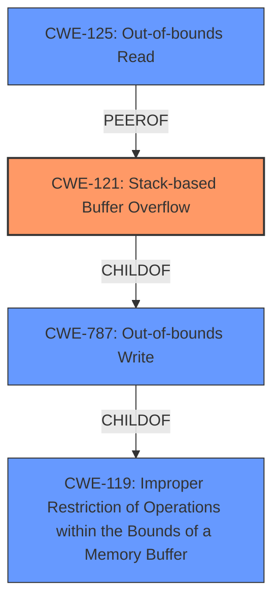

# Raw Analyzer Response for CVE-2021-33945

# Summary
| CWE ID | CWE Name | Confidence | CWE Abstraction Level | CWE Vulnerability Mapping Label | CWE-Vulnerability Mapping Notes |
|---|---|---|---|---|---|
| CWE-121 | Stack-based Buffer Overflow | 1.0 | Variant | Allowed | Primary CWE |
| CWE-119 | Improper Restriction of Operations within the Bounds of a Memory Buffer | 0.7 | Class | Discouraged | Secondary Candidate |
| CWE-125 | Out-of-bounds Read | 0.6 | Base | Allowed | Secondary Candidate |
| CWE-787 | Out-of-bounds Write | 0.6 | Base | Allowed | Secondary Candidate |

## Evidence and Confidence

*   **Confidence Score:** 0.9
*   **Evidence Strength:** HIGH

## Relationship Analysis
The primary CWE is CWE-121, Stack-based Buffer Overflow, a variant of CWE-787, Out-of-bounds Write, which in turn is a child of CWE-119, Improper Restriction of Operations within the Bounds of a Memory Buffer. The vulnerability involves writing past the end of a stack-allocated buffer, making CWE-121 the most specific and accurate choice. CWE-125 (Out-of-bounds Read) was considered because buffer overflows often involve both reading and writing out of bounds, but the primary issue described is the write.

## Vulnerability Chain
The vulnerability chain starts with **lack of bounds checking** when copying data into a stack buffer, leading to a **stack buffer overflow**, which results in a Denial of Service.

## Summary of Analysis
The initial analysis pointed towards a buffer overflow, specifically a **stack buffer overflow**. The provided evidence strongly supports this, particularly the CVE Reference Links Content Summary, which explicitly mentions the **stack buffer overflow** in the `wpa_supplicant_conf_parser` function due to the **lack of bounds checking** when using `strncpy`.

The selection of CWE-121 as the primary CWE is justified by its specificity and the direct evidence from the vulnerability description. While CWE-119 is a parent class, it is too general and the mapping guidance discourages its use when more specific CWEs are available. The vulnerability description clearly describes a **stack buffer overflow**, making CWE-121 the most appropriate choice.

The evidence for this is clear: "The vulnerability stems from a **stack buffer overflow** in the `wpa_supplicant_conf_parser` function of Ricoh printer firmware." and "The `strncpy` function is used to copy data from the file content into a stack buffer. If a line in the configuration file exceeds the stack buffer's size, it will cause a buffer overflow."
Relevant CWE Information:

# Enhanced Context (25 CWEs)
The following CWEs were identified as potentially relevant to this vulnerability:

## CWE-131: Incorrect Calculation of Buffer Size
**Abstraction Level**: Base
**Similarity Score**: 0.79
**Source**: dense

**Description**:
The product does not correctly calculate the size to be used when allocating a buffer, which could lead to a buffer overflow.

**Mapping Guidance**:
- Usage: Allowed
- Rationale: This CWE entry is at the Base level of abstraction, which is a preferred level of abstraction for mapping to the root causes of vulnerabilities.

*Reason for not using CWE-131*: While the description mentions the calculation of a buffer size, the root cause is the **lack of bounds checking**, not an incorrect calculation.

## CWE-191: Integer Underflow (Wrap or Wraparound)
**Abstraction Level**: Base
**Similarity Score**: 0.79
**Source**: dense

**Description**:
The product subtracts one value from another, such that the result is less than the minimum allowable integer value, which produces a value that is not equal to the correct result.

**Mapping Guidance**:
- Usage: Allowed
- Rationale: This CWE entry is at the Base level of abstraction, which is a preferred level of abstraction for mapping to the root causes of vulnerabilities.

*Reason for not using CWE-191*: Integer underflow is not related to the **stack buffer overflow** vulnerability.

## CWE-126: Buffer Over-read
**Abstraction Level**: Variant
**Similarity Score**: 0.77
**Source**: dense

**Description**:
The product reads from a buffer using buffer access mechanisms such as indexes or pointers that reference memory locations after the targeted buffer.

**Mapping Guidance**:
- Usage: Allowed
- Rationale: This CWE entry is at the Variant level of abstraction, which is a preferred level of abstraction for mapping to the root causes of vulnerabilities.

*Reason for not using CWE-126*: While reading past a buffer is possible in buffer overflows, the root cause of the vulnerability is a **stack buffer overflow**.

## CWE-193: Off-by-one Error
**Abstraction Level**: Base
**Similarity Score**: 0.77
**Source**: dense

**Description**:
A product calculates or uses an incorrect maximum or minimum value that is 1 more, or 1 less, than the correct value.

**Mapping Guidance**:
- Usage: Allowed
- Rationale: This CWE entry is at the Base level of abstraction, which is a preferred level of abstraction for mapping to the root causes of vulnerabilities.

*Reason for not using CWE-193*: Off-by-one errors are not related to the **stack buffer overflow** vulnerability, although they can cause them.

## CWE-119: Improper Restriction of Operations within the Bounds of a Memory Buffer
**Abstraction Level**: Class
**Similarity Score**: 0.77
**Source**: dense

**Description**:
The product performs operations on a memory buffer, but it reads from or writes to a memory location outside the buffer's intended boundary. This may result in read or write operations on unexpected memory locations that could be linked to other variables, data structures, or internal program data.

**Mapping Guidance**:
- Usage: Discouraged
- Rationale: CWE-119 is commonly misused in low-information vulnerability reports when lower-level CWEs could be used instead, or when more details about the vulnerability are available.

*Reason for considering CWE-119*: It is a parent class of CWE-121 and CWE-787, but the mapping guidance discourages its use when more specific CWEs are available.

## CWE-125: Out-of-bounds Read
**Abstraction Level**: Base
**Similarity Score**: 0.77
**Source**: dense

**Description**:
The product reads data past the end, or before the beginning, of the intended buffer.

**Mapping Guidance**:
- Usage: Allowed
- Rationale: This CWE entry is at the Base level of abstraction, which is a preferred level of abstraction for mapping to the root causes of vulnerabilities.

*Reason for considering CWE-125*: Reading data past the end of buffer is possible in buffer overflows.

## CWE-190: Integer Overflow or Wraparound
**Abstraction Level**: Base
**Similarity Score**: 0.77
**Source**: dense

**Description**:
The product performs a calculation that can
         produce an integer overflow or wraparound when the logic
         assumes that the resulting value will always be larger than
         the original value. This occurs when an integer value is
         incremented to a value that is too large to store in the
         associated representation. When this occurs, the value may
         become a very small or negative number.

**Mapping Guidance**:
- Usage: Allowed
- Rationale: This CWE entry is at the Base level of abstraction, which is a preferred level of abstraction for mapping to the root causes of vulnerabilities.

*Reason for not using CWE-190*: Integer overflow is not related to the **stack buffer overflow** vulnerability.

## CWE-805: Buffer Access with Incorrect Length Value
**Abstraction Level**: Base
**Similarity Score**: 0.77
**Source**: dense

**Description**:
The product uses a sequential operation to read or write a buffer, but it uses an incorrect length value that causes it to access memory that is outside of the bounds of the buffer.

**Mapping Guidance**:
- Usage: Allowed
- Rationale: This CWE entry is at the Base level of abstraction, which is a preferred level of abstraction for mapping to the