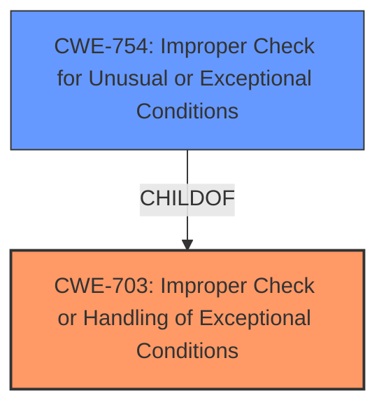

# Analysis for CVE-2021-3433

# Summary
| CWE ID | CWE Name | Confidence | CWE Abstraction Level | CWE Vulnerability Mapping Label | CWE-Vulnerability Mapping Notes |
|---|---|---|---|---|---|
| CWE-703 | Improper Check or Handling of Exceptional Conditions | 0.8 | Pillar | Allowed | The vulnerability description explicitly mentions this CWE. |
| CWE-754 | Improper Check for Unusual or Exceptional Conditions | 0.6 | Class | Allowed-with-Review | A more specific child of CWE-703. |

## Evidence and Confidence

*   **Confidence Score:** 0.7
*   **Evidence Strength:** MEDIUM

## Relationship Analysis
The primary relationship considered was the parent-child relationship between CWE-703 and CWE-754. CWE-703 is a pillar, while CWE-754 is a class. While the description directly mentions CWE-703, CWE-754 is a more specific classification that could be applicable as it represents a lack of checking for unusual conditions.

## Vulnerability Chain
The chain starts with an **improper check for exceptional conditions (CWE-703)** in the handling of a `CONNECT_IND` message with an invalid channel map. This leads to a **deadlock**. The root cause is the **lack of validation** of the channel map.

## Summary of Analysis
The initial analysis identified CWE-703 as the primary CWE due to its explicit mention in the vulnerability description. Further analysis considered CWE-754, a child of CWE-703, which represents a more specific class of weakness: **Improper Check for Unusual or Exceptional Conditions**. The vulnerability involves a failure to validate the channel map in a `CONNECT_IND` message, fitting the description of CWE-754. However, since the vulnerability description explicitly names CWE-703, it is retained as the primary classification with CWE-754 being a secondary classification.

Relevant CWE Information:

# Enhanced Context (25 CWEs)
The following CWEs were identified as potentially relevant to this vulnerability:

## CWE-703: Improper Check or Handling of Exceptional Conditions
**Abstraction Level**: Pillar
**Similarity Score**: 0.80
**Source**: dense

**Description**:
The product does not properly anticipate or handle exceptional conditions that rarely occur during normal operation of the product.

**Mapping Guidance**:
- Usage: Discouraged
- Rationale: This CWE entry is extremely high-level, a Pillar.

## CWE-130: Improper Handling of Length Parameter Inconsistency
**Abstraction Level**: Base
**Similarity Score**: 0.76
**Source**: dense

**Description**:
The product parses a formatted message or structure, but it does not handle or incorrectly handles a length field that is inconsistent with the actual length of the associated data.

**Mapping Guidance**:
- Usage: Allowed
- Rationale: This CWE entry is at the Base level of abstraction, which is a preferred level of abstraction for mapping to the root causes of vulnerabilities.

## CWE-588: Attempt to Access Child of a Non-structure Pointer
**Abstraction Level**: Variant
**Similarity Score**: 0.77
**Source**: dense

**Description**:
Casting a non-structure type to a structure type and accessing a field can lead to memory access errors or data corruption.

**Mapping Guidance**:
- Usage: Allowed
- Rationale: This CWE entry is at the Variant level of abstraction, which is a preferred level of abstraction for mapping to the root causes of vulnerabilities.

## CWE-191: Integer Underflow (Wrap or Wraparound)
**Abstraction Level**: Base
**Similarity Score**: 0.77
**Source**: dense

**Description**:
The product subtracts one value from another, such that the result is less than the minimum allowable integer value, which produces a value that is not equal to the correct result.

**Mapping Guidance**:
- Usage: Allowed
- Rationale: This CWE entry is at the Base level of abstraction, which is a preferred level of abstraction for mapping to the root causes of vulnerabilities.

## CWE-754: Improper Check for Unusual or Exceptional Conditions
**Abstraction Level**: Class
**Similarity Score**: 0.78
**Source**: dense

**Description**:
The product does not check or incorrectly checks for unusual or exceptional conditions that are not expected to occur frequently during day to day operation of the product.

**Mapping Guidance**:
- Usage: Allowed-with-Review
- Rationale: This CWE entry is a Class and might have Base-level children that would be more appropriate

## CWE-1264: Hardware Logic with Insecure De-Synchronization between Control and Data Channels
**Abstraction Level**: Base
**Similarity Score**: 0.77
**Source**: dense

**Description**:
The hardware logic for error handling and security checks can incorrectly forward data before the security check is complete.

**Mapping Guidance**:
- Usage: Allowed
- Rationale: This CWE entry is at the Base level of abstraction, which is a preferred level of abstraction for mapping to the root causes of vulnerabilities.

## CWE-805: Buffer Access with Incorrect Length Value
**Abstraction Level**: Base
**Similarity Score**: 0.76
**Source**: dense

**Description**:
The product uses a sequential operation to read or write a buffer, but it uses an incorrect length value that causes it to access memory that is outside of the bounds of the buffer.

**Mapping Guidance**:
- Usage: Allowed
- Rationale: This CWE entry is at the Base level of abstraction, which is a preferred level of abstraction for mapping to the root causes of vulnerabilities.

## CWE-694: Use of Multiple Resources with Duplicate Identifier
**Abstraction Level**: Base
**Similarity Score**: 0.77
**Source**: dense

**Description**:
The product uses multiple resources that can have the same identifier, in a context in which unique identifiers are required.

**Mapping Guidance**:
- Usage: Allowed
- Rationale: This CWE entry is at the Base level of abstraction, which is a preferred level of abstraction for mapping to the root causes of vulnerabilities.

## CWE-755: Improper Handling of Exceptional Conditions
**Abstraction Level**: Class
**Similarity Score**: 0.78
**Source**: dense

**Description**:
The product does not handle or incorrectly handles an exceptional condition.

**Mapping Guidance**:
- Usage: Discouraged
- Rationale: This CWE entry is a level-1 Class (i.e., a child of a Pillar). It might have lower-level children that would be more appropriate

## CWE-476: NULL Pointer Dereference
**Abstraction Level**: Base
**Similarity Score**: 0.78
**Source**: dense

**Description**:
The product dereferences a pointer that it expects to be valid but is NULL.

**Mapping Guidance**:
- Usage: Allowed
- Rationale: This CWE entry is at the Base level of abstraction, which is a preferred level of abstraction for mapping to the root causes of vulnerabilities.

CWE-130, CWE-588, CWE-191, CWE-1264, CWE-805, CWE-694, CWE-755 and CWE-476 were considered but ultimately not selected as they did not accurately describe the root cause of the vulnerability, which is the **improper check or handling of exceptional conditions**. These other CWEs represent different types of weaknesses that are not directly related to the **lack of validation of the channel map** leading to the deadlock. The choice of CWE-703 is based on the direct statement in the vulnerability description. The choice of CWE-754 is based on the parent-child relationship with CWE-703 and because it reflects the **lack of checking**.