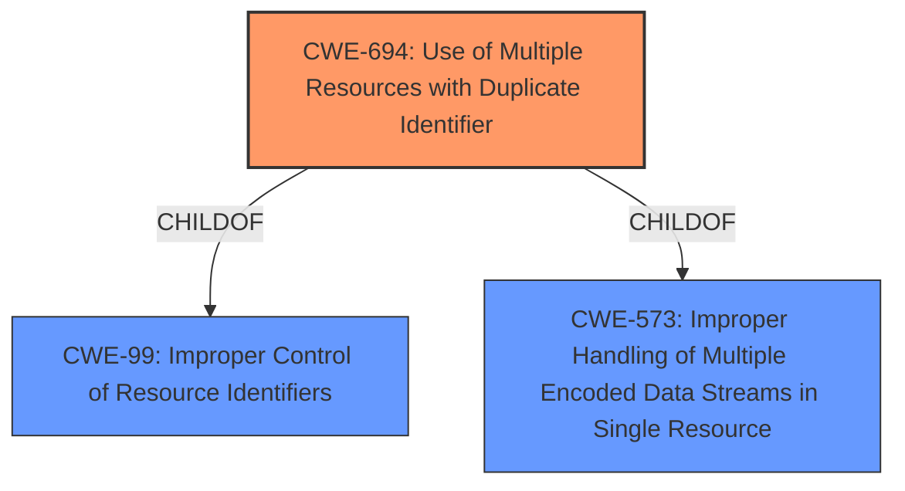

# Enhanced Analysis for CVE-2021-3436

# Summary
| CWE ID | CWE Name | Confidence | CWE Abstraction Level | CWE Vulnerability Mapping Label | CWE-Vulnerability Mapping Notes |
|---|---|---|---|---|---|
| CWE-694 | Use of Multiple Resources with Duplicate Identifier | 1.0 | Base | Allowed | Primary CWE |

## Evidence and Confidence

*   **Confidence Score:** 1.0
*   **Evidence Strength:** HIGH

## Relationship Analysis
The primary CWE, CWE-694, is a base level CWE. It has parent child relationships to CWE-99 and CWE-573. There are no chain relationships. The abstraction level of Base is appropriate because it is the most specific level that matches the provided information.



## Vulnerability Chain
The vulnerability chain starts with the **Use of Multiple Resources with Duplicate Identifier (CWE-694)**, leading to overwriting existing bond information in persistent storage, incorrect key entry selection, MIC failure, pairing failure, and disconnection.

## Summary of Analysis
The initial analysis focused on the provided **rootcause**, **Use of Multiple Resources with Duplicate Identifier (CWE-694)**, which is a direct match for the vulnerability description. The vulnerability description explicitly states: "Zephyr versions >= 1.14.2, >= 2.4.0, >= 2.5.0 contain **Use of Multiple Resources with Duplicate Identifier (CWE-694)**." The evidence strength is high because the vulnerability description explicitly mentions the CWE.

The graph relationships show that CWE-694 is a child of CWE-99 and CWE-573, but these are higher level and less specific than CWE-694.

The selected CWE is at the optimal level of specificity because it directly reflects the **rootcause** identified in the vulnerability description.

Relevant CWE Information:

# Enhanced Context (25 CWEs)

## CWE-694: Use of Multiple Resources with Duplicate Identifier
**Abstraction:** Base
**Status:** Incomplete

### Description
The product uses multiple resources that can have the same identifier, in a context in which unique identifiers are required.

### Extended Description
If the product assumes that each resource has a unique identifier, the product could operate on the wrong resource if attackers can cause multiple resources to be associated with the same identifier.

### Alternative Terms
None

### Relationships
ChildOf -> CWE-99
ChildOf -> CWE-573

### Mapping Guidance
**Usage:** Allowed
**Rationale:** This CWE entry is at the Base level of abstraction, which is a preferred level of abstraction for mapping to the root causes of vulnerabilities.
**Comments:** Carefully read both the name and description to ensure that this mapping is an appropriate fit. Do not try to 'force' a mapping to a lower-level Base/Variant simply to comply with this preferred level of abstraction.
**Reasons:**
- Acceptable-Use


### Additional Notes
**[Relationship]** This weakness is probably closely associated with other issues related to doubling, such as CWE-675 (Duplicate Operations on Resource). It's often a case of an API contract violation (CWE-227).

### Observed Examples
- **CVE-2013-4787:** chain: mobile OS verifies cryptographic signature of file in an archive, but then installs a different file with the same name that is also listed in the archive.


## CWE Relationship Analysis

Current CWEs represent these abstraction levels: .


### Vulnerability Chain Analysis

**Chain starting from CWE-675:**
- 675 (Multiple Operations on Resource in Single-Operation Context) - ROOT


**Chain starting from CWE-573:**
- 573 (Improper Following of Specification by Caller) - ROOT


### CWE Relationship Diagram

```mermaid
graph TD
    classDef primary fill:#f96,stroke:#333,stroke-width:2px
    classDef secondary fill:#69f,stroke:#333
    classDef tertiary fill:#9e9,stroke:#333
```